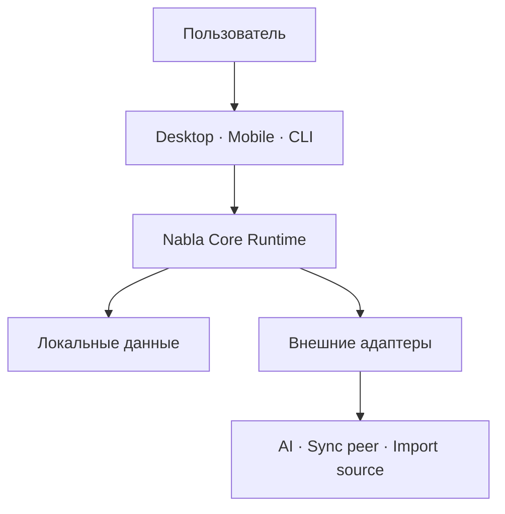
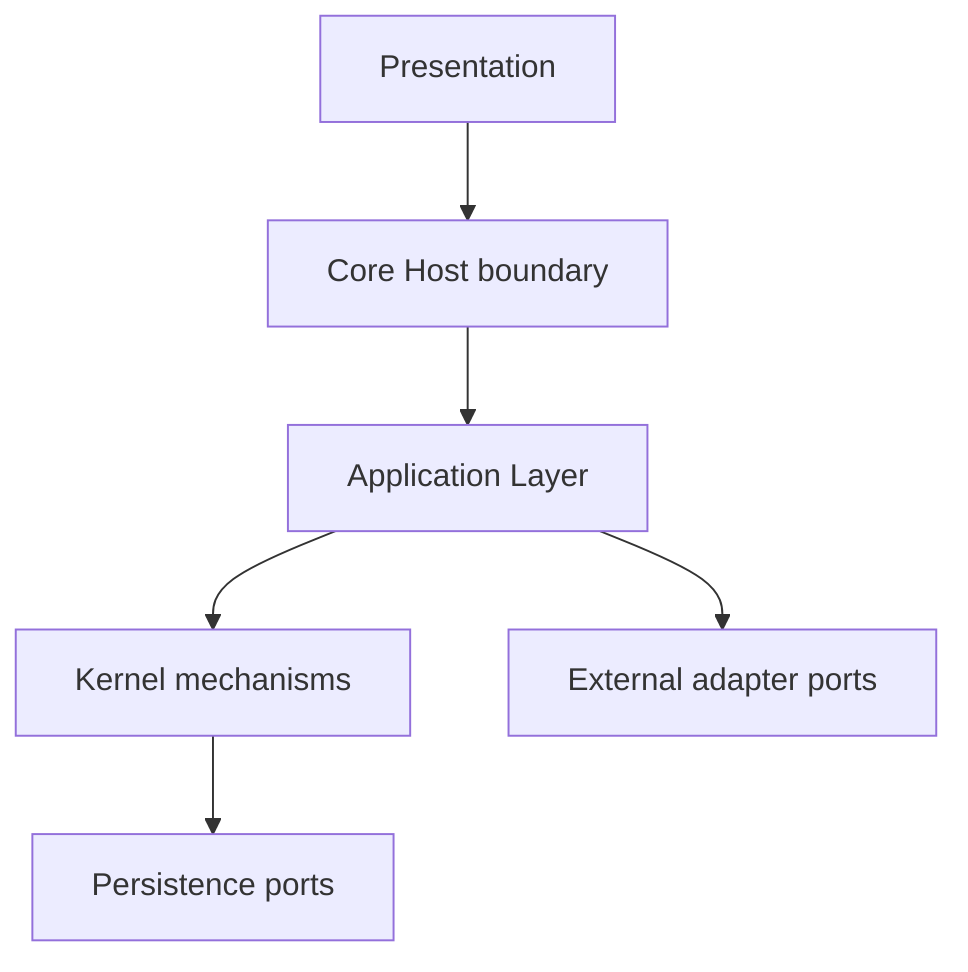
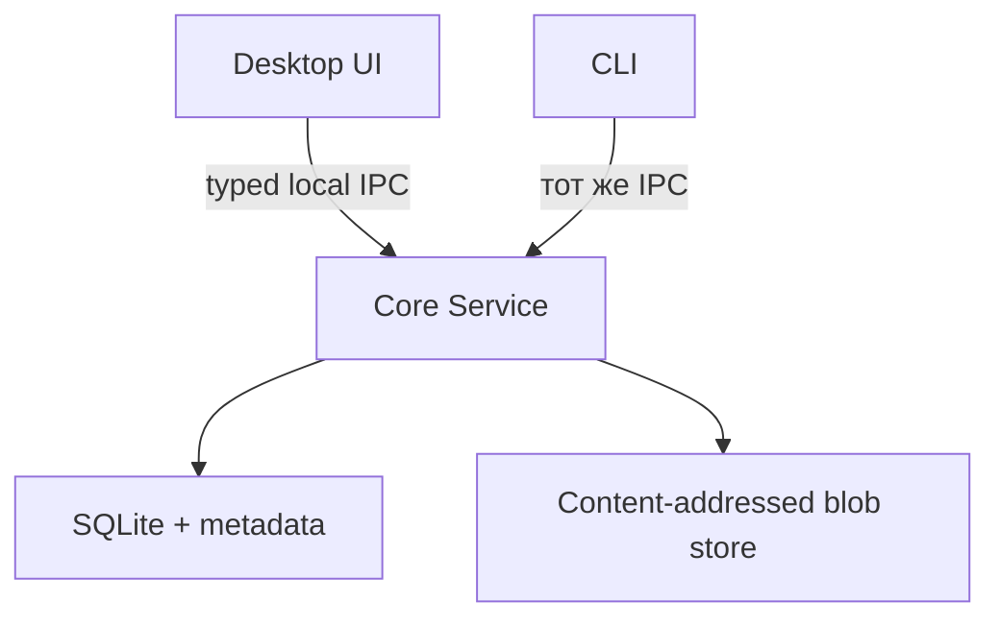
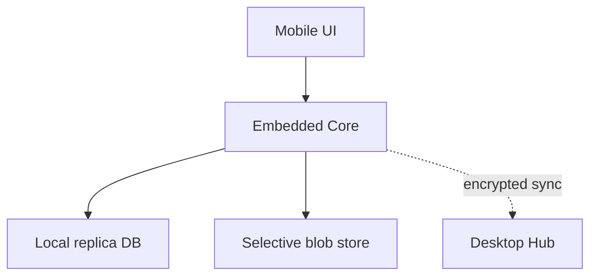
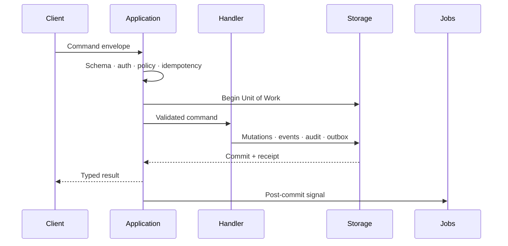
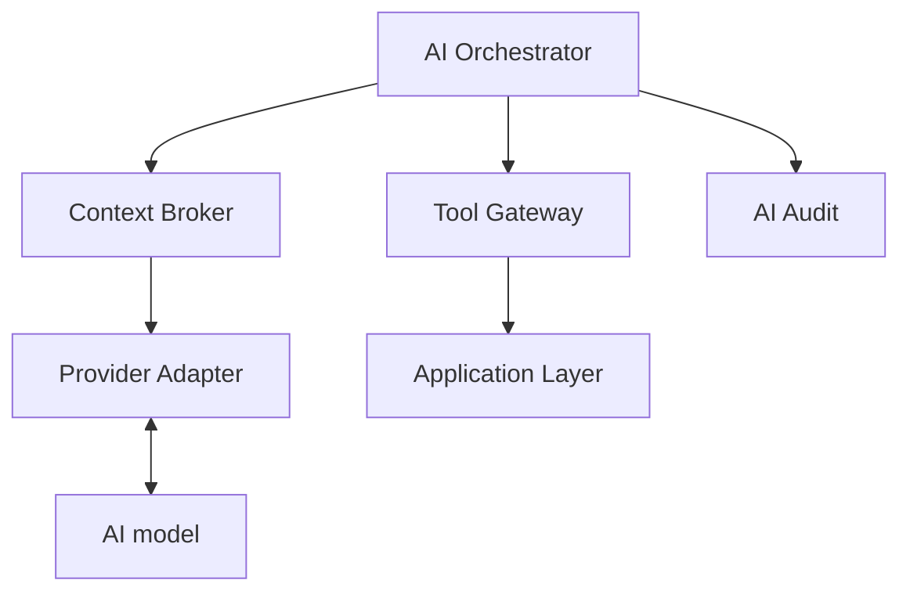

# Nabla Architecture v0.1

**Статус:** проект к утверждению  
**Дата:** 2026-07-11  
**Нормативная основа:** `CONSTITUTION.md` v0.1  
**Заменяет после утверждения:** `ARCHITECTURE-1.md` как действующий архитектурный документ

---

# 0. Назначение документа

Этот документ переводит Конституцию Nabla в конкретную структуру системы:

- определяет процессы и deployment boundaries;
- разделяет Presentation, Application, Kernel, modules и persistence;
- задаёт единственные допустимые пути чтения и записи;
- определяет владение данными и зависимостями;
- фиксирует локальную транзакционную модель;
- оставляет совместимые extension points для mobile, sync и AI;
- задаёт обязательные свойства v1, без которых v2-v3 потребовали бы переписывания фундамента.

Документ намеренно не определяет:

- поля всех сущностей;
- окончательный DDL;
- wire-format IPC и sync;
- синтаксис Safe Query DSL;
- алгоритм Markdown merge;
- PDF rendering engine;
- конкретный язык Core Runtime;
- календарную последовательность задач.

Эти решения принимаются в подчинённых specifications и ADR.

## 0.1 Нормативность

Формулировки MUST, MUST NOT, SHOULD и MAY используются в смысле `CONSTITUTION.md`.

Если этот документ допускает поведение, запрещённое Конституцией, действует Конституция, а расхождение регистрируется как blocking architecture defect.

`ARCHITECTURE-1.md` после утверждения настоящего документа остаётся исторической архитектурной картой и источником контекста, но не параллельным источником истины.

---

# 1. Архитектурные драйверы

## 1.1 Главная задача

Nabla должна развиваться от локальной Desktop-системы знаний и документов до многоплатформенной среды обучения и контролируемой AI-оркестрации без потери накопленных данных и без замены основных путей чтения и записи.

## 1.2 Приоритеты

При конфликте архитектурных качеств действует следующий порядок:

1. сохранность и интерпретируемость canonical data;
2. возможность независимого export и recovery;
3. безопасность и ограничение полномочий;
4. локальная работоспособность;
5. совместимость эволюции и миграций;
6. корректность sync и conflict handling;
7. изоляция отказов;
8. производительность;
9. удобство реализации.

Производительность не оправдывает потерю provenance, прямой доступ к DB или скрытое изменение смысла данных.

## 1.3 Исходные предположения

- Nabla изначально является single-user системой.
- Пользователь может владеть несколькими устройствами.
- Устройства могут длительно работать без связи друг с другом.
- Desktop обычно хранит полную реплику и blob store, но не является обязательным для локальной работы другого устройства.
- Облачные сервисы, AI providers и network считаются ненадёжными внешними зависимостями.
- Imported content и AI output считаются недоверенными данными.
- Основной объём canonical metadata хранится в локальной реляционной DB; большие бинарные объекты хранятся отдельно.
- v1 использует встроенные модули; external plugins не являются условием первого выпуска.

## 1.4 Архитектурные не-цели

Архитектура не оптимизируется для:

- многопользовательского совместного редактирования;
- server-first SaaS;
- произвольного исполнения пользовательских scripts;
- полной замены файловой системы;
- полного event sourcing;
- единой универсальной модели «всего»;
- runtime-генерации новых программных возможностей;
- хранения данных без известного применения;
- зависимости core-функций от AI.

---

# 2. Системный контекст



## 2.1 Участники

### Пользователь

Владеет данными, выбирает outbound policies, подтверждает опасные действия и принимает решения о подключённых устройствах и providers.

### Presentation clients

Desktop UI, Mobile UI и CLI отображают состояние и отправляют typed commands/queries. Они не владеют canonical storage.

### Core Runtime

Общий переносимый runtime, содержащий Application Layer, Kernel mechanisms и активированные built-in modules.

### External adapters

Изолируют network, filesystem imports, AI providers и будущий sync protocol от внутренних contracts.

## 2.2 Trust boundaries

| Граница | Базовое доверие | Обязательная защита |
|---|---|---|
| UI → Core | Ограниченное | Typed schema, permissions, expected revision, limits |
| Module → Kernel | Ограниченное manifest | Declared scopes, owner, transaction boundary |
| Imported content → Core | Недоверенное | Parsing sandbox/limits, validation, no instructions |
| Sync peer → Core | Недоверенное до pairing | Device identity, authentication, replay protection |
| AI provider → Core | Недоверенное | Context policy, Tool Gateway, confirmation, audit |
| Local process → Core Service | Не считается автоматически доверенным | OS peer identity или install-scoped credential |

---

# 3. Логическая декомпозиция



Modules подключаются к Application Layer и Kernel registries через публичные contracts, но не меняют направление зависимостей.

## 3.1 Presentation

Отвечает только за:

- rendering;
- ввод и локальную UI-навигацию;
- optimistic presentation state;
- отправку commands;
- выполнение queries;
- отображение validation, conflict и freshness states.

Presentation MUST NOT содержать:

- domain calculations;
- SQL;
- mutation logic;
- sync merge;
- окончательную validation;
- AI permission decisions.

Client-side validation MAY улучшать UX, но Core validation остаётся авторитетной.

## 3.2 Core Host boundary

Host принимает IPC или in-process calls и отвечает за:

- lifecycle Core Runtime;
- authentication origin;
- request size/time limits;
- serialization и contract negotiation;
- cancellation;
- graceful shutdown;
- single-writer coordination.

Host не содержит предметную логику.

## 3.3 Application Layer

Application Layer координирует use cases:

- command/query dispatch;
- policies и permissions;
- cross-module workflows;
- transaction scope;
- external effect orchestration;
- user confirmation state;
- mapping capabilities в UI, CLI и AI tools.

Application Layer зависит от публичных module contracts и Kernel ports, но не от UI framework или конкретного provider SDK.

## 3.4 Kernel

Kernel реализует универсальные механизмы:

- Command и Query buses;
- Unit of Work;
- audit/evidence;
- revisions и heads;
- IDs и device sequence;
- domain events и outbox;
- registries;
- jobs/processors;
- generic relations;
- blob identity и integrity;
- policies;
- backup/recovery primitives;
- sync hooks;
- diagnostics.

Kernel MUST NOT знать, что такое note, PDF textbook, mathematical task, sleep session или review card.

## 3.5 Domain modules

Module владеет:

- своей domain model;
- schemas;
- command/query handlers;
- persistence adapters;
- processors;
- widgets/forms descriptions;
- loops;
- migrations;
- export policy;
- acceptance suite.

Module MUST NOT владеть Kernel DB connection, process lifecycle или global permissions.

## 3.6 Persistence

Persistence реализует storage ports и является единственным местом, где разрешён SQL и физическая работа с canonical files.

Module-specific SQL допускается только внутри зарегистрированного persistence adapter соответствующего модуля и только в Core Runtime.

Module persistence adapter получает от Kernel scoped transaction/read context и MUST NOT самостоятельно открывать canonical DB или владеть connection lifecycle.

## 3.7 External adapters

Adapter преобразует внутренний contract в конкретный внешний протокол или SDK.

Adapter MUST NOT:

- определять canonical schema;
- писать DB напрямую;
- расширять permissions;
- интерпретировать внешний ответ как истину без application policy.

---

# 4. Правила зависимостей и владения

## 4.1 Направление зависимостей

1. Kernel MUST NOT зависеть от Presentation, domain modules или providers.
2. Domain module MAY зависеть от Kernel contracts и собственных внутренних packages.
3. Module MUST NOT импортировать внутренние packages другого module.
4. Application Layer MAY зависеть только от Kernel contracts и публичных module contracts.
5. Presentation MAY зависеть от generated client contracts, но не от server-side handlers или repositories.
6. External adapter реализует port, объявленный Application/Kernel contract.
7. Persistence adapter реализует storage port и не экспортируется Presentation или AI Layer.

Циклические module dependencies запрещены.

## 4.2 Владение сущностями

Каждый entity type, command, query, event, processor и persistent field имеет ровно одного owner.

Owner отвечает за:

- semantic version;
- validation;
- migrations;
- retention;
- export;
- conformance tests;
- deprecation.

Shared ownership запрещён. Совместное использование выполняется через published contracts.

## 4.3 Межмодульное чтение

Module читает данные другого module только через:

- registered query;
- versioned read model;
- declared analytics source;
- domain event payload, если event contract содержит необходимые данные.

Произвольный SQL join по чужим tables запрещён.

Safe Query DSL MAY объединять зарегистрированные views только при явном owner, schema, limits и provenance.

## 4.4 Межмодульная запись

Module изменяет данные другого module только через published command или явно объявленный composite workflow.

Composite workflow:

- имеет одного owner;
- объявляет участвующие modules;
- выполняется в одном Unit of Work, если требуется атомарность;
- не запускает nested public commands;
- вызывает internal mutation ports участников с теми же permissions и validation;
- создаёт один command receipt и перечисляет sub-results;
- не получает произвольного доступа к tables участников.

## 4.5 Kernel-owned schemas

Kernel владеет только универсальными schemas: commands, idempotency, audit, events, revisions, registries, jobs, blobs, relations, migrations и transport hooks.

Предметные поля в Kernel schema запрещены.

---

# 5. Deployment и process model

## 5.1 Общий Core Runtime

Application Layer, Kernel и переносимая часть built-in modules MUST иметь общие semantics на Desktop и Mobile.

Platform host MAY различаться, но один и тот же command contract не должен означать разные предметные действия на разных устройствах.

## 5.2 Desktop v1



Production Desktop v1 состоит минимум из двух OS processes: Desktop UI и Core Service.

Single-process host MAY использоваться для spike, unit/integration tests или изолированного prototype, но:

- не считается security boundary;
- не является доказательством выполнения production release gate;
- сохраняет те же logical interfaces и запрет прямого доступа Presentation к storage;
- не должен закреплять process-global shortcuts, препятствующие переходу к отдельному Core Service.

### Desktop UI

- не открывает DB;
- не читает blob store напрямую, кроме выданного Core read handle;
- может быть перезапущен без остановки data integrity;
- не является writer.

### Core Service

- является единственным logical writer;
- владеет DB connections и blob adoption;
- обслуживает Desktop UI и CLI;
- запускает jobs;
- создаёт backup/export;
- в v2 получает роль sync hub.

Core Service SHOULD запускаться по требованию пользователя и MUST NOT требовать публичного network listener.

Если IPC реализован поверх TCP, listener MUST быть ограничен loopback, а запросы MUST проходить install-scoped authentication. Предпочтительны OS-native local IPC и peer credentials.

## 5.3 Mobile v2



Mobile использует Embedded Core в application process либо platform-compatible host.

Отдельный постоянно работающий background service не является архитектурным требованием.

Все platform background jobs MUST координироваться через тот же logical writer и не открывать второй независимый путь записи.

## 5.4 CLI и будущие clients

CLI на Desktop использует тот же IPC, permissions и command/query contracts, что Desktop UI.

Новый client не получает прямой storage access. Добавление client не требует изменения domain modules.

## 5.5 Desktop Hub

В v2 Desktop Core Service становится sync coordinator и обычно хранит полную реплику.

Hub:

- не является единственным источником истины;
- не отменяет локальную автономность devices;
- не разрешает conflicts через silent LWW;
- создаёт snapshots и blob manifests;
- принимает только paired devices;
- может быть восстановлен из backup и данных replicas.

---

# 6. Storage architecture

## 6.1 Локальный storage set

Каждое устройство имеет логически разделённые хранилища:

| Хранилище | Содержимое | Владелец записи |
|---|---|---|
| Canonical relational store | facts, entities, revisions, relations, audit, idempotency, durable outbox | Core writer |
| Blob store | immutable content-addressed files | Blob Service |
| Derived stores | FTS, backlinks, aggregates, model states, caches | Registered processors |
| Device-local store | UI state, paths, local blob presence, download progress | Local State Service |
| Secret store | tokens, API keys, encryption keys, device credentials | Secret Service |

Физически derived и device-local state MAY находиться в отдельных DB либо в изолированных logical namespaces одного engine. Независимо от размещения они MUST быть удаляемы без потери canonical state.

Secrets MUST физически находиться вне основной canonical DB.

## 6.2 Canonical relational store

SQLite является baseline engine для локальной canonical DB.

Причины выбора:

- локальная транзакционность;
- отсутствие server dependency;
- зрелые backup и integrity primitives;
- переносимость;
- достаточная производительность при single-writer model.

Смена engine не является Constitutional Amendment, но требует ADR, migration и обновления настоящего документа.

Core Runtime владеет всеми write connections. Read connections MAY использовать snapshot isolation/WAL при условии, что UI не получает raw connection.

## 6.3 Transaction domain

Одна canonical command transaction MUST атомарно фиксировать применимые:

- fact или revision;
- head/tombstone;
- relations;
- idempotency receipt;
- audit record;
- domain events;
- durable job/event outbox;
- sync outbox для syncable mutations.

Network, AI calls, PDF parsing и другие длительные операции MUST NOT выполняться внутри canonical transaction.

## 6.4 Derived state

Derived state:

- строится только после canonical commit;
- содержит source cursor или provenance;
- имеет processor version;
- допускает полное удаление и rebuild;
- MAY отставать от canonical state;
- MUST сообщать freshness, когда отставание влияет на решение пользователя.

## 6.5 Operational state

Operational state делится на:

- **transaction-critical:** idempotency, outbox, migration state, durable workflow state;
- **recreatable:** leases, ephemeral cursors, retries, diagnostics buffers.

Transaction-critical operational records MUST храниться в том же atomicity domain, что соответствующая canonical mutation.

## 6.6 DB ownership и migrations

1. Только Core Service/Embedded Core открывает canonical DB.
2. Каждая migration имеет ID, owner, checksum, forward plan и recovery plan.
3. Migrations выполняются под exclusive writer lock.
4. Перед несовместимой migration обязателен проверенный backup или безопасная копия.
5. Module activation блокируется, если его schema version несовместима.
6. Unknown future schema открывается read-only либо отклоняется; silent downgrade запрещён.

---

# 7. Command architecture



## 7.1 Command envelope

Core собирает внутренний validated Command Envelope из client-controlled request fields и trusted execution metadata.

Client MAY передавать только schema-bound intent fields: command type/version constraint, command ID, idempotency key, expected revisions/preconditions, payload, preview/confirmation references и correlation request. Actor, origin, device identity, effective permissions и authoritative accepted time определяются либо проверяются Core Host и MUST NOT приниматься из domain payload как доверенные значения.

Внутренний envelope содержит:

- command type и version;
- command ID;
- idempotency key и scope;
- actor/origin;
- device/client identity;
- client-issued time, если он нужен для UX/provenance, и отдельный Core-accepted time;
- expected revision или другие preconditions;
- payload;
- confirmation token для опасных действий, если требуется;
- trace/correlation ID.

Точный client request, trusted execution context и их mapping в validated envelope определяются `CAPABILITY-CONTRACT.md`.

## 7.2 Pipeline

Command проходит:

1. transport limits и decoding;
2. contract/version negotiation;
3. schema validation;
4. origin authentication;
5. permission и sensitivity policy;
6. idempotency lookup;
7. optimistic preconditions;
8. Unit of Work;
9. handler validation и mutation;
10. audit/events/outbox;
11. commit;
12. post-commit processors.

Ошибка любого шага до commit не оставляет частичной предметной mutation.

## 7.3 Handler rules

Command handler:

- детерминирован относительно canonical inputs, command payload и явного execution context, предоставленного Kernel, включая clock/ID generator;
- не использует скрытый wall clock, random source или environment state;
- не выполняет network calls;
- не обращается к UI;
- не меняет чужой module state вне composite workflow;
- возвращает typed result или typed error;
- объявляет undo policy;
- ограничивает batch size;
- эмитирует только versioned events.

## 7.4 Idempotency

Idempotency receipt сохраняется до тех пор, пока повторная доставка команды возможна по protocol и retention policy.

Payload equivalence MUST учитывать command version. Повтор key с другим payload возвращает `IDEMPOTENCY_CONFLICT`.

## 7.5 Optimistic concurrency

Изменение revisioned entity SHOULD передавать `expected_revision`.

Несовпадение не перезаписывает текущий head, а возвращает typed conflict с достаточными данными для refresh, merge или повторного решения пользователя.

## 7.6 Administrative workflows

Migration, restore и purge используют отдельные privileged entry points.

Они не доступны как generic command для UI или AI и требуют усиленных policy, preflight и audit.

---

# 8. Query architecture

## 8.1 Query path

Query проходит:

1. schema и version validation;
2. origin authentication;
3. read scopes и sensitivity policy;
4. cost/row/time limits;
5. registered query handler или Safe Query DSL;
6. provenance/freshness enrichment;
7. typed response.

## 8.2 Ограничения

Query MUST NOT:

- принимать raw SQL;
- выполнять canonical mutation;
- запускать скрытый external effect;
- обходить module ownership;
- возвращать secrets;
- отдавать AI больше данных, чем разрешено Context Broker.

## 8.3 Canonical и derived reads

Query contract явно указывает:

- читает ли он canonical, derived или mixed state;
- возможную задержку projection;
- provenance;
- pagination;
- максимальный объём;
- стабильность sorting;
- missing-data semantics.

## 8.4 Safe Query DSL

DSL используется для saved queries, layouts и analytics, но не заменяет public query contracts.

DSL MUST быть:

- read-only;
- типизированным;
- ограниченным зарегистрированными sources и joins;
- budgeted;
- versioned;
- способным возвращать provenance.

Точный набор operators определяется ADR-003 и отдельной specification.

---

# 9. Events, jobs и внешние эффекты

## 9.1 Три разных понятия

| Механизм | Назначение | Source of truth |
|---|---|---|
| Audit record | Кто и как выполнил действие | Да, evidence state |
| Domain event | Семантическое уведомление о committed change | Нет, если событие восстановимо из canonical state |
| Outbox/job record | Надёжная доставка или выполнение после commit | Operational |

Domain Event Log не превращает Nabla в full event-sourced систему.

## 9.2 Event contract

Event содержит:

- type и version;
- event ID;
- command/correlation ID;
- owner module;
- subject IDs;
- logical/device sequence;
- минимальный payload;
- sensitivity class;
- occurred/committed metadata.

Event payload не должен дублировать всё чувствительное содержимое сущности без необходимости.

## 9.3 Delivery semantics

Внутренние processors работают как минимум с at-least-once delivery.

Поэтому processor MUST быть:

- идемпотентным;
- checkpointed;
- ограниченным по ресурсам;
- наблюдаемым;
- повторяемым после crash.

## 9.4 External effect workflow

Network call или другой необратимый внешний эффект выполняется вне canonical transaction:

1. command фиксирует intent и durable outbox record;
2. executor получает intent после commit;
3. executor использует provider-side idempotency, если доступно;
4. результат или ошибка фиксируется новой command/fact;
5. retry следует declared policy и stop conditions.

Generic processor не может скрыто выполнять внешний эффект, не объявленный capability contract.

## 9.5 Failure handling

Permanent failure переводит job/workflow в typed terminal state. Он не блокирует unrelated queues.

Dead-letter state сохраняет минимальную diagnostics и позволяет контролируемый retry или cancellation.

---

# 10. Identity, revisions и relations

## 10.1 Global identity from v1

Все syncable entities, facts, revisions, events, commands и blobs MUST получать IDs, уникальные без центрального сервера, уже в v1.

Точный ID format определяется ADR-009, но он MUST поддерживать:

- генерацию offline;
- отсутствие координации между devices;
- стабильный export/import;
- безопасное сравнение equality;
- отсутствие зависимости от изменяемого user path или title.

## 10.2 Device identity и sequence

Каждая установка имеет device identity и монотонную local sequence для syncable commits.

Wall clock сохраняется для UX и диагностики, но не является единственным механизмом causal ordering.

## 10.3 Revision model

Revisioned entity состоит из:

```text
entity identity
immutable revisions
parent edges
one or more heads
tombstone/archive state
```

v1 обычно имеет один head, но revisions уже содержат parentage, необходимый для будущего DAG merge.

Формат хранения full snapshots/patches определяется ADR-002. Public revision semantics от этого не меняется.

## 10.4 Conflicts

Concurrent descendants общего ancestor создают несколько heads.

Разрешение:

1. deterministic fast-forward, если ветвления нет;
2. three-way merge для поддерживаемого content type;
3. явный conflict state при неуспехе;
4. resolution revision с несколькими parents.

Ни одна ветвь не удаляется автоматически.

## 10.5 Typed relations

Generic Relation Service хранит typed edges между registered entity types.

Relation contract определяет:

- source/target types;
- relation type и version;
- anchors;
- cardinality;
- ownership;
- delete/tombstone behavior;
- export/sync policy.

Backlinks являются derived projection.

Cross-module relation не даёт одному module права изменять content другого.

---

# 11. Blob architecture

## 11.1 Identity

Blob identity определяется cryptographic content hash и algorithm version.

Blob metadata отделена от domain Document entity и от device-local presence.

## 11.2 Adoption flow

Импорт blob выполняется crash-safe:

1. содержимое записывается во временный staging file;
2. вычисляются size, MIME evidence и checksum;
3. limits и basic validation проверяются до canonical reference;
4. файл атомарно перемещается в immutable hash path;
5. command transaction создаёт blob identity и domain reference;
6. orphaned staged/final files без DB reference безопасно удаляются последующим GC.

DB MUST NOT commit ссылку на отсутствующий final blob.

Исходный local path не является blob identity и не синхронизируется. Если он нужен для provenance, сохраняется отдельное явно классифицированное source reference; технический путь устройства остаётся device-local state.

## 11.3 Immutability и verification

Содержимое по hash path не изменяется in place.

Checksum проверяется:

- при import;
- перед включением в backup/export manifest;
- после transfer;
- при подозрении на corruption;
- периодически согласно policy.

## 11.4 Presence и selective transfer

Глобально синхронизируется blob identity и manifest metadata.

Наличие bytes на устройстве, download progress и local path являются device-local state.

## 11.5 Garbage collection

GC удаляет bytes только после проверки:

- отсутствия live canonical references;
- retention window;
- незавершённых imports/transfers;
- backup policy;
- pending sync/tombstones.

Purge использует отдельный более строгий workflow.

---

# 12. Kernel components

## 12.1 Command Bus

- registry command contracts;
- dispatch;
- schema/version validation;
- permissions;
- idempotency;
- Unit of Work;
- typed errors.

## 12.2 Query Bus

- registry query contracts;
- read scopes;
- pagination и limits;
- provenance/freshness;
- cancellation;
- caching hooks.

## 12.3 Revision Service

- entity/revision/head primitives;
- parent validation;
- optimistic concurrency;
- conflict state;
- revision retrieval;
- archive/tombstone primitives.

Revision Service не реализует domain-specific text merge.

## 12.4 Audit Service

- append-only command receipts;
- security-relevant read audit;
- privacy minimization;
- correlation;
- integrity evidence;
- retention hooks.

## 12.5 Event and Outbox Service

- transactional event append;
- post-commit signaling;
- delivery attempts;
- checkpoints;
- dead-letter state;
- sync change journal.

## 12.6 Module Registry

- manifest discovery;
- compatibility;
- dependency DAG;
- lifecycle;
- migrations;
- activation state;
- safe disable/archive.

## 12.7 Capability Registry

- commands;
- queries;
- events;
- processors;
- widgets;
- forms;
- exporters.

Kernel Capability Registry является единственным авторитетным registry capability descriptors и хранит versions, owner, schemas, scopes и test references. Presentation MAY строить только read-only client projection и registry platform renderers; такая projection не становится вторым источником истины.

## 12.8 Workflow Registry

- first-class Workflow Descriptors;
- pinned versions и state schemas;
- finite state-machine validation;
- step/capability/external-effect references;
- OT transition authority;
- retry/compensation/cancellation policies;
- active-instance compatibility и recovery.

Workflow Registry не создаёт новый unrestricted capability kind. Entry и result operations остаются typed Commands/Queries, а workflow composition проходит отдельный contract validation.

## 12.9 Loop Registry

- loop declarations;
- producer/consumer validation;
- field coverage;
- collection cost;
- observation review dates;
- retention and export checks.

## 12.10 Relation Service

- typed edges;
- endpoint validation;
- anchor contracts;
- relation ownership;
- rebuildable backlink indexes.

## 12.11 Blob Service

- staging/adoption;
- content addressing;
- integrity;
- references;
- local presence;
- GC;
- backup/export streams.

## 12.12 Job Runner

- durable job state;
- processor registration;
- concurrency/resource budgets;
- retry/cancellation;
- checkpoints;
- failure isolation.

## 12.13 Search and Index Service

- source registration;
- full-text/property/relation indexing;
- index versions;
- rebuild;
- query limits;
- freshness.

Search schemas остаются derived.

## 12.14 Policy Engine

- capability permissions;
- sensitivity;
- outbound data;
- confirmation requirements;
- batch/time/resource limits;
- AI tool exposure;
- module restrictions.

## 12.15 Migration Service

- ordered migrations;
- checksums;
- compatibility gates;
- exclusive execution;
- recovery reporting;
- module migration coordination.

## 12.16 Backup and Recovery Service

- consistent DB snapshot;
- blob manifest;
- checksums;
- restore staging;
- integrity validation;
- rebuild derived state.

---

# 13. Capability architecture

## 13.1 Capability types

Nabla использует ограниченный набор primitives:

- Command;
- Query;
- Event;
- Processor;
- Widget;
- Form;
- Exporter.

Сложный use case собирается как explicit workflow, а не как unrestricted capability.

Workflow является отдельным first-class registered contract, но не capability kind: он связывает entry Command, конечный state machine, bounded steps и result Query, не предоставляя generic execution surface.

## 13.2 Contract identity

Capability identity включает stable ID и semantic version.

Contract объявляет как минимум:

- owner;
- input/output schemas;
- permissions/scopes;
- limits;
- preconditions;
- idempotency или read semantics;
- preview/confirmation;
- undo policy;
- events;
- error contract;
- consumers;
- acceptance tests.

Точный meta-schema определяется `CAPABILITY-CONTRACT.md`.

## 13.3 Compatibility

- Patch version не меняет accepted inputs или observable semantics несовместимо.
- Minor MAY добавлять backward-compatible optional data.
- Major используется для несовместимого contract.
- Core MAY одновременно обслуживать ограниченное число поддерживаемых versions.
- Unknown major version отклоняется явно.

## 13.4 Forms и widgets

Widget связывается только с registered Query или Safe Query DSL definition.

Form связывается только с одной declared Command либо entry Command зарегистрированного explicit workflow.

Widget/Form description не содержит executable code.

## 13.5 Layout-as-data

Layout является revisioned entity и содержит:

- pages/sections;
- widget instances;
- query bindings;
- props;
- responsive rules;
- display conditions.

Layout не может создавать capability, которой нет в registry, или расширять её permissions.

---

# 14. Module architecture

## 14.1 Packaging v1

В v1 modules являются compile-time packages, поставляемыми вместе с приложением.

Runtime выполняет только:

- manifest validation;
- activation/deactivation;
- configuration;
- migrations;
- capability registration.

## 14.2 Manifest

Manifest описывает:

- module ID/version;
- compatible Kernel range;
- dependencies;
- owned schemas;
- capabilities/events/processors;
- workflows и external-effect rules;
- widgets/forms;
- loops;
- permissions;
- sync/export/retention policies;
- migrations;
- acceptance suite.

Формат определяется `MODULE-MANIFEST.md`.

## 14.3 Lifecycle

```text
discovered → validated → migrated → activated → running
                                      ↓
                                  disabled → archived
```

Disable:

- прекращает handlers/processors;
- не удаляет canonical data;
- сохраняет export path через restricted maintenance exporter либо документированный generic fallback;
- сохраняет manifest metadata, необходимую для интерпретации;
- запрещается, если нарушит обязательную dependency.

## 14.4 Failure isolation

Module exception откатывает текущую transaction и переводит module/job в diagnostic state, но не останавливает независимые modules.

Unknown widget или inactive module отображаются как локально недоступный component с понятным recovery/export path.

## 14.5 Future external modules

External executable modules не входят в v1.

Их добавление требует ADR-007 и реализации trusted installation boundary согласно I6 Конституции. Manifest сам по себе не является sandbox.

---

# 15. v1 module boundaries

## 15.1 Platform Shell

Владеет:

- navigation shell;
- layout rendering;
- platform renderer registry и read-only client projection Kernel Capability Registry;
- settings surfaces;
- diagnostics UI;
- command/query client.

Не владеет предметными entities.

## 15.2 Knowledge module

Владеет концептами:

- spaces/collections;
- notes и note revisions;
- typed properties;
- tags;
- templates;
- saved queries;
- knowledge-specific commands/queries.

Точные schemas определяются `KNOWLEDGE-MODULE.md`.

## 15.3 Document module

Владеет:

- documents и versions;
- annotations;
- bookmarks;
- reading position/checkpoints;
- bounded active reader session state; completed session history требует
  отдельного approved loop и не собирается в v1 по умолчанию;
- document reader contracts;
- text extraction processors.

Blob bytes остаются во владении Kernel Blob Service.

Точные anchors и rendering engine определяются `DOCUMENT-MODULE.md`, ADR-006 и ADR-011.

## 15.4 Связи Knowledge ↔ Documents

Связи note-document, annotation-note и source references используют generic Relation Service.

Ни Knowledge, ни Document module не читает чужие tables напрямую.

Cross-module UI, например split view, является composition Platform Shell над двумя public queries и отдельными commands.

## 15.5 Search integration

Каждый module регистрирует indexable sources и serializers в Search Service.

Search result содержит owner module, entity ID, source version и navigation target.

Search Service не становится владельцем проиндексированного content.

---

# 16. Sync architecture v2

## 16.1 Что закладывается в v1

Хотя network sync не входит в v1, v1 MUST уже иметь:

- globally unique offline IDs;
- device identity;
- revision parentage;
- tombstones/archive semantics;
- immutable fact identity;
- content-addressed blobs;
- logical/device sequence;
- transactional change/outbox records для syncable types;
- versioned schemas и events.

Это предотвращает разрушительную миграцию идентичности после накопления пользовательских данных.

## 16.2 Sync classes

| Класс | Sync behavior |
|---|---|
| Immutable facts | Union by global ID; duplicate payload mismatch → integrity conflict |
| Revisioned entities | Transfer revisions/parents/heads; merge или explicit conflict |
| Relations | Versioned facts/revisions согласно relation contract |
| Blobs | Manifest by hash; selective bytes transfer |
| Derived state | Не синхронизируется как source of truth |
| Device-local state | Не синхронизируется |
| Secrets | Не синхронизируются обычным protocol |
| Operational transport | Локален protocol endpoint, кроме explicit receipts |

## 16.3 Protocol properties

Sync protocol MUST обеспечивать:

- mutual authentication paired devices;
- encryption in transit;
- protocol/schema negotiation;
- replay protection и idempotency;
- resumable batches;
- bounded messages;
- checksums;
- explicit conflicts;
- device revocation;
- snapshot + incremental recovery.

## 16.4 Merge

Wall-clock LWW запрещён для пользовательского content.

Order определяется revision ancestry, device sequence и логическим временем. Wall clock используется только как дополнительная metadata.

## 16.5 Hub loss

Восстановление Hub:

1. restore последнего валидного backup;
2. validation schemas/manifests;
3. ingest отсутствующих facts/revisions с paired replicas;
4. rebuild derived state;
5. reconcile blob manifest;
6. resume incremental sync с новым cursor.

## 16.6 Tombstone GC

Tombstone удаляется физически только после retention proof, учитывающего paired devices, snapshots, backups и revoked-device policy.

Точная политика определяется ADR-008.

---

# 17. AI Operating Layer v3

## 17.1 Position

AI Layer является внешней orchestration над готовыми commands/queries, а не частью canonical domain model.



## 17.2 Provider Adapter

Изолирует:

- OAuth/API/local authorization;
- model capabilities;
- streaming;
- errors/retry;
- token/cost accounting;
- provider-specific formats.

Provider SDK не проникает в Kernel или module contracts.

## 17.3 Context Broker

Context Broker:

- получает user request;
- выбирает registered queries;
- применяет sensitivity/outbound policy;
- минимизирует context;
- показывает preview, когда требуется;
- сохраняет source provenance;
- не отправляет secrets.

## 17.4 Tool Gateway

Tool Gateway публикует модели только allowlisted capabilities с уменьшенными scopes, batch limits и confirmation policy.

Наличие capability в Registry не означает автоматическую доступность ИИ.

## 17.5 Authority levels

| Level | Возможности |
|---|---|
| 0 | Text-only, без персональных queries/tools |
| 1 | Разрешённые read-only queries |
| 2 | Proposals без mutation |
| 3 | Validated command drafts с подтверждением/policy |
| 4 | Заранее зарегистрированные restricted workflows |

Повышение level выполняется policy, а не текстом prompt.

## 17.6 AI proposals

AI-generated layout, metric, plan, form или loop сохраняется как proposal revision.

Apply проходит schema, capability, loop, permission, cost и preview validation.

## 17.7 AI external effects

AI provider call и AI-triggered external workflow используют механизм раздела 9.4. Они не выполняются внутри canonical transaction.

## 17.8 Prompt injection

Retrieved content остаётся data. Оно не может:

- изменить system/tool policy;
- добавить tool;
- расширить scope;
- отменить confirmation;
- потребовать раскрытия secret.

---

# 18. Security architecture

## 18.1 Threat model

Архитектура учитывает:

- malicious/corrupt imported file;
- prompt injection;
- compromised provider/token;
- unpaired или revoked device;
- replayed sync/command;
- local rogue process;
- lost device;
- corrupted DB/blob/backup;
- buggy module/processor;
- accidental destructive action.

## 18.2 Local IPC

Core Service не слушает non-loopback interfaces по умолчанию.

IPC использует OS peer identity или install-scoped credential и ограничивает:

- request size;
- connection count;
- command/query scopes;
- protocol version;
- timeouts.

## 18.3 Permissions

Permissions назначаются capability, а не только module.

Они ограничивают:

- entity/data classes;
- read/write scopes;
- batch size;
- time range;
- outbound access;
- external effects;
- confirmation level.

## 18.4 Secrets

Secret Service предоставляет opaque handles. Raw secret не возвращается обычным query и не попадает в audit, export, logs или AI context.

## 18.5 Encryption at rest

Полное DB/blob/backup encryption определяется ADR-005 после threat/risk и recovery analysis.

До принятия ADR система MUST честно документировать фактическую защиту и не заявлять encryption, которого нет.

## 18.6 Purge

Purge является отдельным privileged workflow:

- preview exact scope;
- dependency/reference analysis;
- replica/backup reachability report;
- explicit confirmation;
- staged execution;
- verification report;
- минимальный privacy-safe receipt, сохраняющий идемпотентность повторной доставки purge command.

Система не обещает уничтожение копии, которой она больше не управляет; такие ограничения показываются пользователю.

---

# 19. Backup, export и recovery

## 19.1 Разделение целей

| Механизм | Цель |
|---|---|
| Backup | Полное восстановление работоспособной Nabla |
| Export | Доступ к пользовательским данным без Nabla |
| Sync | Согласование replicas, не замена backup |

## 19.2 Backup set

Backup содержит:

- consistent canonical DB snapshot;
- schema/migration versions;
- module manifests/versions;
- blob manifest;
- выбранные canonical blobs;
- checksums;
- backup format version;
- creation/result metadata.

Derived indexes SHOULD не включаться либо считаться disposable.

## 19.3 Consistent snapshot

Backup Service фиксирует DB snapshot и соответствующий blob manifest из одной логической generation.

Blobs immutable по hash, поэтому bytes MAY копироваться после DB snapshot при сохранении manifest/checksum consistency.

## 19.4 Restore

Restore выполняется в staging:

1. manifest/checksum validation;
2. schema compatibility;
3. migrations на staging copy;
4. canonical integrity checks;
5. blob verification;
6. atomic activation восстановленного set;
7. rebuild derived state;
8. post-restore report.

Неудачный restore не должен разрушать текущий working set.

## 19.5 Restore testing

Backup без периодического успешного restore test не считается проверенным.

## 19.6 Portable export

Exporter работает через registered module exporters и общий manifest.

Он сохраняет stable IDs, versions, relations, units, timestamps, provenance и original files согласно I16.

---

# 20. Reliability, diagnostics и observability

## 20.1 Failure domains

Минимальные domains:

- UI/widget;
- module;
- command transaction;
- processor queue;
- index;
- blob;
- external adapter/provider;
- sync peer;
- backup job.

## 20.2 Error boundaries

- UI component failure не останавливает Core.
- Handler exception откатывает только текущую transaction.
- Processor failure блокирует только зависимую projection/job chain.
- Provider failure открывает circuit и не блокирует local core.
- Corrupt blob quarantined; остальные blobs доступны.
- Unknown module/widget version деградирует локально.

## 20.3 Diagnostics

Diagnostics предоставляет:

- component health;
- migration status;
- queue lag;
- projection freshness;
- index state;
- blob integrity failures;
- backup/restore status;
- sync/device status;
- provider errors;
- correlation IDs.

## 20.4 Logs vs Audit

Logs предназначены для диагностики и MAY ротироваться.

Audit является evidence state и имеет отдельную retention/privacy policy.

Logs по умолчанию не содержат note bodies, document text, secrets или полный AI context.

## 20.5 Crash recovery

После некорректного завершения Core:

1. DB выполняет recovery/integrity checks;
2. незавершённые transactions отсутствуют благодаря atomic commit;
3. outbox/jobs возобновляются идемпотентно;
4. staging/orphan blobs проверяются и очищаются;
5. interrupted migration требует отдельного recovery path;
6. UI получает явный health state.

---

# 21. Consistency и performance model

## 21.1 Consistency classes

| Состояние | Модель |
|---|---|
| Local canonical mutation | Strong transaction consistency |
| Immediate canonical query | Read-your-writes после commit |
| Derived projection | Eventual, с freshness metadata |
| Cross-device state | Eventual merge с explicit conflicts |
| Blob transfer | Eventual presence, integrity by hash |
| External provider result | Asynchronous workflow result |

## 21.2 UI responsiveness

UI MUST NOT ждать внутри render thread:

- PDF parsing;
- full-text indexing;
- backup;
- export больших наборов;
- sync batch;
- AI/network response.

Длительная операция возвращает job/workflow ID и observable progress/cancellation.

## 21.3 Bounded work

Commands/queries/processors объявляют:

- maximum batch;
- pagination;
- time/resource budget;
- cancellation behavior;
- retry policy;
- memory/streaming limits для blobs.

## 21.4 Performance honesty

Кэш или projection не может скрывать stale result, если freshness влияет на пользовательское решение.

Оптимизация MUST сохранять observable semantics и conformance tests.

Точные SLO определяются после измерительных spikes, а не угадываются в архитектуре.

---

# 22. Version boundaries

## 22.1 v1 — Kernel + Knowledge Desktop

### Обязательная платформа

- Desktop UI + Core Service;
- typed IPC;
- single writer;
- Command/Query buses;
- canonical transactions;
- IDs/device sequence;
- revisions/heads/tombstones;
- audit/events/outbox;
- registries;
- built-in modules;
- jobs;
- blobs;
- search/index rebuild;
- migrations;
- backup/restore/export;
- diagnostics.

### Предметные modules

- Knowledge;
- Documents/PDF;
- Platform Shell composition.

### Закладывается, но не включается как пользовательская функция

- syncable identity;
- revision parentage;
- dormant change journal/outbox;
- device identity;
- selective blob metadata hooks;
- AI-compatible capability contracts.

### Не входит

- Mobile client;
- network sync;
- Learning/Analytics domain;
- AI providers/OAuth;
- external executable plugins.

## 22.2 v2 — Learning + Analytics + Mobile + Sync

Добавляются:

- Learning module;
- generic observations;
- model/metric definitions;
- Analytics queries/projections;
- Mobile host/UI;
- paired-device sync;
- conflict resolution;
- selective blobs;
- device management;
- interactive graphs.

v2 не требует AI.

## 22.3 v3 — AI Operating Layer

Добавляются:

- provider adapters;
- Context Broker;
- Tool Gateway;
- AI Policy/Audit;
- proposals;
- confirmed command drafts;
- restricted workflows;
- AI evals и provenance.

Отключение v3 не нарушает v1-v2.

## 22.4 Scope discipline

Версия не может объявляться завершённой только по наличию UI. Она проходит соответствующий architecture gate, backup/export/recovery и conformance tests.

Feature, требующая ещё не существующего Constitutional mechanism, остаётся experimental и не включается в release.

---

# 23. Release gates

Release gate проверяет работающую систему и доказательства, а не наличие заявленного кода или экрана.

## 23.1 Gate v1

v1 считается архитектурно завершённой только если:

1. Desktop UI и CLI не имеют прямого доступа к canonical DB.
2. Все предметные mutations проходят Command pipeline.
3. Retry любой command не дублирует canonical effect.
4. Каждое persistent field классифицировано в Data Catalog.
5. Предметные fields покрыты loops, служебные — техническими justifications.
6. Note, relation, document и annotation сохраняют stable IDs после restart и после round-trip через обязательный machine-readable export/import format; human-readable export MAY не поддерживать обратный import.
7. Revision history восстанавливает прежнее состояние без уничтожения новых revisions.
8. Optimistic conflict не выполняет silent overwrite.
9. Derived indexes полностью удаляются и перестраиваются.
10. Backup восстанавливается на чистой совместимой установке.
11. Portable export читается без Nabla и проходит manifest validation.
12. Corrupt blob обнаруживается checksum-проверкой и изолируется.
13. Disable одного module не ломает Kernel и unrelated module.
14. Unknown widget/module version деградирует локально.
15. Core-функции проходят offline acceptance suite.
16. Global IDs, parent revisions, device sequence и dormant outbox присутствуют для syncable types.
17. Ни одна длительная внешняя или parsing operation не выполняется внутри canonical transaction.
18. Migrations и restore имеют recovery evidence.

## 23.2 Gate v2

v2 считается архитектурно завершённой только если:

1. Mobile читает и изменяет локальные данные offline.
2. Повторная доставка immutable fact не создаёт duplicate.
3. Payload mismatch одного global ID создаёт integrity conflict.
4. Concurrent note edits дают deterministic merge или explicit multiple-head conflict.
5. Ни одна ветвь revision DAG не теряется.
6. Sync transport аутентифицирован, зашифрован и устойчив к replay.
7. Revoked device больше не принимает и не отправляет новые sync changes.
8. Derived states не передаются как source of truth и воспроизводятся из одинаковых facts/versions.
9. Raw learning observations не меняются при замене model или scheduler.
10. Hub восстанавливается из backup и дополняется изменениями replicas.
11. Blob presence остаётся device-local.
12. Tombstone GC следует принятой retention proof.
13. Неизвестная protocol/schema version отклоняется без corruption.
14. Отсутствие Hub не блокирует локальные commands.

## 23.3 Gate v3

v3 считается архитектурно завершённой только если:

1. AI provider не имеет прямого DB/blob/secret access.
2. Level 0-1 технически не может выполнить mutation.
3. Proposal не изменяет canonical state до Apply.
4. Apply проходит schema, permissions, loop, cost и confirmation policy.
5. Повтор AI tool call не дублирует mutation или внешний effect.
6. Prompt injection из content не расширяет tool scopes.
7. Outbound sources и redactions видимы в audit/preview согласно policy.
8. Provider replacement не меняет capability contracts.
9. AI result не подменяет raw observation и хранит provenance/uncertainty.
10. Restricted workflow имеет scope, budget, stop conditions и compensation/undo policy.
11. Неавторизованная self-reconfiguration отклоняется validators.
12. Provider outage не блокирует v1-v2.
13. Полное отключение AI Layer оставляет все не-AI data читаемыми и изменяемыми.

## 23.4 Gate discipline

- Gate evidence хранится рядом с release metadata.
- Flaky либо вручную не воспроизводимый результат не считается доказательством.
- Неисполненный критический пункт нельзя заменить обещанием в ROADMAP.
- Новая версия может иметь дополнительные product criteria, но не ослабляет предыдущие применимые gates.

---

# 24. Обязательные ADR и spikes

## 24.1 ADR из исходной карты

| ADR | Решение | Требуется до |
|---|---|---|
| ADR-001 | Язык, packaging и process model Core Runtime | Production skeleton |
| ADR-002 | Full snapshots, patches или hybrid revisions | Revision DDL |
| ADR-003 | Safe Query DSL | Layout/saved-query implementation |
| ADR-004 | Markdown three-way merge и conflict format | Sync conflict implementation |
| ADR-005 | DB/blob/backup encryption и key recovery | Security claim/release policy |
| ADR-006 | Stable document anchors | Annotation schema freeze |
| ADR-007 | Module packaging/trust | Module framework freeze |
| ADR-008 | Retention, tombstones, audit, backups и purge | DDL retention rules |

## 24.2 Дополнительные обязательные ADR

| ADR | Решение | Причина |
|---|---|---|
| ADR-009 | Global IDs, device identity, sequence и logical time | Эти поля должны существовать с v1 |
| ADR-010 | Local IPC, authentication и Core lifecycle | Фиксирует real security/process boundary |
| ADR-011 | PDF renderer/parser, licensing и isolation | Document module зависит от внешнего engine |
| ADR-012 | Migration framework и compatibility policy | Нужен до первого долгоживущего DDL |

## 24.3 Обязательные spikes

### Core portability spike

Проверяет выбранный runtime на:

- Desktop Core Service;
- Mobile Embedded Core;
- SQLite transactions;
- IPC/FFI;
- packaging;
- agent/tooling support.

### PDF spike

Проверяет:

- rendering fidelity;
- text layer;
- page/text/visual anchors;
- highlights;
- large-document memory;
- search extraction;
- licensing;
- malformed PDF isolation.

### Backup/restore spike

Проверяет consistent SQLite snapshot + blob manifest и восстановление на чистой установке.

### Revision/sync-preparation spike

Проверяет offline ID generation, parent revisions, idempotent outbox и deterministic replay без реализации network sync.

Spike не пишет production data и завершается измерениями, выводом и ADR input.

## 24.4 Порядок принятия решений

Не требуется ждать всех ADR перед любым prototype. Однако DDL или public contract не замораживается до принятия влияющих на него ADR.

Module specification MAY сначала зафиксировать требования, затем зависимый spike/ADR, после чего specification получает окончательный статус.

---

# 25. Политика разработки и автоматизации

## 25.1 Contract first

До production-реализации capability существуют:

- owner;
- input/output schema;
- permissions;
- error contract;
- idempotency/read semantics;
- undo policy;
- loop или technical justification;
- acceptance tests.

Spike MAY предшествовать окончательному contract, но не становится production implementation автоматически.

## 25.2 Размер изменения

Одна implementation task SHOULD завершать один проверяемый contract или один ограниченный вертикальный slice.

Задача вида «реализовать sync» или «сделать модуль знаний» слишком широка для принятия без декомпозиции.

Допустимый slice содержит:

- одну capability или узко связанный workflow;
- schema/migration;
- handler;
- tests;
- diagnostics;
- documentation/conformance update.

## 25.3 Ограничения автоматизированных агентов

Агент без отдельного утверждённого решения MUST NOT:

- менять Конституцию;
- ослаблять release gate или acceptance test;
- добавлять production dependency;
- менять public capability contract несовместимо;
- вводить новый data class;
- обходить Command/Query boundary;
- изменять чужой module schema напрямую;
- добавлять network listener или outbound flow;
- включать runtime code execution;
- удалять migration/recovery path.

Если задача требует такого действия, агент останавливает mutation, формулирует ADR/CA need и передаёт решение владельцу проекта.

## 25.4 Dependency governance

Новая production dependency требует:

- owner и purpose;
- license review;
- security/maintenance оценку;
- size/performance impact;
- offline behavior;
- replacement/exit strategy;
- lockfile/version pinning policy.

Transitive dependency не считается бесплатной только потому, что её не импортирует application code напрямую.

## 25.5 Автоматические архитектурные проверки

CI MUST обнаруживать как минимум:

- DB writes вне persistence boundary;
- module без manifest/owner;
- capability без version/scopes/tests;
- persistent field без catalog classification;
- предметное поле без loop;
- служебное поле без purpose/retention;
- command без idempotency/undo policy;
- syncable mutation без transactional outbox;
- derived store без rebuild processor;
- secret в запрещённом store/log/export;
- migration без checksum/recovery plan;
- module dependency cycle;
- raw SQL в Presentation/AI/adapters;
- unbounded query или batch capability.

## 25.6 Spec drift

После каждого milestone выполняется сверка:

- manifests ↔ registered capabilities;
- contracts ↔ handlers/clients;
- schemas ↔ Data Catalog;
- loops ↔ persistent fields;
- migrations ↔ actual DB versions;
- Conformance Matrix ↔ tests;
- README/ROADMAP ↔ реальный scope.

Расхождение создаёт defect. Код не становится новым контрактом молча.

## 25.7 Review evidence

Архитектурное изменение считается проверенным только при наличии сочетания:

- contract review;
- automated tests;
- migration/recovery evidence, если затронуты данные;
- threat review, если затронуты permissions/network/AI;
- measured spike, если решение зависит от производительности или platform behavior.

---

# 26. Сценарная проверка архитектуры

| Сценарий | Архитектурный путь | Условие успеха |
|---|---|---|
| Новый модуль сна | Manifest → immutable observation → commands/queries → loop → widget/export | Kernel и существующие modules не меняются |
| Замена memory model | Новый processor/model version → rebuild derived state | Raw review observations и scheduler history не меняются |
| Смена AI provider | Новый Provider Adapter | Tools, permissions и canonical schemas не меняются |
| Concurrent edit заметки | Общий ancestor → две revisions → merge/conflict → multi-parent resolution | Ни одна версия текста не теряется |
| Потеря Desktop Hub | Backup restore → replica ingest → projection rebuild → blob reconciliation | Canonical history восстанавливается без признания derived state истиной |
| Падение analytics processor | Job failure/dead-letter → stale projection marker | Notes, documents, raw observations, export и backup работают |
| Повреждение одного blob | Checksum failure → quarantine → recovery lookup | DB и остальные blobs доступны; corruption явно показана |
| Malicious PDF/prompt | Bounded parser/Context Broker → no tool escalation | Content не выполняет код и не расширяет permissions |
| Повтор command/sync packet | Idempotency receipt/replay protection | Canonical effect появляется ровно один раз |
| Многолетняя эволюция | Versioned schema/contracts → migrations → export/deprecation | Старые данные остаются интерпретируемыми |

## 26.1 Результат проверки

Все перечисленные сценарии имеют путь через уже определённые boundaries; ни один не требует прямой DB mutation из UI/AI, полной смены storage model или превращения Kernel в предметный monolith.

Открытые риски сосредоточены в конкретных ADR/spikes, а не скрыты в общих формулировках:

- portability Core Runtime;
- revision encoding;
- IPC security;
- PDF rendering/anchors;
- encryption/recovery;
- tombstone retention;
- Safe Query DSL.

---

# 27. Constitutional Conformance Matrix

| Инвариант | Архитектурный механизм | Основное доказательство |
|---|---|---|
| I1 | Core-owned storage, Command API, Audit Service, privileged admin workflows | Static write-boundary + integration tests |
| I2 | Immutable facts + correction chain | Storage permission/repository tests |
| I3 | Entity/revision/head/DAG model | History/conflict tests |
| I4 | Versioned processors + rebuildable stores | Delete-and-rebuild tests |
| I5 | Semantic contract versions + migrations | Compatibility tests |
| I6 | Registries, manifests, compile-time v1 modules | Activation/trust tests |
| I7 | Data Catalog + Loop Registry + service-field justification | Catalog validator |
| I8 | Capability outcomes + acceptance suites | End-to-end outcome tests |
| I9 | Separate raw/confidence/uncertainty schemas | Schema/model recalculation tests |
| I10 | Command envelope, receipts, transactional audit/outbox | Retry/property-based tests |
| I11 | Declared undo policy + isolated purge | Undo/destructive-flow tests |
| I12 | Local DB/Core, external adapters, queued offline work | Network-blocked suite |
| I13 | Context Broker, Tool Gateway, provider isolation | Injection/escalation tests |
| I14 | Raw source + versioned transformations/provenance | Raw/transformed trace tests |
| I15 | Failure domains, transaction rollback, job isolation | Fault-injection suite |
| I16 | Module exporters + common manifest + original blobs | External readability/import tests |

Ни одна строка не может перейти в `not_applicable` для всей системы. Конкретный module MAY отметить неприменимые инварианты только с обоснованием в собственной Conformance Matrix.

---

# 28. Architecture acceptance criteria

`ARCHITECTURE.md` v0.1 готов к утверждению, если:

1. все system components имеют однозначные responsibilities;
2. направления dependencies не образуют cycles;
3. каждый canonical write path проходит Core boundary;
4. Desktop и Mobile используют одинаковые command semantics;
5. v1 содержит минимальные identity/revision/outbox primitives для v2 sync;
6. Kernel не содержит domain concepts;
7. Knowledge и Document modules разделены публичными contracts;
8. external calls не выполняются внутри canonical transaction;
9. storage classes имеют владельцев и допустимые writers;
10. все открытые технологические решения вынесены в ADR/spikes;
11. Conformance Matrix покрывает I1-I16;
12. владелец проекта явно утверждает документ.

После утверждения следующий нормативный документ — `DATA-CLASSIFICATION.md`.

Дальнейшая последовательность:

1. `DATA-CLASSIFICATION.md`;
2. `CAPABILITY-CONTRACT.md`;
3. `MODULE-MANIFEST.md`;
4. `LOOP-SPEC.md`;
5. `KNOWLEDGE-MODULE.md`;
6. `DOCUMENT-MODULE.md`;
7. `BACKUP-RECOVERY.md`;
8. зависимые ADR и spikes;
9. v1 DDL;
10. v1 ROADMAP.
