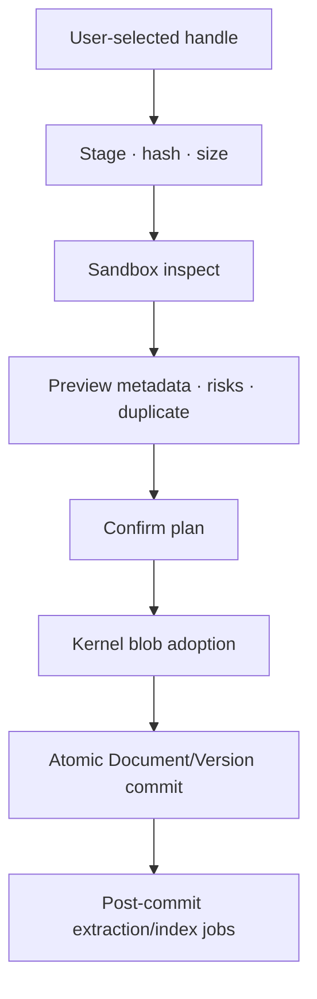

# Nabla Documents Module Specification v0.1

**Статус:** проект к утверждению  
**Дата:** 2026-07-13  
**Нормативная основа:** `CONSTITUTION.md` v0.1, `ARCHITECTURE.md` v0.1,
`DATA-CLASSIFICATION.md` v0.1, `CAPABILITY-CONTRACT.md` v0.1,
`MODULE-MANIFEST.md` v0.1, `LOOP-SPEC.md` v0.1  
**Согласован с optional integration:** `KNOWLEDGE-MODULE.md` v0.1  
**Module ID:** `documents`  
**Целевая версия module contract:** `1.0.0`  
**Следующий зависимый документ:** `BACKUP-RECOVERY.md`

---

# 0. Назначение

Module `documents` является владельцем переносимой библиотеки документов и
локального PDF-reading workflow Nabla v1.

Настоящий документ определяет:

- границу владения Documents и Kernel Blob Service;
- stable Document identity, metadata revisions и immutable content versions;
- безопасный import/adoption original PDF bytes;
- parser, text extraction, optional OCR и page-render projections;
- version-bound stable anchors и re-resolution;
- annotations, bookmarks и user extraction corrections;
- live cursor, durable checkpoints и resume projection без скрытой reading
  telemetry;
- reader/search/UI contracts;
- capability, catalog, loop, manifest, export и recovery surface;
- optional typed relations с Knowledge без циклической зависимости.

Module хранит original bytes и пользовательские semantic artifacts так, чтобы
они оставались доступны, проверяемы и экспортируемы независимо от конкретного
PDF engine.

## 0.1 Нормативность

Этот документ финализирует preliminary Documents decisions родительских
contracts. При расхождении действует иерархия `CONSTITUTION.md` §5.

Product descriptor MAY уточнить измеренный numeric limit или serialization
dialect только внутри обозначенного blocking decision. Он MUST NOT:

- объединить metadata revision и content identity так, что rename ломает
  anchors;
- признать extraction/OCR единственным source of truth;
- переписать canonical anchor после parser update;
- сохранять каждый scroll movement или completed reading session «на будущее»;
- позволить renderer/parser писать canonical state;
- получить Knowledge table access;
- скрыть original file или исключить его из portable export.

## 0.2 Область v1

Обязательный v1 scope:

- import локально выбранного PDF;
- immutable original bytes через Kernel Blob Service;
- library metadata и version history;
- локальный sandboxed PDF render;
- embedded text extraction, когда доступна;
- full-text search по успешно извлечённому text layer;
- annotations/highlights, bookmarks и resume checkpoints;
- machine-readable lossless export + original PDF export;
- archive/restore, backup hooks и explicit purge boundary;
- local-first operation без cloud/AI/network dependency.

OCR и manual extraction corrections имеют полностью определённые semantics, но
MAY быть выключены в первом release profile, если PDF spike не подтверждает
bounded local implementation. Выключение означает отсутствие их producers/UI,
а не сохранение неиспользуемых полей.

## 0.3 Не-цели v1

Documents v1 не определяет и не владеет:

- office-suite editing или conversion;
- произвольный file manager;
- browser fetch, web clipping или remote URL download;
- cloud OCR;
- DRM bypass;
- PDF JavaScript, embedded executable actions или arbitrary plugins;
- real-time collaboration/CRDT;
- completed reading-session analytics, dwell-time telemetry или productivity
  scoring;
- Learning concepts/tasks/schedules;
- Note content, Tags, Collections или Saved Queries;
- network sync transport;
- AI summarization, embeddings или autonomous annotation.

Unknown/unsupported format MAY сохраняться только maintenance restore path как
opaque versioned record, если он уже присутствует в compatible backup/export.
Обычный v1 import не превращает Documents в хранилище произвольных bytes.

---

# 1. Инварианты Documents

1. Document имеет stable `document_id`, не зависящий от title, path, filename,
   blob hash или active version.
2. Metadata edit создаёт immutable Document Revision и не создаёт новую content
   version без новых original bytes.
3. Document Version является immutable content identity, ссылающейся на exact
   Kernel Blob identity/checksum.
4. Original bytes никогда не изменяются in place; replacement создаёт новую
   Document Version.
5. Blob bytes принадлежат Kernel Blob Service; Documents владеет domain
   reference, semantics, policy и export coverage.
6. Commit canonical Document Version невозможен, если final blob presence и
   checksum не подтверждены Kernel adoption workflow.
7. Parser, renderer, OCR, thumbnail, search и anchor resolver пишут только
   `DD/OR` и не меняют original bytes или canonical user artifacts.
8. Parser failure не удаляет и не переклассифицирует original PDF.
9. Canonical anchor всегда связан с exact `document_version_id` и сохраняет
   capture evidence.
10. Parser/renderer update создаёт новую resolved-anchor projection; canonical
    anchor не переписывается.
11. Retarget annotation/bookmark к другой content version создаёт новую
    revision после preview; старый anchor остаётся в history.
12. Annotation, Bookmark и Extraction Correction имеют stable entity IDs и
    immutable revisions.
13. Annotation body v1 является inert bounded text; она не исполняет Markdown,
    HTML, commands или scripts.
14. Live cursor и zoom/viewport state являются device-local и не sync/export
    authority.
15. Durable resume checkpoint является минимальным immutable fact; каждый
    pixel/page movement canonical не сохраняется.
16. Concurrent checkpoints не теряются и не разрешаются silent wall-clock LWW.
17. Completed Reading Session facts не собираются в v1 без отдельного approved
    Loop и user-facing consumer.
18. Reader работает без extraction/search; derived failure локально деградирует
    feature, а не original access.
19. Search result всегда указывает Document, content version, page/anchor,
    extraction version и freshness.
20. Document, annotations, bookmarks, corrections, checkpoints и relations
    доступны только через registered capabilities и scoped Kernel ports.
21. Documents не читает Knowledge storage и не получает Knowledge authority.
22. Cross-module relation сохраняет opaque stable endpoints при inactive
    target module.
23. Default v1 reader/import не выполняет network requests из PDF content.
24. Original PDF и достаточная machine metadata входят в required portable
    export и full backup.
25. Module disable сохраняет canonical records, schemas, anchors и maintenance
    export.
26. Purge отделён от archive и учитывает shared blobs, revisions, relations,
    replicas и backups.
27. Effective sensitivity derived output не ниже original/annotation inputs;
    `P4` никогда не доступен cloud AI.
28. Every persistent field имеет exact Catalog coverage и active LoopRef либо
    TechnicalPurposeRef.

---

# 2. Владение и границы

## 2.1 Owned domain concepts

| Concept | Canonical owner | Основная роль |
|---|---|---|
| Document | `documents` | Stable library artifact identity |
| Document Revision | `documents` | Immutable metadata/policy/current-version snapshot |
| Document Version | `documents` | Immutable content-version reference to original blob |
| Import provenance | `documents` | Trace of explicitly adopted source bytes |
| Annotation | `documents` | User-created version-bound semantic artifact |
| Canonical Anchor | `documents` | Capture evidence inside Annotation/Bookmark/Correction revision |
| Bookmark | `documents` | Named user navigation point |
| Extraction Correction | `documents` | User-authored sidecar correction, never overwrite of extraction |
| Reading Checkpoint | `documents` | Minimal immutable resume observation |
| Document cross-module relation types | `documents` through Relation port | Typed opaque endpoint links |

Physical revision/relation storage MAY обслуживаться Kernel services. Domain
schemas, validation, capability writers, loop bindings and export semantics
belong to `documents`.

## 2.2 Kernel dependencies

Documents v1 requires public Kernel contracts for:

- Command/Query buses and Core Execution Context;
- Entity/Revision Service;
- Blob Service and scoped adoption/read streams;
- Relation Service;
- Search Service;
- Job/Processor and Workflow registries;
- Audit/Event/Outbox;
- Policy/Permission;
- Migration Registry;
- Backup/Recovery and Export primitives;
- Clock/ID/device sequence services;
- user-selected staged file grants from Platform Host.

Kernel does not contain PDF page, annotation, bookmark, anchor or resume
semantics.

## 2.3 Blob boundary

Kernel Blob Service owns:

- content-hash identity and algorithm version;
- staging/final path and atomic adoption;
- checksum verification;
- immutable byte streaming;
- device-local presence;
- orphan/shared-reference-aware GC;
- backup/transfer integrity primitives.

Documents owns:

- why bytes are a Document Version;
- allowed format profile and import decision;
- title/source/domain provenance;
- reference from version to blob;
- content sensitivity/policy inheritance;
- reader/parser eligibility;
- original-file export requirement;
- purge dependency request, but not unsafe direct byte deletion.

Blob hash equality does not merge Documents or versions automatically.

## 2.4 Knowledge boundary

`knowledge` is an optional integration, never a required dependency.

Documents MUST NOT:

- read/write Knowledge tables;
- resolve Note visibility from cached labels;
- create Note content as a side effect;
- interpret a Note endpoint without public endpoint/schema validation;
- grant Knowledge permissions;
- require Knowledge for basic import/read/annotate/export.

Cross-module read uses public Queries or Relation endpoint metadata. Cross-module
write uses explicit composite workflow/public Commands. When Knowledge is
inactive, relation ID/type/endpoints remain canonical and exportable; UI shows
an unavailable target without deleting it.

## 2.5 Platform Shell boundary

Platform Shell:

- hosts library, reader, split view and navigation composition;
- obtains user-selected file handles;
- invokes public Documents Queries/Commands/Workflows;
- stores window/split/zoom preferences as scoped `DL`;
- MAY compose Document and Knowledge queries without joining storage tables;
- MUST preserve unknown widget/form state inertly.

Renderer receives bounded read handles/tile streams, never DB/blob path or broad
filesystem permission.

## 2.6 Search boundary

Documents publishes versioned searchable page records to Search Service.
Search Service owns only rebuildable indexes and:

- retains source `document_id`, `document_version_id`, page and anchor ref;
- filters results by current actor/effective document scope;
- exposes extraction/index generation and stale state;
- never becomes authority for original text, annotation or title;
- can be deleted and rebuilt without loss.

## 2.7 Parser/renderer boundary

PDF engine is an isolated failure domain selected by ADR-011. It receives:

- a bounded read-only byte stream or brokered handle;
- declared render/extraction options;
- time/memory/output budgets;
- no network, secret, DB, Command or Relation authority.

Its output is untrusted structured data validated again before entering `DD`.

---

# 3. Identity, references and versions

## 3.1 ID rules

All syncable IDs are opaque, globally unique offline and validated by Kernel:

```text
DocumentId
DocumentRevisionId
DocumentVersionId
AnnotationId
AnnotationRevisionId
BookmarkId
BookmarkRevisionId
ExtractionCorrectionId
ExtractionCorrectionRevisionId
ReadingCheckpointId
RelationId
```

No ID embeds filename, local path, title, page text, MIME or blob hash.

## 3.2 DocumentRef

```yaml
document_ref:
  document_id: DocumentId
  selector:
    kind: current | exact_revision | exact_version
    revision_id: DocumentRevisionId | null
    document_version_id: DocumentVersionId | null
```

Exactly one selector form is valid. `current` is resolved inside authorized Query
snapshot; stored canonical relation MUST use stable endpoint identity and exact
version/anchor when its meaning depends on content.

## 3.3 DocumentVersionRef

```yaml
document_version_ref:
  document_id: DocumentId
  document_version_id: DocumentVersionId
  blob_ref:
    algorithm: HashAlgorithmId
    digest: Hash
```

Blob ref is integrity evidence, not DocumentVersion identity. Mismatch between
registered version and blob ref is corruption.

## 3.4 AnchorRef

Portable relations/navigation use:

```yaml
anchor_ref:
  owner_module: documents
  anchor_schema_version: 1.0.0
  document_version_id: DocumentVersionId
  anchor_id: AnchorId
```

`anchor_id` is stable only within containing revision/anchor set unless a
separate public canonical anchor entity is explicitly declared. v1 Annotation
and Bookmark refs therefore include owner entity/revision when needed.

## 3.5 Display references

Title, filename, page label and text quote are display/evidence, never authority.
UI MAY show them next to stable IDs. Rename or duplicate title does not retarget a
relation.

## 3.6 Version dimensions

The following versions are independent:

- module/contract version;
- Document Revision;
- Document Version/content version;
- blob hash algorithm;
- PDF format profile;
- parser/renderer/OCR algorithm version;
- anchor schema and resolver version;
- text-normalization profile;
- export format version.

Changing one does not silently reinterpret another.

---

# 4. Domain model

## 4.1 Entity graph

```text
Document
  ├─ immutable Document Revisions ── current heads
  │      └─ selects one active Document Version
  ├─ immutable Document Versions ── exact Kernel Blob refs
  ├─ Annotation entities/revisions ── canonical anchors
  ├─ Bookmark entities/revisions ── canonical anchors
  ├─ Extraction Correction entities/revisions ── extraction source + anchor
  ├─ Reading Checkpoint facts ── causal predecessor refs
  └─ typed Relations ── optional Knowledge/other endpoints

Document Version + parser profile
  └─ extracted pages/OCR/geometry/thumbnails/search/anchor resolution (DD)
```

## 4.2 Canonical record families

| Family | Class | Mutation model |
|---|---|---|
| Document identity/head/revisions | `CE` | Immutable revision + head |
| Document Version | `CE` immutable child/version record | Append only; selected by Document Revision |
| Original bytes | `CB` Kernel-owned | Immutable by hash |
| Annotation/Bookmark/Correction | `CE` | Stable entity + immutable revisions |
| Typed links | `CR` | Relation revision/tombstone |
| Reading Checkpoint | `CF` | Append/correction/reconciliation facts |
| Extraction/render/search/resume | `DD` | Versioned rebuildable projections |
| Import/export/active reader run | `OT` | Bounded workflow state |
| Cursor/zoom/local source path | `DL` | Device-local resettable state |

## 4.3 State vocabulary

Document/child entity state:

```text
active | archived | conflict | unavailable_version | purged_reference
```

Parser/readability projection state:

```text
not_started | queued | ready | stale | locked | unsupported |
malformed | quarantined | failed | missing_blob
```

Parser state is `DD/OR`; it MUST NOT overwrite Document canonical lifecycle.

## 4.4 Time semantics

Canonical records distinguish:

- client-observed/source time (untrusted provenance);
- Core accepted/committed time;
- device ID and device sequence;
- causal parent/predecessor refs.

Wall clock alone never resolves concurrent heads or checkpoints.

---

# 5. Document and metadata revisions

## 5.1 Document identity

```yaml
document:
  document_id: DocumentId
  created_by: ActorRef
  created_at: Instant
  initial_revision_id: DocumentRevisionId
```

Identity contains no mutable title, path or active blob.

## 5.2 Document Revision

Logical revision payload:

```yaml
document_revision:
  document_revision_id: DocumentRevisionId
  document_id: DocumentId
  parent_revision_ids: [DocumentRevisionId]
  title: String
  description: String | null
  authors: [DisplayString]
  language_tags: [LanguageTag]
  publication_metadata: PublicationMetadata | null
  active_document_version_id: DocumentVersionId
  source_reference: ExplicitSourceReference | null
  sensitivity_override: P0 | P1 | P2 | P3 | null
  outbound_policy_override: OutboundPolicy | null
  state: active | archived
  extension_bag: VersionedInertMap | null
  accepted_at: Instant
  actor_ref: ActorRef
```

Exact lengths/list bounds are finite product schema parameters. `authors` and
publication metadata are user/imported claims with provenance, not verified
identity or permissions.

## 5.3 Revision behavior

- metadata change creates new revision;
- title change does not change content version or anchors;
- selecting a newly adopted content version creates new revision;
- expected head is required for normal revise;
- conflict preserves all heads;
- merge revision names all parents;
- archive/restore creates revision/state change, not physical deletion;
- no-op does not create revision.

## 5.4 Source reference

Explicit source URI/identifier MAY be canonical metadata only when user/import
intends to preserve it. It is inert text with scheme/profile validation.

Absolute technical local path is `DL`, never source identity, sync value or
portable provenance. A safe source label/filename MAY be preserved separately.

## 5.5 Metadata extraction

PDF metadata extracted by parser is `DD` suggestion. It becomes canonical title,
author or publication metadata only through import preview/apply or later
explicit revision Command with provenance. Parser update never overwrites user
metadata.

---

# 6. Document Version and original blob

## 6.1 Document Version schema

```yaml
document_version:
  document_version_id: DocumentVersionId
  document_id: DocumentId
  predecessor_version_ids: [DocumentVersionId]
  blob_ref: BlobRef
  byte_size: UInt64
  detected_media_evidence: MediaEvidence
  format_profile_ref: FormatProfileRef
  original_safe_filename: String | null
  import_provenance: ImportProvenance
  created_by: ActorRef
  accepted_at: Instant
```

`byte_size` and hash are verified against Blob Service. Parser-derived page
count, title or encryption state are not canonical fields here.

## 6.2 Version creation

New version is created only by validated import/apply or explicit replace/add
version flow. It is immutable after commit.

`predecessor_version_ids` express user-declared content lineage, not automatic
byte similarity. Empty predecessor is valid for initial version.

## 6.3 Metadata-only vs content change

| Action | New Document Revision | New Document Version |
|---|---:|---:|
| Rename/title/edit description | Yes | No |
| Change sensitivity/policy | Yes | No |
| Archive/restore | Yes | No |
| Import replacement PDF | Yes | Yes |
| Re-select an existing version as active | Yes | No |
| Parser/OCR update | No | No |
| Rebuild page cache/search | No | No |

This separation prevents metadata edits from invalidating anchors.

## 6.4 Deduplication semantics

Blob Service deduplicates identical bytes by hash. Domain behavior remains
explicit:

- duplicate import MAY create a separate Document referencing the same blob;
- it MAY add/reuse a Document Version only after preview and user intent;
- byte equality MUST NOT silently merge metadata, annotations, policy or history;
- exact idempotent retry of the same import plan does not duplicate Document or
  Version.

## 6.5 Presence and missing bytes

Blob identity/reference remains canonical when local bytes are missing on a
future replica. `DL` presence controls reader availability, not Document
existence.

In v1 local import apply requires bytes present. Corruption/missing bytes later
produces explicit degraded state and recovery options; it never substitutes
extracted text as original.

---

# 7. Import and adoption workflow

## 7.1 Supported inputs

Ordinary v1 import supports:

1. a user-selected PDF file matching active `documents.format.pdf@1` profile;
2. compatible Nabla Documents machine bundle through module importer/restore;
3. original PDF member selected from a compatible export.

Filename extension alone does not establish format. Remote URI fetch is absent.

## 7.2 Phases



Before step G no parsed metadata becomes canonical. Blob finalization and DB
reference obey Architecture §11.2: DB never commits a reference to absent final
bytes.

## 7.3 Staging

Staging uses a scope-limited user-selected handle and:

- streams bytes without exposing broad path authority to module;
- calculates cryptographic hash/size;
- enforces file/byte/time limits;
- does not follow symlinks or alternate paths outside grant;
- stores technical path only as `DL` while needed;
- prevents parser/network/AI access outside brokered stream;
- expires after apply/cancel/recovery window;
- never indexes or exports staged content as a completed Document.

## 7.4 Inspection

Sandbox inspection produces untrusted `DD/OT` plan data:

- signature/media evidence;
- PDF version/features;
- encryption/locked state;
- page-count estimate with explicit parser provenance;
- malformed/complexity/security warnings;
- safe metadata suggestions;
- duplicate blob/version candidates;
- parser profile/version and resource outcome.

Inspection failure does not create canonical data automatically. v1 permits
explicit `store_unrenderable` only when bounded media evidence still identifies
the bytes as PDF and checksum/size validation succeeds. This mode requires a
warning-bound confirmation; the version remains inert/exportable, is not
auto-opened or repeatedly auto-parsed, and exposes `unsupported/malformed` as
derived state. Bytes that do not satisfy the PDF media profile are rejected by
ordinary import rather than stored as arbitrary files.

## 7.5 Import plan

```yaml
import_plan:
  import_run_id: ImportRunId
  staged_blob_hash: Hash
  staged_byte_size: UInt64
  format_profile_ref: documents.format.pdf@1.0.0
  inspector_ref: CapabilityRef
  target:
    mode: create_document | add_version
    document_id: DocumentId | null
    expected_document_revision_id: DocumentRevisionId | null
  proposed_metadata: ProposedDocumentMetadata
  duplicate_candidates: [DuplicateCandidate]
  warnings: [TypedImportWarning]
  effective_policy_summary: EffectivePolicySummary
  apply_mode: normal | store_unrenderable
  plan_hash: Hash
  expires_at: Instant
```

Plan is immutable `OT/DD`, not permission/confirmation grant.

## 7.6 Apply semantics

`documents.import.apply@1` requires plan hash, unexpired preview, actor scope,
expected target head, idempotency key and confirmation required by warnings.

Apply:

- revalidates staged hash/size/handle and policy;
- adopts/finalizes blob through Kernel Service;
- creates Document, initial Revision and Version or adds Version to exact target;
- records safe provenance and no absolute path;
- emits minimal events/outbox atomically;
- verifies committed blob reference;
- schedules derived jobs after commit;
- returns typed receipt and version refs;
- leaves no visible partial Document on failure.

## 7.7 Crash and retry

Workflow state is Kernel-owned `OT`. Recovery distinguishes:

- staged bytes without final blob/reference — expire/delete;
- final blob without canonical reference — orphan GC after safety window;
- canonical reference with verified final blob — success/reconcile receipt;
- uncertain commit — idempotency/status Query before retry.

Retry with same key/plan is exactly idempotent. Same key with changed plan/hash is
`IDEMPOTENCY_CONFLICT`.

## 7.8 Import provenance

Canonical version provenance includes:

- source kind/format profile;
- original content hash and safe filename/label;
- source timestamp if available, clearly marked untrusted;
- local importer/parser profile used for preview;
- importing actor and Core accepted time;
- target mode and predecessor mapping;
- acknowledged warnings/store-unrenderable decision;
- migration/ID mapping for machine bundle import.

Credentials, full technical path and permission grants are excluded.

---

# 8. PDF format and reader profile

## 8.1 Required profile

`documents.format.pdf@1` is the only ordinary v1 managed format profile. It
defines media evidence, supported/unsupported feature policy, parser isolation,
render semantics and export as original bytes.

Exact engine/licensing/package selection is ADR-011; semantic contract is engine
independent.

## 8.2 Feature policy

Reader v1:

- renders static pages;
- extracts embedded text when available;
- supports rotation/page boxes according to ADR-006/011;
- treats forms as non-authoritative inert/display content unless a later
  capability explicitly supports them;
- disables PDF JavaScript, launch actions and embedded executable content;
- makes external URI click a separate host action with preview/policy;
- performs no document-triggered network fetch;
- does not execute embedded files;
- does not trust metadata/links as commands.

## 8.3 Encrypted/locked PDFs

Original locked PDF MAY be stored. Without an authorized credential handle:

- reader/extraction state is `locked`;
- metadata exposure is minimized;
- original bytes remain exportable to authorized user;
- repeated unlock attempts are bounded and audited as required.

Persistent PDF password support is not required for v1. If enabled, password is
`SE` in Secret Service under exact purpose; it never enters Document DB,
logs/export/AI context or parser command line. Transient password is passed via
opaque brokered channel.

## 8.4 Unsupported/malformed content

Unsupported or malformed state is a derived inspection result tied to engine
version. It is visible, retryable with a new profile and does not alter the
original hash.

Renderer/parser MUST have crash, timeout, memory/output and recursion limits.
Repeated deterministic failure enters bounded backoff/quarantine instead of
infinite retry.

## 8.5 Page identity

Within an exact Document Version, canonical logical page index is zero-based.
UI page labels/numbers are display metadata. Page count/labels derived from
parser include profile/version and MUST NOT be treated as version-independent
identity.

---

# 9. Parsing, extraction and OCR

## 9.1 Derived pipeline

```text
exact blob + format profile
→ bounded inspection
→ page geometry/text extraction
→ optional OCR by page/region
→ validated extracted-page records
→ search serialization / anchor resolution / accessibility view
```

Every output is keyed by exact Document Version, input blob hash, algorithm
version, configuration/profile and source page.

## 9.2 Extracted page record

Logical `DD` record:

```yaml
extracted_page:
  document_version_id: DocumentVersionId
  page_index: UInt32
  source_blob_hash: Hash
  extractor_ref: CapabilityRef
  algorithm_version: String
  configuration_hash: Hash
  page_geometry_ref: PageGeometryRef
  spans: [ExtractedTextSpan]
  language_hints: [LanguageTag]
  extraction_status: ready | partial | empty | failed
  source_generation: GenerationId
  built_at: Instant
```

Each span keeps text, bounded geometry/glyph mapping when supported, reading
order evidence and provenance. Extracted text is not proof that visual content
has the same meaning.

## 9.3 Text normalization

Raw parser output and normalized searchable representation are distinct
derived layers. Normalization profile declares:

- Unicode normalization;
- whitespace/line-break handling;
- ligature/hyphenation rules;
- control-character policy;
- locale/language behavior;
- offset mapping back to raw span/page geometry.

Changing normalization creates a new derived generation. Canonical anchor quote
preserves captured text/evidence according to its own pinned profile.

## 9.4 OCR

OCR is a local optional processor. It MUST:

- be explicitly enabled by active release/profile or user action;
- operate per bounded page/region;
- preserve engine/model/configuration version;
- keep recognized text separate from confidence and quality flags;
- never overwrite embedded extraction;
- expose `missing`, `not_run`, `low_confidence` and `failed` distinctly;
- inherit Document sensitivity;
- perform no cloud call in core v1.

Search/UI identify whether a span came from embedded text, OCR or user
correction.

## 9.5 User corrections are not parser output

Parser/OCR results remain immutable derived generations. A user correction is a
canonical `ExtractionCorrection` (§14) and is applied as an overlay by authorized
Queries/processors. Rebuild of `DD` never deletes that correction.

## 9.6 Rebuild and promotion

All extraction, OCR and geometry records can be deleted and rebuilt.

No processor output becomes canonical automatically. If an external/AI result
must become historical user content, a separate typed Command and active loop
are required; none exists in core Documents v1.

## 9.7 Failure behavior

Failure of one page:

- marks exact page/generation partial/failed;
- leaves other pages usable;
- leaves reader original rendering available when renderer succeeds;
- does not block annotation retrieval on unaffected anchors;
- does not place raw document content in diagnostics;
- supports bounded manual retry/rebuild.

---

# 10. Page geometry and coordinate model

## 10.1 Logical requirements

ADR-006 fixes exact coordinate dialect after PDF spike. Any accepted dialect
MUST provide:

- exact Document Version and zero-based page index;
- explicit page box kind/dimensions and rotation basis;
- zoom-independent normalized coordinates;
- finite precision and canonical serialization;
- ordered point/quad semantics;
- mapping to current renderer profile;
- validation against NaN/infinity/out-of-range/degenerate shapes;
- round-trip fixtures across supported rotations/page boxes.

## 10.2 PageGeometryRef

```yaml
page_geometry_ref:
  document_version_id: DocumentVersionId
  page_index: UInt32
  geometry_profile_ref: ArtifactRef
  source_blob_hash: Hash
  page_box_fingerprint: Hash
```

Geometry record is `DD`. The canonical anchor embeds enough capture evidence to
remain interpretable if this record is rebuilt.

## 10.3 Coordinate safety

Canonical anchor MUST NOT store only screen pixels, zoom, window size or current
tile coordinates. UI conversion:

```text
screen point
→ renderer viewport
→ declared page box/rotation
→ normalized canonical selector
```

The inverse mapping is derived and may fail explicitly.

## 10.4 Multi-region selection

Anchor MAY contain a finite ordered list of page-local regions for a selection
that crosses lines/pages. Active schema fixes maximum pages/regions/points and
rejects unbounded geometry.

Each region names its page and selector; implicit continuation across missing
pages is forbidden.

---

# 11. Canonical anchors and resolution

## 11.1 Anchor purpose

An anchor is durable evidence of what/where the user selected in an exact
Document Version. It is not a mutable pointer to whatever a future parser
considers similar.

## 11.2 Anchor schema

```yaml
canonical_anchor:
  anchor_id: AnchorId
  anchor_schema_version: 1.0.0
  document_version_id: DocumentVersionId
  capture:
    page_indices: [UInt32]
    geometry_profile_ref: ArtifactRef
    page_box_fingerprints: [Hash]
    renderer_ref: ArtifactRef
    captured_at: Instant
    actor_ref: ActorRef
  selectors:
    geometry: [GeometrySelector]
    text_quote: TextQuoteSelector | null
    text_position: TextPositionSelector | null
    visual_fingerprint: VisualFingerprintSelector | null
  original_selection_text: String | null
  selector_set_hash: Hash
```

At least one permitted selector is required. Highlight normally requires
geometry and SHOULD include text evidence when available. Area annotation may
use geometry/visual evidence without text. Page bookmark uses a bounded page
position selector.

`original_selection_text` inherits Document sensitivity and is bounded. It is
canonical evidence, not a search index.

## 11.3 Text quote selector

Logical fields:

```yaml
text_quote:
  exact: String
  prefix: String | null
  suffix: String | null
  normalization_profile_ref: ArtifactRef
  exact_hash: Hash
  source_kind: embedded_text | ocr | user_visible_selection
```

Prefix/suffix and exact text are capped to the minimum useful evidence. Empty
quote does not satisfy a text anchor.

## 11.4 Text position selector

Position selector is meaningful only with pinned extraction generation/profile:

```yaml
text_position:
  extractor_ref: ArtifactRef
  source_generation: GenerationId
  page_index: UInt32
  start_offset: UInt32
  end_offset: UInt32
  source_text_hash: Hash
```

Offsets without source hash/profile are invalid.

## 11.5 Resolution projection

Resolver writes `DD`:

```yaml
anchor_resolution:
  owner_entity_ref: EntityRevisionRef
  anchor_id: AnchorId
  target_document_version_id: DocumentVersionId
  resolver_ref: CapabilityRef
  source_generation_refs: [GenerationRef]
  status: exact | mapped | ambiguous | orphaned | unavailable | failed
  resolved_regions: [ResolvedRegion]
  confidence: Float01 | null
  quality_flags: [QualityFlag]
  candidate_count: UInt32
  built_at: Instant
```

Confidence and quality remain separate. `ambiguous` never chooses a canonical
target silently. `orphaned` preserves original anchor and history.

## 11.6 Same-version re-resolution

Parser/renderer update MAY rebuild current resolved geometry for the same
Document Version. No canonical revision is created. UI shows low-confidence or
orphaned state and allows user correction through explicit revise Command.

## 11.7 Cross-version migration

Anchor from Version A never automatically becomes canonical anchor for Version
B.

Migration flow:

1. resolver produces bounded candidate mapping `DD`;
2. preview shows old/new context, confidence and ambiguity;
3. user selects candidate or edits position;
4. `retarget` Command creates new Annotation/Bookmark/Correction revision;
5. new revision keeps provenance to old revision and mapping profile;
6. old anchor remains exportable in history.

## 11.8 Stable navigation

Navigation to anchor resolves exact owner entity revision and Document Version.
If active Document version differs, UI explicitly offers:

- open historical exact version;
- show mapped candidate on current version;
- retarget with preview;
- keep unresolved.

It never silently opens a similarly titled Document or same page number in a
different version.

---

# 12. Annotations

## 12.1 Annotation identity

```yaml
annotation:
  annotation_id: AnnotationId
  document_id: DocumentId
  created_at: Instant
  created_by: ActorRef
  initial_revision_id: AnnotationRevisionId
```

## 12.2 Annotation Revision

```yaml
annotation_revision:
  annotation_revision_id: AnnotationRevisionId
  annotation_id: AnnotationId
  parent_revision_ids: [AnnotationRevisionId]
  kind: highlight | note | area
  anchors: [CanonicalAnchor]
  body_text: String | null
  style: AnnotationStyle
  state: active | archived
  provenance: AnnotationProvenance
  accepted_at: Instant
  actor_ref: ActorRef
```

`anchors` is non-empty and bounded. `body_text` is inert plain UTF-8 text with
line breaks, not executable Markdown/HTML. Style uses finite tokens/validated
values and is part of user-visible portable state.

## 12.3 Create/revise

- create binds exact Document Version and captures selector evidence atomically;
- revise body/style/anchor creates new revision;
- expected head prevents silent overwrite;
- conflict preserves branches;
- archive/restore are ordinary reversible lifecycle Commands;
- retarget follows §11.7;
- renderer cannot create annotation without Command validation.

## 12.4 Highlights and selected text

Highlight does not rely solely on copied text: geometry/selector evidence is
required by profile. Selected text stored in anchor is original evidence and
does not update after extraction correction.

Copy/export MAY offer current resolved text separately with provenance.

## 12.5 Annotation relations

Annotation MAY be endpoint of typed `CR`, including optional Knowledge Note
link. Relation creation:

- validates both public endpoint schemas/scopes;
- stores exact annotation identity and optionally exact revision/anchor;
- does not copy Note/Annotation body;
- survives inactive endpoint module;
- inherits max endpoint sensitivity.

## 12.6 Unknown anchor/profile

Unknown but preserved anchor version renders as unavailable with raw
machine-export path. It MUST NOT be discarded or coerced to current schema
without migration.

---

# 13. Bookmarks

## 13.1 Bookmark model

Bookmark is a user-named navigation artifact, not reading telemetry.

```yaml
bookmark_revision:
  bookmark_revision_id: BookmarkRevisionId
  bookmark_id: BookmarkId
  parent_revision_ids: [BookmarkRevisionId]
  document_id: DocumentId
  anchor: CanonicalAnchor
  label: String | null
  rank: PortableRank | null
  state: active | archived
  accepted_at: Instant
  actor_ref: ActorRef
```

## 13.2 Behavior

- create/revise/archive/restore use expected head;
- rank/order changes create revision;
- duplicate positions/labels are allowed;
- navigation uses exact anchor semantics;
- bookmark does not imply page read/completion;
- cross-version retarget creates revision with provenance;
- search MAY index label, never infer history from open count.

## 13.3 Bookmark vs checkpoint

| Bookmark | Reading Checkpoint |
|---|---|
| Explicit user artifact | Minimal resume observation |
| Stable named entity/revisions | Append-only fact |
| Many arbitrary saved positions | Causal latest-resume candidates |
| Directly visible/manageable | Visible through resume state/history controls |
| Covered by document artifact-use loop | Covered by resume feedback loop |

One does not substitute the other silently. Explicit «save as bookmark» MAY also
record a checkpoint only if UI/command declares both effects.

---

# 14. Extraction Corrections

## 14.1 Purpose

Extraction Correction lets user correct text used for search/copy/accessibility
without altering original PDF or deleting raw parser/OCR output.

## 14.2 Schema

```yaml
extraction_correction_revision:
  correction_revision_id: ExtractionCorrectionRevisionId
  correction_id: ExtractionCorrectionId
  parent_revision_ids: [ExtractionCorrectionRevisionId]
  document_id: DocumentId
  document_version_id: DocumentVersionId
  source:
    extractor_ref: ArtifactRef
    source_generation: GenerationId
    source_span_hash: Hash
    source_text: String
  anchor: CanonicalAnchor
  replacement_text: String
  reason: String | null
  state: active | archived
  accepted_at: Instant
  actor_ref: ActorRef
```

Original source/replacement are bounded and inherit sensitivity.

## 14.3 Overlay semantics

Authorized derived consumer MAY build corrected view:

```text
raw extracted generation
+ applicable current correction revisions
→ corrected derived text view
```

Result exposes both sources/provenance. Raw extraction remains queryable for
diagnostics/verification by authorized actor.

## 14.4 Parser update

New extraction generation does not mutate correction. Resolver attempts mapping
and returns `exact/mapped/ambiguous/orphaned`. Ambiguous/orphaned correction is
not applied silently. User retarget creates new correction revision.

## 14.5 Scope activation

If correction UI/processor is disabled in a release profile:

- no correction producer is registered;
- existing imported corrections remain readable/exportable through maintenance
  surface;
- extraction/search functions continue on raw derived text;
- inactive schema is not used to collect placeholder data.

---

# 15. Reading cursor, checkpoints and resume

## 15.1 Live cursor

`documents.reader.live_cursor` is `DL`:

```yaml
live_cursor:
  document_id: DocumentId
  document_version_id: DocumentVersionId
  viewport_anchor: EphemeralViewportAnchor
  updated_at_local: Instant
```

It MAY update frequently, is device-local/resettable, and is not ordinary
export/sync/backup data. Zoom/split/theme remain separate `DL` preferences.

## 15.2 Durable Reading Checkpoint

```yaml
reading_checkpoint:
  checkpoint_id: ReadingCheckpointId
  document_id: DocumentId
  document_version_id: DocumentVersionId
  position: CanonicalAnchor | beginning
  kind: explicit | bounded_auto | close | reset | reconcile
  predecessor_checkpoint_ids: [ReadingCheckpointId]
  checkpoint_policy_ref: ArtifactRef
  client_observed_at: Instant | null
  core_accepted_at: Instant
  actor_ref: ActorRef
  device_id: DeviceId
  device_sequence: UInt64
  provenance: CheckpointProvenance
```

Checkpoint is `CF`: committed record never mutates. Reaching the final page can
be represented by an ordinary exact anchor; it does not create a separate
completion/understanding claim.

## 15.3 Collection policy

Automatic checkpoint is allowed only as visible/documented side effect of active
reader use and active resume loop. Pinned policy defines finite:

- minimum time between durable checkpoints;
- minimum meaningful position change;
- maximum checkpoints per open/run window;
- close/crash behavior;
- cleanup/reconciliation behavior.

Exact measured values are fixed before capability activation. Every page turn,
scroll event, dwell time, mouse movement and visibility sample MUST NOT become
canonical facts.

User can disable automatic checkpoints; explicit checkpoint/reset remains.

## 15.4 Causality and concurrency

Producer references the last checkpoint(s) it actually observed. Resume
projection computes causal maxima.

- one maximal checkpoint → resolved candidate;
- descendant checkpoint supersedes ancestor for latest projection, without
  deleting ancestor;
- multiple concurrent maxima → `conflicted` candidates;
- wall-clock latest does not erase concurrent branch;
- user reconcile creates new checkpoint referencing all selected maxima.

## 15.5 Resume projection

`documents.reading.resume_current` is `DD`:

```yaml
resume_projection:
  document_id: DocumentId
  status: none | resolved | conflicted | unavailable_version
  primary_candidate: ResumeCandidate | null
  alternative_candidates: [ResumeCandidate]
  checkpoint_ids: [ReadingCheckpointId]
  policy_ref: ArtifactRef
  source_cursor: Cursor
  built_at: Instant
```

UI MAY prefer current-device candidate visually, but conflict remains explicit
until reconciliation. Projection never writes a mutable global row as authority.

## 15.6 Reset and correction

Reset creates a new checkpoint with `position: beginning` and predecessor refs.
Incorrect fact metadata is corrected through a correction fact according to I2;
normal resume choice uses reset/reconcile rather than rewriting history.

## 15.7 Version changes

Checkpoint remains tied to exact content version. On active-version change:

- old checkpoint stays valid for historical version;
- resolver MAY offer mapped candidate on new version as `DD`;
- user resume/retarget creates new checkpoint on new version;
- automatic anchor migration without visible state is forbidden.

---

# 16. Reading sessions decision

## 16.1 Active reader state

An active reader run MAY have bounded Kernel-owned `OT` state for:

- crash recovery;
- pending checkpoint debounce;
- cancellation/cleanup;
- pinned Document Version/renderer generation;
- resource handles.

It contains no unnecessary page-by-page history and expires after close/recovery
window.

## 16.2 No completed-session facts in v1

Documents v1 does not persist start/end duration, dwell time, page sequence or a
Completed Reading Session summary. Resume consumer needs checkpoints, not
behavioral history.

Adding completed sessions later requires:

- new versioned `CF` schema;
- concrete user-facing history/Learning consumer;
- active Loop Descriptor and proportionality review;
- explicit UI notice/control;
- correction/export/retention/purge semantics;
- no retroactive inference from logs/cursors.

Potential future analytics is not a valid current consumer.

---

# 17. Search and derived projections

## 17.1 Search source

`documents.search.pages@1` serializes permission-filtered records from:

- current or explicitly requested Document Revision metadata;
- exact Document Version;
- extracted/OCR/corrected derived text with provenance;
- authorized Annotation/Bookmark labels/content where enabled.

Default search uses active Document Version and active child heads. Historical
versions require explicit scope.

## 17.2 Search result

```yaml
document_search_result:
  document_id: DocumentId
  document_revision_id: DocumentRevisionId
  document_version_id: DocumentVersionId
  page_index: UInt32 | null
  navigation_anchor: ResolvedNavigationAnchor | null
  snippet: String
  text_source: metadata | embedded | ocr | corrected | annotation | bookmark
  source_ref: GenerationOrRevisionRef
  index_generation: GenerationId
  freshness: FreshnessState
```

Snippet does not reveal hidden document/annotation. Counts/pagination are
permission filtered.

## 17.3 Projections baseline

Rebuildable projections include:

- PDF inspection/readability;
- page geometry and labels;
- embedded extraction/OCR;
- corrected text view;
- rendered tiles/thumbnails;
- anchor resolutions;
- latest resume/conflict state;
- full-text/search index;
- annotation/bookmark navigation index;
- current library list view.

No projection is independently writable user authority.

## 17.4 Degraded mode

| Missing/failed projection | Required behavior |
|---|---|
| Search index | Direct library/read works; search reports unavailable/stale |
| Extraction | Visual reader works; text search/copy/accessibility degrades |
| Page cache | Render directly/bounded retry; original remains |
| Anchor resolution | Show canonical evidence/unresolved state; no loss |
| Resume projection | Query checkpoints directly/rebuild; no mutable fallback |
| Annotation index | Direct annotation query works; navigation may degrade |

## 17.5 Rebuild

Rebuild uses shadow generation and atomic switch where partial exposure could
mix versions. It records input cursors/profile hashes and deletes obsolete
generation after verified switch/retention.

---

# 18. Data Catalog baseline

## 18.1 Common rules

Every persistent field receives exact Catalog entry or explicit schema-expanded
inheritance. `documents` owns no `SE`; password handles remain Kernel Secret
Service. Original blob identity/bytes are Kernel `CB` entries referenced by
Documents-owned version records.

## 18.2 Canonical entries

| Catalog ID | Class | Default sensitivity | Sync | Export | Backup | Primary coverage |
|---|---|---|---|---|---|---|
| `documents.document.entity` | `CE` | `P2` | Global | Required | Required | `documents.access.reading@1` |
| `documents.document.head` | `CE` | Document-derived | Global | Required | Required | `documents.access.reading@1` |
| `documents.document.revision` | `CE` | Field/document max | Global | Required | Required | `documents.access.reading@1` |
| `documents.version.record` | `CE` immutable version | Document/blob max | Global | Required | Required | `documents.access.reading@1` |
| `kernel.blob.identity` referenced | `CB` | Document-derived | Metadata global | Original bytes | Required | `documents.access.reading@1` via exact binding |
| `documents.version.import_provenance` | `CE` field | Source/document max | With version | Required | Required | inherited from `documents.version.record` |
| `documents.annotation.entity` | `CE` | Document/body max | Global | Required | Required | `documents.annotation.capture_use@1` |
| `documents.annotation.head` | `CE` | Annotation-derived | Global | Required | Required | `documents.annotation.capture_use@1` |
| `documents.annotation.revision` | `CE` | Annotation/document max | Global | Required | Required | `documents.annotation.capture_use@1` |
| `documents.annotation.anchor` | `CE` field | Document-derived | With revision | Required | Required | `documents.annotation.capture_use@1` |
| `documents.bookmark.entity` | `CE` | Document-derived | Global | Required | Required | `documents.access.reading@1` |
| `documents.bookmark.head` | `CE` | Bookmark-derived | Global | Required | Required | `documents.access.reading@1` |
| `documents.bookmark.revision` | `CE` | Bookmark/document max | Global | Required | Required | `documents.access.reading@1` |
| `documents.extraction_correction.entity` | `CE` | Document-derived | Global | Required | Required | `documents.extraction_correction.use@1` |
| `documents.extraction_correction.head` | `CE` | Correction-derived | Global | Required | Required | `documents.extraction_correction.use@1` |
| `documents.extraction_correction.revision` | `CE` | Source/replacement max | Global | Required | Required | `documents.extraction_correction.use@1` |
| `documents.reading.checkpoint` | `CF` | Document-derived | Global | Required | Required | `documents.reading.resume@1` |
| `documents.relation.document_note_link` | `CR` | Max endpoints | Global | Required | Required | `documents.access.reading@1` |
| `documents.relation.annotation_note_link` | `CR` | Max endpoints | Global | Required | Required | `documents.annotation.capture_use@1` |

Each row resolves to the exact versioned relation descriptor in §20.7; wildcard
relation Catalog entries are forbidden.

## 18.3 Derived entries

| Catalog ID | Class | Sensitivity | Sync | Export | Rebuild/retention | Coverage |
|---|---|---|---|---|---|---|
| `documents.pdf.inspection` | `DD` | Document-derived | Rebuild | None | Reinspect exact blob/profile | `documents.parser.derived_serving@1` |
| `documents.page.geometry` | `DD` | Document-derived | Rebuild | None | Rebuild exact version/profile | `documents.parser.derived_serving@1` |
| `documents.extraction.embedded_text` | `DD` | Document-derived | Rebuild | Optional derived sidecar only | Rebuild | `documents.parser.derived_serving@1` |
| `documents.extraction.ocr_text` | `DD` | Document-derived | Rebuild | Optional derived sidecar only | Rebuild | `documents.ocr.derived_serving@1` |
| `documents.extraction.corrected_view` | `DD` | Max extraction/correction | Rebuild | None | Rebuild | `documents.correction.overlay_serving@1` |
| `documents.render.page_cache` | `DD` | Document-derived | Never | None | LRU/version invalidation | `documents.render.performance@1` |
| `documents.render.thumbnail` | `DD` | Document-derived | Rebuild | None | Rebuild | `documents.render.performance@1` |
| `documents.anchor.resolution` | `DD` | Anchor/document max | Rebuild | None | Resolver generation | `documents.anchor.resolution_serving@1` |
| `documents.reading.resume_current` | `DD` | Checkpoint/document max | Rebuild | Optional | Rebuild from facts | `documents.resume.projection_serving@1` |
| `documents.search.page_index` | `DD` | Max indexed sources | Rebuild | None | Shadow rebuild | `documents.search.index_serving@1` |
| `documents.search.checkpoint` | `DD` | Minimal positions | Rebuild | None | Until generation switch | `documents.search.index_serving@1` |

Derived output used directly in a domain loop also has exact Loop bindings;
Technical Purpose justifies its service state/storage mechanics, not collection
of new domain facts.

## 18.4 Operational and device-local entries

| Catalog ID | Class | Sensitivity | Sync/export | Retention | Technical purpose |
|---|---|---|---|---|---|
| `documents.import.run` | `OT` | Source max | Never / receipt only | Completion + recovery window | `documents.import.atomic_staging@1` |
| `documents.import.staging` | `OT` | Source max | Never | Apply/cancel/recovery TTL | `documents.import.atomic_staging@1` |
| `documents.export.run` | `OT` | Selection max | Never / receipt only | Delivery/recovery TTL | `documents.export.integrity@1` |
| `documents.reader.active_run` | `OT` | Document-derived | Never | Close/crash-recovery TTL | `documents.reader.crash_recovery@1` |
| `documents.reader.live_cursor` | `DL` | Document-derived | Never | Session/user bounded | `documents.reader.local_state@1` |
| `documents.reader.viewport_state` | `DL` | `P1-P2` | Never | User/device policy | `documents.reader.local_state@1` |
| `documents.import.source_path` | `DL` | `P2-P3` | Never | Import/recent-source policy | `documents.platform.file_grant_state@1` |

Blob local presence/download fields use Kernel Catalog and Technical Purposes.

## 18.5 No completed-session entry

There is no active `documents.reading.completed_session` catalog entry in v1.
Active reader `OT`, cursor `DL` and checkpoint `CF` cannot be mined later as a
secret substitute schema without new approved contract.

## 18.6 Catalog validation

Activation is blocked if:

- a schema field lacks exact/inherited entry;
- Document metadata and content version are conflated;
- blob ref writer bypasses Kernel adoption;
- original bytes lack export/backup coverage;
- anchor lacks exact version/evidence policy;
- extraction/OCR/cache is marked canonical;
- correction overwrites derived source;
- checkpoint has no active resume loop or unbounded producer;
- completed-session/telemetry field appears;
- `P4` is outbound-enabled;
- service state lacks exact TechnicalPurposeRef;
- relation endpoint/owner/version is unresolved;
- manifest authority ceiling is below possible `P4` content.

---

# 19. Sensitivity and policy containers

## 19.1 Defaults

- Document/Version/original blob: `P2` default;
- Annotation/Correction text: max Document and field/content classification;
- Bookmark label: Document-derived;
- Checkpoint/anchor: Document-derived and MAY reveal reading interest;
- extraction/OCR/render/search: max source Document/content;
- staging/export: max selected source;
- technical local path: `P2-P3`, `DL`, never portable.

User MAY assign Document `P0-P3`. Content detector or explicit protected
handling MAY assign field/content-level `P4`; this does not turn text into a
credential or give module Secret Service authority.

## 19.2 Effective policy

Effective sensitivity is the maximum of:

```text
Document container/default
⊔ Document/child override
⊔ original content classification
⊔ annotation/correction body classification
⊔ relation endpoint sensitivity
⊔ operation/destination policy
```

Derived output inherits all actual inputs. Thumbnail, quote, snippet and page
number are not assumed public merely because they are small.

## 19.3 Policy changes

Changing Document sensitivity/outbound policy:

- creates Document Revision;
- re-evaluates child/derived/index effective policies;
- invalidates unsafe caches/search generations;
- may block export/AI/query until rebuild/redaction completes;
- never rewrites original bytes;
- cannot lower relation endpoint policy silently.

## 19.4 AI outbound

Core Documents v1 has no AI producer/consumer. Future AI access can only use Tool
Gateway and exact read-only capabilities:

- `P4`: outbound denied;
- `P3`: local-only or separately explicit approved policy;
- `P0-P2`: actor scope + declared purpose + provider policy;
- original full PDF is not automatically included because a snippet was
  requested;
- page/quote selection is previewed with provenance;
- PDF content is untrusted prompt data;
- AI output never mutates annotation/metadata without ordinary Command.

## 19.5 Relation privacy

Relation/backlink/query counts MUST NOT reveal an inaccessible Document, Note or
Annotation. Generic unavailable endpoint returns only metadata permitted by
relation contract, not hidden title/quote/page.

## 19.6 Export and clipboard policy

Copy text, open external link, save original outside Nabla and export are
distinct user actions. Host applies effective sensitivity, destination preview
and confirmation. Clipboard/file destination is not treated as safe merely
because it is local.

---

# 20. Capability inventory

## 20.1 Data scopes

| Scope ID | Compact key | Meaning |
|---|---|---|
| `documents.document.read_target@1` | `documents.document:read_target` | Read exact/current Document, permitted versions and reader data |
| `documents.document.revise_target@1` | `documents.document:revise_target` | Revise metadata/select version/archive/restore |
| `documents.version.read_blob@1` | `documents.version:read_blob` | Brokered read of exact original blob after policy |
| `documents.annotation.read_target@1` | `documents.annotation:read_target` | Read exact/listed annotation revisions/resolutions |
| `documents.annotation.revise_target@1` | `documents.annotation:revise_target` | Create/revise/archive/retarget annotations |
| `documents.bookmark.read_target@1` | `documents.bookmark:read_target` | Read/list bookmarks |
| `documents.bookmark.revise_target@1` | `documents.bookmark:revise_target` | Create/revise/archive/retarget bookmarks |
| `documents.correction.read_target@1` | `documents.correction:read_target` | Read raw/corrected extraction view and correction history |
| `documents.correction.revise_target@1` | `documents.correction:revise_target` | Create/revise/archive/retarget extraction correction |
| `documents.reading.checkpoint_target@1` | `documents.reading:checkpoint_target` | Append/reconcile/reset checkpoints for exact Document |
| `documents.import.apply_target@1` | `documents.import:apply_target` | Adopt selected PDF/create or add exact version |
| `documents.export.read_target@1` | `documents.export:read_target` | Export pinned authorized selection and blobs |
| `documents.relation.manage_target@1` | `documents.relation:manage_target` | Manage exact optional cross-module relation types |

Compact keys are never actor-supplied proof of grant.

## 20.2 Commands

| Capability ID | Primary effects | Undo policy | AI exposure v1 |
|---|---|---|---|
| `documents.import.start@1` | Import `OT` intent/workflow | Cancellable before apply | None |
| `documents.import.apply@1` | Blob ref + Document/Revision/Version | Compensating archive before external delivery | None |
| `documents.document.revise@1` | New Document Revision/head | Compensating revision | Proposal only, disabled v1 |
| `documents.document.select_version@1` | New Document Revision/head | Compensating select previous | None |
| `documents.document.archive@1` | Archived revision/state | Reversible restore | None |
| `documents.document.restore@1` | Active revision/state | Reversible archive | None |
| `documents.annotation.create@1` | Annotation identity/revision/head | Reversible archive | Confirmed command max, disabled v1 |
| `documents.annotation.revise@1` | Annotation revision/head | Compensating revision | Proposal only, disabled v1 |
| `documents.annotation.retarget@1` | New anchor revision/head | Compensating revision | None |
| `documents.annotation.archive@1` | Annotation state | Reversible restore | None |
| `documents.bookmark.create@1` | Bookmark identity/revision/head | Reversible archive | None |
| `documents.bookmark.revise@1` | Bookmark revision/head | Compensating revision | None |
| `documents.bookmark.retarget@1` | New anchor revision/head | Compensating revision | None |
| `documents.bookmark.archive@1` | Bookmark state | Reversible restore | None |
| `documents.extraction_correction.create@1` | Correction identity/revision/head | Reversible archive | None |
| `documents.extraction_correction.revise@1` | Correction revision/head | Compensating revision | None |
| `documents.extraction_correction.retarget@1` | New source/anchor revision | Compensating revision | None |
| `documents.reading.checkpoint.record@1` | Append checkpoint `CF` | New reset/reconcile/correction fact | None |
| `documents.reading.checkpoint.reconcile@1` | Append multi-predecessor checkpoint | New reconcile/reset fact | None |
| `documents.reading.checkpoint.reset@1` | Append beginning checkpoint | New checkpoint | None |
| `documents.relation.note_link.create@1` | Exact typed `CR` | Reversible close/tombstone | None |
| `documents.relation.note_link.remove@1` | Close/tombstone exact `CR` | Reversible new relation revision | None |

Restore variants for child entities follow same contract even if omitted from
compact table.

## 20.3 Queries

| Capability ID | Output |
|---|---|
| `documents.document.get@1` | Current/exact Document Revision and active version refs |
| `documents.document.list@1` | Paged permission-filtered library view |
| `documents.document.history@1` | Revision graph and content-version lineage |
| `documents.version.get@1` | Exact Version metadata/blob integrity/presence summary |
| `documents.reader.open@1` | Session-bound exact-version reader descriptor |
| `documents.reader.page.get@1` | Bounded page render/stream result with profile |
| `documents.reader.text.get@1` | Exact page/span raw/corrected text + provenance |
| `documents.annotation.get@1` | Exact/current Annotation + anchor resolution |
| `documents.annotation.list@1` | Paged annotations for exact Document Version/scope |
| `documents.bookmark.list@1` | Paged current bookmarks/resolutions |
| `documents.extraction_correction.list@1` | Authorized correction/raw mapping view |
| `documents.reading.resume.get@1` | Current resume status/candidates/freshness |
| `documents.reading.checkpoint.list@1` | Bounded checkpoint history/candidate evidence |
| `documents.search@1` | Full-text results + source/freshness |
| `documents.import.status@1` | Import workflow/plan status |
| `documents.import.preview@1` | Immutable apply plan/warnings/duplicate candidates |
| `documents.export.preview@1` | Closure, original bytes, size, sensitivity, exclusions |

## 20.4 Events

| Event ID | Minimal payload |
|---|---|
| `documents.document.created@1` | Document/initial revision/version IDs |
| `documents.document.revised@1` | Document old/new revision IDs, change mask |
| `documents.document.version_added@1` | Document/Version/blob hash ref, predecessor IDs |
| `documents.document.state_changed@1` | Document state/head version |
| `documents.annotation.created@1` | Annotation/revision/Document Version IDs |
| `documents.annotation.revised@1` | Annotation old/new revision IDs, change mask |
| `documents.bookmark.changed@1` | Bookmark/revision/Document Version IDs, state |
| `documents.extraction_correction.changed@1` | Correction/revision/source refs, state |
| `documents.reading.checkpoint_recorded@1` | Checkpoint/Document Version/predecessor refs |
| `documents.relation.note_link_changed@1` | Relation/type/endpoints/state |

Event payload excludes full PDF bytes, annotation body, selected quote,
credential, local path and full checkpoint anchor. Consumer hydrates through
authorized Query.

## 20.5 Processors

| Processor ID | Input → output | Failure behavior |
|---|---|---|
| `documents.pdf.inspect@1` | exact blob/profile → inspection `DD` | Typed state/backoff; original preserved |
| `documents.pdf.extract_text@1` | exact version/page → embedded text/geometry `DD` | Page-local partial/rebuild |
| `documents.pdf.ocr_page@1` | exact page/profile → OCR text/confidence `DD` | Optional/disabled; bounded retry |
| `documents.extraction.apply_corrections@1` | extraction + correction heads → corrected view `DD` | Raw fallback; ambiguity explicit |
| `documents.render.build_thumbnail@1` | exact page/profile → thumbnail `DD` | Optional; placeholder/direct render |
| `documents.anchor.resolve@1` | canonical anchor + derived generations → resolution `DD` | Preserve unresolved/orphaned |
| `documents.reading.build_resume@1` | checkpoint facts → resume projection `DD` | Direct facts/rebuild |
| `documents.search.index_pages@1` | source events/generations → Search `DD` | Stale marker/rebuild |
| `documents.export.build@1` | pinned selection → staged package | Checksums/incomplete on failure |

Processor writes no canonical record. Retarget/correction/checkpoint always uses
Command.

## 20.6 Widgets, Forms and Exporters

| Artifact ID | Kind | Contract |
|---|---|---|
| `documents.library.panel@1` | Widget | Paged list/search/import/open actions |
| `documents.reader.pdf@1` | Renderer/Widget | Exact-version page/text/annotation/bookmark bindings |
| `documents.annotation.sidebar@1` | Widget | List/get + declared create/revise/archive actions |
| `documents.import.review_form@1` | Form | Plan warnings/target/metadata → apply |
| `documents.annotation.edit_form@1` | Form | Anchor/body/style → create/revise preview |
| `documents.anchor.retarget_form@1` | Form | Candidate comparison → retarget Command |
| `documents.export.machine_readable@1` | Exporter | Required lossless bundle with originals |
| `documents.export.originals@1` | Exporter | Human-usable original files + sidecars/manifest |

Widgets/Forms contain no DB access, arbitrary code or hidden mutation.

## 20.7 Relation type descriptors

Documents v1 optional Knowledge integration owns:

| Relation type | Source | Target | Anchor |
|---|---|---|---|
| `documents.document.note_link@1` | Document or exact Document Version/anchor | `knowledge.note` public endpoint | Optional exact Document anchor |
| `documents.annotation.note_link@1` | Annotation/current or exact revision/anchor | `knowledge.note` public endpoint | Annotation anchor/ref |

Descriptors define endpoint schema versions, max-endpoint sensitivity, sync,
export, tombstone and permission behavior. They do not claim Knowledge-owned
relation types that may later originate from Note content.

Optional integration is registered only if compatible Knowledge endpoint
contracts are active. Existing relations remain opaque/maintenance-readable
when target is inactive.

## 20.8 Workflows

`documents.import.file@1` is the baseline long-running workflow:

```text
created
→ staging
→ inspecting
→ awaiting_confirmation
→ adopting_blob
→ applying
→ verifying
→ succeeded | cancelled | failed_recoverable | failed_terminal
```

Kernel Workflow Service owns state writer. Instance pins descriptor versions,
limits, import plan/hash and idempotency scope. Network/external effect list is
empty.

Exporter jobs use Exporter/Kernel job contracts. Purge remains privileged Kernel
administrative workflow and is not ordinary module capability.

---

# 21. Core Command contracts

## 21.1 Common rules

All Commands:

- use Core-injected actor/time/IDs/device context;
- declare exact reads/writes/events/outbox;
- require finite input/batch limits;
- validate effective policy before transaction;
- use optimistic preconditions for `CE/CR`;
- perform no parser/network/UI call inside canonical transaction;
- return typed result/error and idempotency receipt;
- never accept raw path, DB ID, permission or confirmation as domain authority.

## 21.2 Import Apply

Input domain payload includes:

```yaml
import_run_id: ImportRunId
plan_hash: Hash
target_mode: create_document | add_version
target_document_id: DocumentId | null
proposed_metadata: ValidatedMetadataDecision
warning_acknowledgements: [WarningCode]
```

Envelope supplies idempotency/confirmation/expected target revision.

Atomic transaction after verified blob adoption:

1. validates exact plan/adopted blob receipt;
2. creates/updates Document identity/head/revision;
3. creates immutable Document Version/blob reference;
4. records provenance;
5. emits events/audit/outbox;
6. commits and schedules derived work post-commit.

Typed errors include `IMPORT_PLAN_EXPIRED`, `STAGED_SOURCE_CHANGED`,
`FORMAT_UNSUPPORTED`, `BLOB_ADOPTION_UNVERIFIED`, `DUPLICATE_DECISION_REQUIRED`,
`REVISION_CONFLICT`, `POLICY_CHANGED`, `RESOURCE_LIMIT`.

## 21.3 Revise/select/archive Document

`documents.document.revise@1` changes only metadata/policy fields and keeps
active version unless payload explicitly uses separate select-version Command.

Select version:

- target Version must belong to Document and pass access/integrity checks;
- creates Document Revision;
- invalidates current-version derived views;
- preserves annotations/checkpoints on older versions;
- exposes mapping suggestions only after commit as `DD`.

Archive/restore never deletes versions, blobs or child history.

## 21.4 Create/revise Annotation

Create validates:

- exact active/readable Document Version;
- anchor schema/profile/geometry/size;
- body/style bounds;
- actor write scope;
- sensitivity inheritance;
- optional relation endpoints independently.

Annotation identity/revision/head and owned relations requested in the same
payload commit atomically or fail. Retarget requires preview token bound to old
head, old/new Version, candidate and resolver generation.

## 21.5 Bookmark and Correction Commands

Bookmark uses same anchor/expected-head rules. Correction additionally validates
source generation/span hash/raw source text and never writes extraction tables.

If source generation is stale, create MAY still proceed only with exact captured
source evidence and explicit warning; application to current view remains
resolved by processor.

## 21.6 Checkpoint Commands

Record payload includes exact version, canonical position, kind, observed
predecessors and pinned policy ref. Kernel verifies device sequence and bounded
producer policy.

Reconcile:

- predecessor set equals/references current visible maxima under snapshot;
- chosen position is explicit;
- one new fact is appended;
- concurrent checkpoint arriving after snapshot remains a new alternative, not
  silently consumed.

Reset appends `beginning`; it does not delete history.

## 21.7 Cross-module relation Commands

Relation link Command validates:

- compatible active relation descriptor;
- exact public endpoint schemas;
- actor visibility/permission on both endpoints;
- no copied target content;
- anchor/version compatibility;
- idempotency and cardinality.

Target module inactive returns `CAPABILITY_UNAVAILABLE` for new relation, while
existing relation remains readable through maintenance rules.

## 21.8 Typed domain errors

Baseline includes:

```text
DOCUMENT_NOT_FOUND
DOCUMENT_VERSION_NOT_FOUND
DOCUMENT_VERSION_MISMATCH
BLOB_MISSING
BLOB_CORRUPT
PDF_LOCKED
PDF_UNSUPPORTED
ANCHOR_INVALID
ANCHOR_AMBIGUOUS
ANCHOR_ORPHANED
EXTRACTION_SOURCE_STALE
CHECKPOINT_PREDECESSOR_CONFLICT
OPTIONAL_INTEGRATION_UNAVAILABLE
RELATION_ENDPOINT_FORBIDDEN
```

Errors do not leak title, quote, path or hidden endpoint existence.

---

# 22. Query semantics

## 22.1 Read consistency

| Query family | Consistency |
|---|---|
| Document/version/history | Canonical snapshot |
| Annotation/bookmark/correction | Canonical + explicit resolution freshness |
| Reader page/text | Exact version; derived profile/generation declared |
| Search/resume/resolution | Projection/mixed with freshness |
| Import/export status | Pinned workflow/job state |

## 22.2 Pagination and bounds

Document list, annotations, bookmarks, corrections, checkpoints, history and
search are paginated with deterministic stable-ID tie-breaker. Full PDF bytes or
large page outputs use bounded streaming/content handles, not unbounded JSON.

## 22.3 Document get

`documents.document.get@1` can select:

- current Document Revision and active Version;
- exact historical revision;
- exact content version plus selecting revisions;
- authorized child summary counts after permission filtering.

It does not return full blob/extraction/annotation content by default.

## 22.4 Reader open/page

Reader open returns an opaque, actor/scope/version-bound descriptor:

```yaml
reader_descriptor:
  document_ref: ExactDocumentVersionRef
  blob_integrity: IntegritySummary
  readability: ReadabilityState
  renderer_profile_ref: ArtifactRef
  page_count_state: KnownValueOrUnavailable
  content_handle: OpaqueBoundedHandle
  annotation_query_ref: CapabilityRef
  bookmark_query_ref: CapabilityRef
  resume_query_ref: CapabilityRef
  expires_at: Instant
```

Handle is not transferable permission, local path or secret. Page Query reports
profile/generation and may return typed `PROCESSING/LOCKED/FAILED` state.

## 22.5 Text view

Text Query explicitly chooses:

- raw embedded extraction;
- raw OCR;
- corrected view;
- exact source generation;
- page/span range.

Response identifies source/provenance/confidence/quality and never labels OCR or
correction as original PDF text.

## 22.6 Annotation/anchor view

Query returns canonical anchor and separate current resolution. Caller MAY
request exact historical annotation revision. Stale/missing resolver state does
not hide canonical annotation.

## 22.7 Resume view

Resume Query returns `none/resolved/conflicted/unavailable_version`, all
authorized maximal candidates, policy/generation and supported actions. It MUST
NOT resolve conflict through timestamp-only hidden heuristic.

## 22.8 Search

Search returns text-source/freshness. If extraction/index incomplete, partial
result is marked and total count cannot imply hidden or unindexed pages.

---

# 23. Events, jobs and consistency

## 23.1 Transaction boundary

Canonical transaction may include:

- owned Document/child revisions/heads;
- exact Relation changes;
- Kernel Blob reference/receipt after adoption;
- audit/events/sync outbox.

It never includes parser/render/OCR, file copy, export build or network call.

## 23.2 Delivery

Processors consume at-least-once events and key outputs by exact source
revision/version/generation. Duplicate event cannot duplicate canonical facts or
publish mixed projection.

## 23.3 Dependency order

Typical derived order:

```text
Version committed
→ inspect/geometry
→ embedded extraction
→ optional OCR/correction overlay
→ search serialization/index
→ anchor resolutions/thumbnails
```

Independent page jobs MAY run concurrently. Missing optional layer does not
block unrelated output.

## 23.4 Reconciliation

Startup/maintenance reconciliation detects:

- version → missing/corrupt blob;
- orphan blob without reference;
- stale/missing extraction generation;
- resolution keyed to wrong version/profile;
- search index source mismatch;
- checkpoint projection cursor gaps;
- dangling relation endpoint state;
- abandoned import/export/reader `OT`.

Repair never invents canonical bytes/annotations/checkpoints.

## 23.5 Cancellation

Parser/render/OCR/search/export/import jobs check cancellation at bounded
intervals. Cancellation leaves canonical state intact and cleans partial
derived/staging generation according to Technical Purpose.

---

# 24. UI and reader interaction contract

## 24.1 Minimal v1 surfaces

Required:

- Documents library/list/search;
- import review/status;
- PDF reader;
- page/navigation controls;
- annotation/highlight sidebar/editor;
- bookmark controls;
- resume/conflict choice;
- Document metadata/history/version surface;
- export/archive/restore controls;
- explicit unavailable/corrupt/locked/rebuild states.

## 24.2 Reader states

Renderer must distinguish:

```text
loading | ready | partial | locked | unsupported | malformed |
missing_blob | corrupt_blob | renderer_failed | permission_denied
```

It MUST NOT show blank page as success or silently switch Document Version.

## 24.3 Annotation states

For each annotation:

- canonical exact anchor available;
- resolved exact/mapped/ambiguous/orphaned/unavailable status visible;
- current vs historical Document Version visible;
- retarget is explicit preview/Command;
- conflict branches are not overwritten;
- body/style editor works without direct storage.

## 24.4 Resume UX

- opening a Document MAY offer resume; it does not auto-jump when conflict is
  ambiguous without visible choice;
- automatic checkpoint policy/disable control is discoverable;
- alternative device/version candidates are shown without implying one is
  globally «latest»;
- reset/reconcile effect is explained;
- no reading-duration/productivity metric is shown or collected in v1.

## 24.5 Accessibility and keyboard

Reader declares:

- keyboard page/zoom/navigation/annotation actions;
- focus order and accessible labels;
- text-layer availability/stale status;
- high-contrast/selection states;
- screen-reader fallback when extraction absent;
- no keyboard trap inside embedded renderer.

Exact shortcuts belong to Platform profile, semantics remain stable.

## 24.6 External links and embedded actions

External URI click displays destination and is a separate host-mediated action.
Unsafe schemes/launch actions/embedded executable files are blocked. Hover/open
does not trigger fetch or mutation.

## 24.7 No hidden telemetry

Open/page/scroll/copy/selection events are not persisted for analytics. Only
declared `DL` cursor, bounded `OT` recovery state and resume checkpoint `CF`
exist. Logs use IDs/error codes and omit content/history.

---

# 25. Export and portability

## 25.1 Exporters

Documents v1 provides:

- `documents.export.machine_readable@1` — required lossless round-trip bundle;
- `documents.export.originals@1` — original PDFs with human-usable sidecars and
  mapping manifest.

Exporter reads pinned authorized selection. Writing to user destination is a
host action with separate path grant/confirmation.

## 25.2 Logical machine bundle

```text
manifest.json
checksums.json
documents.ndjson
document-revisions.ndjson
document-versions.ndjson
annotations.ndjson
annotation-revisions.ndjson
bookmarks.ndjson
bookmark-revisions.ndjson
extraction-corrections.ndjson
reading-checkpoints.ndjson
relations.ndjson
provenance.ndjson
originals/<content-hash>.<safe-extension>
schemas/
catalog/
```

Physical archive/JSON profile is fixed by serialization ADR. Logical coverage is
mandatory.

## 25.3 Bundle manifest

```yaml
format_id: nabla.documents.bundle
format_version: 1.0.0
created_at: Instant
exporter_ref: documents.export.machine_readable@1.0.0
source_module:
  module_id: documents
  module_version: 1.0.0
registry_generation: GenerationId
selection: DocumentsExportSelection
closure_policy: DocumentsExportClosurePolicy
counts: RecordCounts
original_blob_manifest: BlobManifestRef
sensitivity_summary: SensitivitySummary
schema_refs: [ArtifactRef]
catalog_refs: [ArtifactRef]
hash_algorithm: sha256
checksum_manifest: checksums.json
derived_sidecars: [DerivedSidecarDeclaration]
exclusions: [ExplicitExclusion]
```

## 25.4 Lossless requirements

Machine bundle preserves:

- stable Document/Revision/Version/child/fact/relation IDs;
- full selected revision DAGs/heads/archive/conflict state;
- content-version lineage and exact blob refs;
- every required original PDF byte stream/checksum;
- import/source provenance without forbidden technical paths;
- canonical anchors and capture evidence;
- annotation/bookmark/correction history;
- reading checkpoints and causal predecessors;
- sensitivity/outbound overrides;
- relation types/endpoints/versions;
- schema/catalog/format/profile refs;
- unknown supported inert extension bags;
- explicit exclusions/redactions.

Derived extraction/OCR/render/search/resolution is not required for losslessness.

## 25.5 Closure policy

Preview offers explicit policies:

- `selected_documents_current` — current metadata/active versions and required
  child heads plus exact parent history required to interpret them;
- `selected_documents_full_history` — all readable revisions/versions/children;
- `include_readable_relations` — include relation records and opaque external
  refs, never hidden endpoint content;
- `library_complete` — all readable Documents canonical state.

Every referenced original blob for included Version is included, or export fails
as incomplete. Shared blob bytes appear once with multiple refs.

## 25.6 Originals package

Human package contains collision-safe original filenames plus sidecars/mapping:

- Document ID/title/active Version map;
- original checksums;
- annotations/bookmarks in documented JSON and/or Markdown sidecar;
- page/anchor evidence;
- optional current extracted text only when user requests it, labelled derived
  with engine/profile/version;
- explicit loss report for omitted history/policy/relations/checkpoints.

Originals-only package is not labelled lossless unless full machine metadata is
also present.

## 25.7 Verification and round trip

Release test:

```text
export A
→ import/restore into empty compatible Core
→ verify every blob checksum
→ export B
→ canonical semantic comparison A ≡ B
```

Allowed differences: package time, export receipt IDs and physical order where
canonical profile declares order irrelevant.

## 25.8 Export safety

Preview shows:

- Document/version/annotation/bookmark/correction/checkpoint counts;
- original file count/bytes and missing/corrupt blobs;
- maximum/distribution sensitivity;
- historical/archived/conflict inclusion;
- external/unavailable relation endpoints;
- derived sidecars and provenance;
- unknown versions/exclusions/redactions;
- destination risk handled by host.

Missing original/checksum/schema blocks successful lossless export. Partial
artifact is marked incomplete and never presented as success.

---

# 26. Value loops and Technical Purposes

## 26.1 Baseline loops

| Loop ID | Kind | Producer → data → consumer | Outcome |
|---|---|---|---|
| `documents.access.reading@1` | `artifact_use` | import/revise/bookmark → Document/Version/original/blob refs/bookmarks → library/reader/search/export | Original document can be stored, found, read, navigated and carried out |
| `documents.annotation.capture_use@1` | `artifact_use` | annotation Commands → Annotation revisions/anchors → reader/sidebar/search/relation/export | User-selected document context can be captured, revisited, revised and exported |
| `documents.reading.resume@1` | `observation_feedback` | bounded reader checkpoint → checkpoint facts → resume projection/UI → resume/reset/reconcile | User can continue from a meaningful position without scroll telemetry |
| `documents.extraction_correction.use@1` | `artifact_use` | explicit correction → Correction revision → corrected text/search/copy/accessibility → revise/archive/retarget | User can preserve and use a correction without falsifying original/extraction |

## 26.2 Document access/reading closure

```text
explicit PDF selection/import
→ exact original CB + Document/Revision/Version CE
→ library/get/reader/search/bookmark/export consumers
→ user reads, navigates, versions, archives or exports
→ revised artifact/bookmark or independent original/export outcome
```

Success evidence is capability/reader/export availability, not hidden read
telemetry.

## 26.3 Annotation closure

```text
explicit selection/create
→ Annotation CE revision + canonical anchor
→ reader/sidebar/search/relation/export
→ user revisits/edits/links/retargets/exports
→ new revision/relation or portable artifact
```

Anchor resolution is derived service; canonical annotation remains useful when
resolver fails.

## 26.4 Resume closure

```text
live cursor DL
→ bounded meaningful checkpoint CF
→ latest/conflicted resume DD
→ visible resume/reset/reconcile decision
→ next/reconciliation checkpoint or no action
```

No completed-session/dwell/page history is required.

## 26.5 Correction closure

```text
explicit correction of observed extracted span
→ canonical Correction revision
→ corrected view/search/copy/accessibility
→ user uses/revises/retargets/archives
→ preserved sidecar and original/raw provenance
```

If correction feature is inactive, producer and loop are inactive; no placeholder
collection occurs.

## 26.6 Technical Purposes

| Technical Purpose ID | Category | Catalog refs | Producer/consumer | Failure/recovery |
|---|---|---|---|---|
| `documents.import.atomic_staging@1` | recovery | import run/staging | import workflow → preview/apply | Expire/reconcile/orphan GC; no partial canonical artifact |
| `documents.parser.derived_serving@1` | bounded_performance | inspection/geometry/embedded text | inspect/extract → reader/search/anchor | Mark stale/failed; rebuild exact version/profile |
| `documents.ocr.derived_serving@1` | bounded_performance | OCR text/confidence | OCR processor → text/search | Disable/raw fallback; rebuild, no canonical loss |
| `documents.correction.overlay_serving@1` | bounded_performance | corrected view | overlay processor → text/search | Raw fallback; ambiguity visible/rebuild |
| `documents.render.performance@1` | bounded_performance | page cache/thumbnail | renderer processor → reader/library | Delete/LRU/re-render; original accessible |
| `documents.anchor.resolution_serving@1` | bounded_performance | anchor resolution | resolver → reader/navigation | Rebuild; canonical anchor preserved |
| `documents.resume.projection_serving@1` | bounded_performance | resume projection | resume processor → resume Query/UI | Rebuild from checkpoint facts |
| `documents.search.index_serving@1` | bounded_performance | search index/checkpoint | search processor → search Query | Stale marker/shadow rebuild |
| `documents.export.integrity@1` | integrity | export run | export processor → exporters | Incomplete/fail; delete/rebuild staging |
| `documents.reader.crash_recovery@1` | recovery | active reader run | reader host → reopen/cleanup | Bounded TTL; canonical artifacts intact |
| `documents.reader.local_state@1` | platform_state | cursor/viewport | reader host → same-device UX | Reset safely; no sync/export authority |
| `documents.platform.file_grant_state@1` | platform_state | source path/grant hint | Platform Host → import status | Revoke/expire; no canonical path |

Every row becomes full immutable `TechnicalPurposeDescriptor` with finite cost,
retention, minimization, reset, tests and exact refs before activation.

## 26.7 Coverage rules

- original bytes and Document semantic fields use access loop;
- annotation body/anchor use annotation loop;
- bookmark fields use access loop;
- checkpoint position/predecessor/kind use resume loop;
- correction source/replacement/anchor use correction loop;
- IDs/hashes/heads/device sequences use exact integrity/transport Technical
  Purposes from module/Kernel;
- derived outputs name both actual domain consumers and Technical Purpose for
  storage/rebuild mechanics;
- completed-session field cannot be covered by resume loop.

## 26.8 Review

Module release checks active producer/consumer/field symmetry, finite checkpoint
policy, no hidden telemetry, no disabled feature collection, export closure,
derived rebuild and optional integration degradation.

---

# 27. Offline, sync preparation and conflicts

## 27.1 Local-first v1

With network blocked and AI absent, v1 supports:

- import local PDF;
- read/render available original;
- annotations/bookmarks/checkpoints;
- local extraction/search when engine installed;
- archive/history/export/backup.

External URI, remote fetch, sync and cloud OCR are not hidden requirements.

## 27.2 Sync-ready canonical records

From v1, syncable records include:

- global IDs;
- immutable revisions/facts/relations;
- parent/predecessor refs and heads;
- device/sequence/accepted time;
- tombstone/archive/correction semantics;
- schema/profile versions;
- blob hash/size/metadata separate from presence;
- transactional outbox requirements.

Network protocol remains v2.

## 27.3 Selective blob presence

Future replica may have metadata/annotations/checkpoints without original bytes.
UI reports `missing_blob`, allows metadata/export of available records and does
not render extracted cache as original. On-demand transfer verifies checksum
before reader availability.

## 27.4 Conflicts

- Document/Annotation/Bookmark/Correction revisions form explicit branches;
- active-version selection conflicts remain multiple heads;
- parser/derived generations do not create canonical conflicts;
- checkpoint causal maxima remain resume conflict candidates;
- relation tombstones/version conflicts follow Relation contract;
- blob hash identity does not conflict; different bytes are different versions.

## 27.5 Merge

Metadata MAY support field-aware three-way merge when unambiguous. Annotation
plain text MAY use bounded text merge; anchor conflict requires explicit
selection/retarget. Different active content versions are never silently merged.

Resolution revision names all parents. Historical branches remain exportable.

## 27.6 Inactive module

Kernel MAY preserve/transfer opaque compatible records and blob refs under
Catalog policy. It does not interpret anchors or merge domain revisions without
active compatible Documents code. Maintenance export remains available.

---

# 28. Archive, deletion and purge

## 28.1 Archive matrix

| Artifact | Ordinary archive effect | Preserved dependants |
|---|---|---|
| Document | Hidden from default library/search | All revisions/versions/blobs/children/relations/checkpoints |
| Document Version | Not independently deleted; may become non-active | Original blob/ref, anchors/history |
| Annotation | Hidden from default reader/sidebar | Revisions/relations/export history |
| Bookmark | Hidden from default navigation | Revisions/anchor history |
| Extraction Correction | Overlay no longer active by default | Revision/raw source provenance |

Archive never triggers blob GC.

## 28.2 Purge boundary

Purge is privileged administrative workflow with preview of:

- exact Document/child/revision/version/fact scope;
- inbound/outbound relations and opaque endpoints;
- every referenced/shared blob and remaining refcount;
- active import/export/jobs;
- replica/tombstone propagation;
- backup/snapshot reachability;
- unavailable copies/limitations;
- minimal audit/idempotency evidence;
- derived generations to invalidate.

## 28.3 Scope semantics

Purge Document requires explicit policy for owned dependants. Default preview
proposes:

- purge Document revisions/versions;
- purge owned annotations/bookmarks/corrections/checkpoints only after explicit
  inclusion;
- tombstone/detach cross-module relations without cascading target content;
- remove derived projections;
- request blob byte purge only when no surviving canonical reference exists.

No unrelated Note/Document is cascaded.

## 28.4 Shared blobs

Same blob may back multiple Documents/Versions. Purging one reference:

- removes only selected domain reference/version scope;
- keeps bytes while any live canonical reference/retention/backup/sync hold
  exists;
- reports that physical byte deletion was not performed;
- never alters bytes in place.

## 28.5 Anchor/relation fallout

Surviving cross-module relation becomes tombstoned/unavailable according to
descriptor. Surviving external content is never rewritten. Derived backlinks,
search and anchor resolutions rebuild.

## 28.6 Derived reset

Extraction/render/search/resolution/resume reset is safe maintenance when
canonical state untouched, degraded state visible and rebuild exists. It is not
Purge and normally requires no destructive confirmation.

---

# 29. Security model

## 29.1 Threat boundaries

Untrusted inputs include:

- every imported PDF byte and object graph;
- filename, metadata, text layer, forms, links and embedded files;
- parser/renderer/OCR output;
- annotation/correction text and anchor evidence;
- machine-bundle manifests and unknown extensions;
- external endpoint labels/previews;
- AI-generated future proposals.

Built-in module/engine package may be trusted release code, but processed data
remains untrusted.

## 29.2 Required controls

- staged user-selected file grant, never arbitrary path;
- content signature/media/profile validation;
- parser/renderer isolation according to ADR-011;
- no parser network/listener/secret/DB/Command authority;
- time, memory, recursion, object, page, bitmap, output and retry limits;
- brokered read-only blob handles, not filesystem paths;
- schema/depth/count/range validation on engine output;
- escaped/inert rendering of metadata/annotation text;
- URI scheme/action allowlist and host confirmation;
- permission filtering before page/text/snippet/count;
- sensitivity-aware caches/logs/errors;
- fuzz/corpus/differential testing;
- signed/pinned engine/package provenance through release chain.

## 29.3 PDF active content

JavaScript, launch actions, automatic external requests and embedded executable
files are disabled. Forms are not submitted. Embedded attachment extraction is
absent unless a future explicit capability with preview/path/content policy is
introduced.

## 29.4 Passwords and secrets

PDF password:

- is accepted only through secret-aware UI/input channel;
- is passed as opaque purpose-bound handle/transient broker value;
- never appears in domain payload, command line, logs, crash dump, export or AI;
- has bounded attempt policy;
- is revoked/forgotten independently of Document data;
- persistent storage, if added, requires SecretPurpose and manifest review.

## 29.5 Content handles

Reader handle is:

- opaque;
- bound to actor, exact blob/version, purpose and expiry;
- non-serializable as portable authority;
- revocable on policy/version/session change;
- size/range/request bounded;
- invalid outside local trusted host boundary.

## 29.6 Prompt injection

PDF/annotation text resembling instructions is data. Future Context Broker:

- labels origin/version/page/anchor/sensitivity;
- retrieves only authorized requested scope;
- caps bytes/pages/snippets;
- rejects content-supplied capability/recipient/path/confirmation;
- cannot treat PDF JavaScript/action as tool call;
- applies ordinary Command validation to any proposal;
- never sends `P4` outbound.

## 29.7 Logs and diagnostics

Normal logs exclude:

- original bytes/text/quotes/annotation/correction bodies;
- titles/filenames/URIs when sensitive;
- local paths and content handles;
- passwords/secret handles;
- rendered images/thumbnails;
- full checkpoint anchors/history;
- relation endpoint labels not otherwise visible.

Use IDs, safe hashes, sizes, profile versions, page index where policy allows,
error codes, durations/budgets and redacted labels. Support bundle has separate
preview/redaction/expiry.

## 29.8 Supply-chain and licensing

ADR-011 records engine source/version, license compatibility, update channel,
known sandbox assumptions and security response. Engine replacement cannot
change public Document/anchor/export semantics silently.

---

# 30. Reliability, performance and diagnostics

## 30.1 Failure domains

Independent domains:

- one imported blob;
- one Document Version;
- parser/renderer worker;
- one page job;
- OCR job/model;
- extraction/search generation;
- anchor resolver;
- reader widget;
- import/export workflow;
- optional Knowledge integration.

Failure does not corrupt canonical DB/original bytes or block unrelated
Documents/modules/backup/export.

## 30.2 Performance profiles

Active release pins measured finite profiles for:

- maximum ordinary import bytes/pages/object complexity;
- staging/read chunk sizes;
- parser/render/OCR memory/time/output;
- concurrent per-module/page jobs;
- render tile/page cache;
- annotation/anchor/region/body limits;
- Query page size/result bytes;
- checkpoint frequency/count;
- search/extraction batch/checkpoint;
- export streaming/temporary-space reserve.

Numbers are fixed after PDF/performance spike, not guessed here. Valid large
Document uses streaming/pagination; implementation MUST NOT silently lower
contract limit after import.

## 30.3 UI responsiveness

Render thread never waits for full:

- file hashing/import;
- complete PDF parse/extraction/OCR;
- search rebuild;
- thumbnail generation for entire library;
- anchor migration;
- export/backup.

UI receives bounded page result or observable job state/cancellation.

## 30.4 Backpressure

- queues bounded by module/resource class;
- visible priority may favor current page without starving integrity work;
- background OCR/search pauses under pressure;
- retry is finite with typed terminal state;
- one pathological PDF cannot monopolize parser pool;
- backup/migration/integrity queues retain reserved capacity.

## 30.5 Integrity health

Diagnostics surface shows, without content leakage:

- blob presence/checksum state;
- active Document/Version/revision conflicts;
- parser/renderer profile and state;
- extraction/search freshness;
- failed/quarantined page jobs;
- unresolved/orphaned anchor counts after permission filtering;
- resume projection state;
- import/export recovery actions;
- last verified export/backup linkage where authorized.

## 30.6 Startup and recovery

Startup does not synchronously parse entire library. It validates registry/schema,
recovers bounded `OT`, checks critical blob references lazily/background and
marks projections stale. Reader opens available exact blob even while unrelated
indexes rebuild.

## 30.7 Corruption handling

Checksum mismatch:

- stops parser/export of affected original;
- quarantines affected local bytes/path via Blob Service;
- preserves metadata/reference/history;
- reports recovery sources/backup/replica options;
- never «repairs» original from extraction cache;
- leaves other blobs/Documents available.

---

# 31. Module manifest baseline

## 31.1 Identity and dependencies

```yaml
module_id: documents
module_version: 1.0.0
distribution:
  kind: built_in
  trust_tier: core_release

kernel_compatibility:
  required_kernel_contracts:
    - kernel.command@^1.0
    - kernel.query@^1.0
    - kernel.revision@^1.0
    - kernel.blob@^1.0
    - kernel.relation@^1.0
    - kernel.search@^1.0
    - kernel.job@^1.0
    - kernel.workflow@^1.0

dependencies: []

optional_integrations:
  - integration_id: documents.knowledge.links
    target_module: knowledge
    version_constraint: ^1.0
    required_artifacts:
      - relation-endpoint://knowledge/note-ref@1
    degraded_behavior: preserve opaque relation endpoints; basic Documents remains available
```

PDF engine is an implementation/package dependency governed by ADR-011 and
Implementation Bundle, not a domain module dependency or authority source.

## 31.2 Authority envelope

Allowed Kernel ports:

- command/query/workflow/processor registration;
- scoped revision read/write for owned entities;
- scoped Blob adoption/read/reference/verification;
- scoped relation read/write for owned types;
- search source/derived writer;
- audit/event/outbox through Core Execution Context;
- migration/export/backup hooks;
- staged user-selected file grant;
- renderer contribution/brokered content handles.

```yaml
authority_envelope:
  local_file_grants: staged_user_selected
  inbound_listener: none
  external_adapter_refs: []
  secret_purposes: []
  administrative_entrypoints: []
  maximum_sensitivity: P4
```

PDF password SecretPurpose is absent by default. Enabling persistent purpose
requires module minor version/manifest review; transient broker input does not
grant general Secret read.

Forbidden:

- raw DB/blob filesystem path/global store connection;
- arbitrary filesystem/network/shell;
- inbound listener;
- Knowledge table/permission access;
- generic Secret store read;
- canonical writes from renderer/parser/processor;
- unscoped relation/search/blob operations;
- ordinary module purge.

## 31.3 Contract bundle groups

Production manifest pins exact immutable refs/hashes for:

- all schemas in §§5–16;
- Catalog entries §18;
- scopes/capabilities/events/processors/widgets/forms/exporters/workflows §20;
- loops/Technical Purposes §26;
- relation types/endpoint requirements;
- format/anchor/geometry/text profiles;
- PDF implementation bindings and resource profiles;
- search source;
- migrations/conformance matrices.

## 31.4 Minimum public artifacts

```yaml
schemas:
  - documents.document@1.0.0
  - documents.document.revision@1.0.0
  - documents.document.version@1.0.0
  - documents.anchor@1.0.0
  - documents.annotation@1.0.0
  - documents.annotation.revision@1.0.0
  - documents.bookmark@1.0.0
  - documents.bookmark.revision@1.0.0
  - documents.reading.checkpoint@1.0.0

capabilities:
  - documents.import.start@1.0.0
  - documents.import.apply@1.0.0
  - documents.document.get@1.0.0
  - documents.document.list@1.0.0
  - documents.reader.open@1.0.0
  - documents.reader.page.get@1.0.0
  - documents.annotation.create@1.0.0
  - documents.annotation.list@1.0.0
  - documents.reading.resume.get@1.0.0
  - documents.export.machine_readable@1.0.0
  - documents.export.originals@1.0.0

workflows:
  - documents.import.file@1.0.0

loops:
  - documents.access.reading@1.0.0
  - documents.annotation.capture_use@1.0.0
  - documents.reading.resume@1.0.0

search_sources:
  - documents.search.pages@1.0.0

renderers:
  - documents.reader.pdf@1.0.0

migrations:
  - documents.schema.initialize@1.0.0
```

Correction/OCR schemas/capabilities/loop appear only in release bundle where
feature is active; existing data from compatible import still has maintenance
read/export schema metadata.

## 31.5 Data survival

```yaml
data_survival:
  disable_behavior: preserve_all_canonical
  uninstall_behavior: archive_with_maintenance_surface
  unknown_version_behavior: read_only_or_reject
  maintenance_exporter: documents.export.machine_readable@1.0.0
  schema_metadata_retention: required
  catalog_metadata_retention: required
  purge_entrypoint: null
```

Maintenance export uses verified schemas/blob streaming without starting normal
parser/OCR/search jobs.

---

# 32. Migration and compatibility

## 32.1 Initial migration

Initial migration creates Kernel-mapped storage for owned records, registers
schemas/catalog/relations/profiles and builds empty derived generations. It does
not scan/import filesystem or create a sample Document.

## 32.2 Compatibility rules

Major version required for incompatible change to:

- Document/Version/anchor identity/meaning;
- coordinate/page-index semantics;
- revision/conflict model;
- original blob/export obligation;
- checkpoint causality;
- relation endpoint meaning;
- body/correction interpretation.

Minor MAY add optional fields/capabilities/profile with safe defaults and old
reader/maintenance behavior. Patch fixes implementation without semantic change.

## 32.3 Anchor/profile migration

Migration never discards old anchor/profile. It either:

- preserves old version with compatible resolver;
- creates deterministic lossless structural migration with provenance/tests;
- leaves read-only/unknown and requires explicit user retarget.

Approximate parser mapping cannot be schema migration of canonical anchor.

## 32.4 Blob/hash migration

Changing hash algorithm stores new verified identity mapping without mutating
bytes or losing old checksum provenance. Until all references/backup/export
profiles understand mapping, old identity remains interpretable.

## 32.5 Processor upgrades

Parser/OCR/render/search/resolver upgrade creates new derived generation. It
does not require canonical migration unless public semantic profile changes.
Shadow rebuild/switch and stale-state behavior apply.

## 32.6 Failure

Migration preflight verifies disk/temp space, schema/profile availability,
original blob integrity sample/full policy, rollback/backup and maintenance
export. Failure leaves previous compatible generation or restricted
maintenance read/export; partial write activation forbidden.

---

# 33. Testing and release gate

## 33.1 Static/contract tests

- manifest/bundle/hash/authority closure;
- every persistent field has Catalog coverage;
- Loop/TechnicalPurpose symmetric refs;
- capability reads/writes match owner/class;
- parser/processor cannot write canonical;
- Blob port scopes exact;
- no Knowledge required dependency/table access;
- no completed-session/telemetry schema;
- exporter covers every canonical entry/original blob.

## 33.2 Domain unit/property tests

- metadata revision does not change content Version;
- new bytes create new immutable Version;
- duplicate hash does not merge Document identity;
- revision conflicts preserve branches;
- anchor schema rejects invalid/unbounded geometry;
- retarget creates revision and preserves old anchor;
- correction never overwrites raw extraction;
- checkpoint causality/maxima/reconcile/reset;
- wall-clock skew cannot erase checkpoint branch;
- relation endpoint/cardinality/privacy behavior;
- archive preserves all history/references.

## 33.3 Parser/renderer security tests

- malformed/truncated/object-bomb/huge-page/deep graph corpus;
- JavaScript/launch/URI/embedded-file policy;
- no network/filesystem escape;
- password not logged/exported/argv;
- timeout/memory/output/process crash isolation;
- engine output schema/range validation;
- repeated failure backoff/quarantine;
- renderer failure leaves original/export accessible.

## 33.4 Import tests

- staged source change/hash mismatch;
- crash at every adoption/apply phase;
- orphan staging/final blob reconciliation;
- DB never references absent final blob;
- exact retry idempotency/payload conflict;
- create vs add-version duplicate decisions;
- unsafe filename/path redaction;
- locked/unsupported/store-unrenderable policy;
- policy/head change between preview/apply;
- no derived work before canonical commit.

## 33.5 Extraction/resolution/search tests

- delete/rebuild equivalence by exact profiles;
- embedded/OCR/confidence/source separation;
- normalization offset round trip;
- page-local partial failure;
- anchor exact/mapped/ambiguous/orphaned fixtures;
- parser update does not mutate canonical anchor;
- corrected view provenance/raw fallback;
- search snippets include source/freshness and enforce permissions;
- stale/partial index visible.

## 33.6 Reader/UI tests

- every reader/error/unavailable state;
- exact Version never switches silently;
- annotation/bookmark create/revise/retarget/conflict;
- resume resolved/conflicted/reset/reconcile;
- automatic checkpoint finite/disable control;
- no open/scroll/dwell telemetry;
- keyboard/accessibility/focus behavior;
- external link host confirmation;
- unavailable Knowledge integration local degradation.

## 33.7 Export/backup/recovery tests

- every selected original checksum and shared-blob dedup;
- full histories/anchors/checkpoints/relations;
- missing/corrupt original makes lossless export fail;
- originals sidecar loss report;
- round-trip semantic equivalence;
- disabled module maintenance export;
- clean restore then derived rebuild;
- purge preview/shared blob/non-cascade behavior.

## 33.8 Failure injection

- Core crash before/after commit;
- parser/renderer/OCR worker crash;
- disk full during staging/blob/export;
- index/resolver/checkpoint processor loss;
- optional module disable;
- corrupted one blob;
- cancelled jobs and saturated queues.

Unrelated Documents/Knowledge/export/backup remain available as architecture
permits.

## 33.9 Release blockers

Release blocks on:

- unverified original/blob reference;
- parser outside approved isolation;
- anchor/profile ADR absent before schema freeze;
- extraction/OCR marked canonical;
- metadata rename invalidating anchors;
- unbounded render/import/checkpoint producer;
- completed-session/hidden telemetry;
- `P4` outbound or content leak in logs;
- missing original in required export/backup;
- failed round-trip/fuzz/fault-isolation gate;
- unresolved manifest/catalog/loop refs;
- unknown-version data not maintenance-exportable.

## 33.10 Verification artifacts

Release retains:

- conformance/manifest/catalog reports;
- PDF corpus/fuzz summaries and engine provenance;
- anchor coordinate/resolution fixtures;
- import crash matrix;
- checkpoint concurrency property results;
- extraction/search rebuild proof;
- export/restore/round-trip checksum report;
- performance/resource measurements;
- unresolved risks/ADRs with blocking status.

---

# 34. Constitutional Conformance Matrix

| Invariant | Documents mechanism | Main proof |
|---|---|---|
| I1 | All canonical Document/child/fact/relation writes through Commands; Blob via scoped Kernel adoption | Static boundary + import/command integration tests |
| I2 | Checkpoints append-only; reset/reconcile/correction create facts | Fact mutation/property tests |
| I3 | Document/Annotation/Bookmark/Correction immutable revisions/heads/conflicts | Revision DAG/conflict tests |
| I4 | Parser/OCR/render/search/resolution/resume are versioned `DD` with rebuild | Delete/rebuild equivalence |
| I5 | Independent schema/content/profile/engine/anchor/export versions | Compatibility/migration tests |
| I6 | Built-in manifest, finite capabilities/workflows, isolated engine binding | Manifest/authority/activation tests |
| I7 | Catalog fields have symmetric LoopRef/TechnicalPurposeRef; no session telemetry | Coverage validator |
| I8 | Access/annotation/resume/correction outcomes and E2E consumers | Loop acceptance tests |
| I9 | OCR text/confidence/quality/source and parser status separated | Schema/output tests |
| I10 | Idempotent import/checkpoint/commands; workflow/audit/outbox atomicity | Crash/retry/property tests |
| I11 | Archive/restore separate from shared-blob-aware privileged purge | Destructive-flow tests |
| I12 | Full local reader/import/annotation/search/export; sync hooks only | Network-blocked suite |
| I13 | No AI v1; future Tool Gateway/P4 deny/untrusted PDF boundary | Injection/outbound tests |
| I14 | Original bytes/raw extraction/correction/derived overlays preserved with provenance | Raw/transformation trace tests |
| I15 | Blob/page/engine/job/index/widget/integration failure domains | Fault-injection suite |
| I16 | Original PDFs + lossless machine metadata/histories/anchors/checksums | External readability + round-trip |

No `not_applicable` hides a missing test. Implementation maps this table to full
Conformance Matrix fields required by Constitution §7.1.

---

# 35. ADRs, spikes and open parameters

## 35.1 Blocking decisions

| Decision | Required output | Blocking point |
|---|---|---|
| ADR-006 Stable document anchors | Coordinate/page-box/text/visual selector dialect, canonical fixtures, migration policy | Anchor/Annotation schema freeze |
| ADR-011 PDF engine/parser/renderer | Engine/license/isolation/update model, APIs, feature policy | Production reader/import binding |
| PDF spike | Fidelity, text/glyph mapping, rotations/boxes, large/malformed files, memory/time, anchor fixtures | ADR-006/011 acceptance |
| Serialization profile | Canonical JSON/NDJSON/archive/member ordering/hash | Export/import implementation |
| Core ID/revision mapping | Opaque IDs, Document Version child mapping, heads/conflicts | DDL/schema generation |
| Blob adoption/GC contract | Staging/finalization/crash/refcount/shared purge | Import/purge freeze |
| Text normalization/search | Unicode/hyphenation/offset mapping/tokenizer | Extraction/search GA |
| Checkpoint policy | Numeric movement/time/count bounds and concurrency UX | Resume activation |
| PDF password policy | Transient/persistent purpose, broker channel, retries | Locked-file support claim |
| Resource profiles | Import/page/object/render/query/job/export limits from measurements | Release gate |
| Optional Knowledge endpoint schemas | Exact endpoint/relation versions and inactive behavior | Link integration activation |
| Purge/retention | Child cascade choice, tombstone/audit/backup/shared blob windows | Purge activation |

Open parameter never permits raw path/DB access, canonical extraction, mutable
anchor, hidden telemetry, unbounded work or missing original export.

## 35.2 Decisions fixed here

No longer open for v1:

- metadata Document Revision and content Document Version are separate;
- Document Version is immutable and references Kernel-owned original blob;
- identical blob hashes do not merge domain identities;
- ordinary managed format is PDF;
- parser/renderer/OCR/search/resolution output is derived;
- canonical anchor is exact-version capture evidence;
- cross-version mapping is proposal, retarget creates revision;
- annotation body is inert bounded plain text;
- extraction correction is canonical overlay, not raw overwrite;
- live cursor is `DL`, checkpoint is `CF`, resume is `DD`;
- concurrent checkpoints survive; no timestamp-only LWW;
- completed reading sessions/dwell telemetry are absent;
- Knowledge integration is optional/public-contract-only;
- original PDFs are required export/backup content;
- module maximum sensitivity is `P4`, but no generic Secret/network authority.

## 35.3 Deferred beyond v1

- office formats/editing/conversion;
- remote URL import/browser clipping;
- cloud OCR/AI summaries/embeddings;
- interactive PDF forms/submission/signatures;
- embedded attachment extraction;
- audio/video/EPUB readers;
- reading-time/history/learning analytics;
- external/community parser plugins;
- collaborative annotations;
- network sync/on-demand transfer UI;
- arbitrary user-defined relation/anchor scripts.

Deferred feature requires new profile/schema/catalog/capability/loop/security and
export review; it cannot reuse v1 IDs with changed meaning.

---

# 36. Acceptance criteria

Documents Module Specification v0.1 is ready for approval if:

1. Documents/Kernel Blob/Knowledge/Platform/Search/parser ownership is unambiguous;
2. Document identity, metadata revisions and content versions are separate;
3. metadata edit cannot invalidate content-bound anchors;
4. original bytes are immutable, verified, Kernel-owned and referenced safely;
5. import staging/inspection/preview/adoption/apply/crash recovery is defined;
6. v1 managed format/profile and unsupported/locked behavior are bounded;
7. parser/renderer active content/network/authority are denied;
8. extraction/OCR/raw/confidence/correction layers are distinct and rebuildable;
9. page geometry requirements and blocking ADR are explicit;
10. canonical anchor contains exact-version capture evidence;
11. re-resolution is `DD`; cross-version retarget creates revision;
12. Annotation/Bookmark/Correction identity/revision/conflict/export semantics are defined;
13. live cursor/checkpoint/resume classes and concurrency are correct;
14. completed-session and hidden reading telemetry are absent from v1;
15. search/source/freshness/degraded behavior is defined;
16. field-level Catalog covers canonical/derived/operational/device-local state;
17. sensitivity inheritance, `P4`, clipboard/export and future AI boundary are defined;
18. scopes/Commands/Queries/Events/Processors/Widgets/Forms/Exporters are finite;
19. import workflow pins state/versions/idempotency/recovery;
20. optional Knowledge relations use public endpoints and degrade without cycle;
21. Commands have atomicity/preconditions/undo/errors and no parser inside transaction;
22. reader/UI handles locked/corrupt/missing/stale/conflict/accessibility states;
23. machine export includes every original, history, anchor, checkpoint and relation;
24. round-trip and external readability are testable;
25. loops close access/annotation/resume/correction without telemetry;
26. Technical Purposes cover every service field with finite retention/reset;
27. offline core works without network/AI and v1 records are sync-ready;
28. archive/purge/shared blob/relation fallout are separated;
29. security/logging/password/content-handle policies are fail-closed;
30. failure domains/resource limits/backpressure/recovery are measurable;
31. manifest authority includes exact Blob/file scopes, `P4`, no broad Secret/network;
32. migrations preserve old anchors/profiles/original hashes;
33. tests cover fuzz, crash, concurrency, rebuild, export, restore and disable;
34. Conformance Matrix covers I1–I16;
35. open ADRs have explicit blocking points and do not create silent exceptions;
36. next document can define backup/recovery without reopening Documents ownership.

After approval, the next normative document is `BACKUP-RECOVERY.md`.
