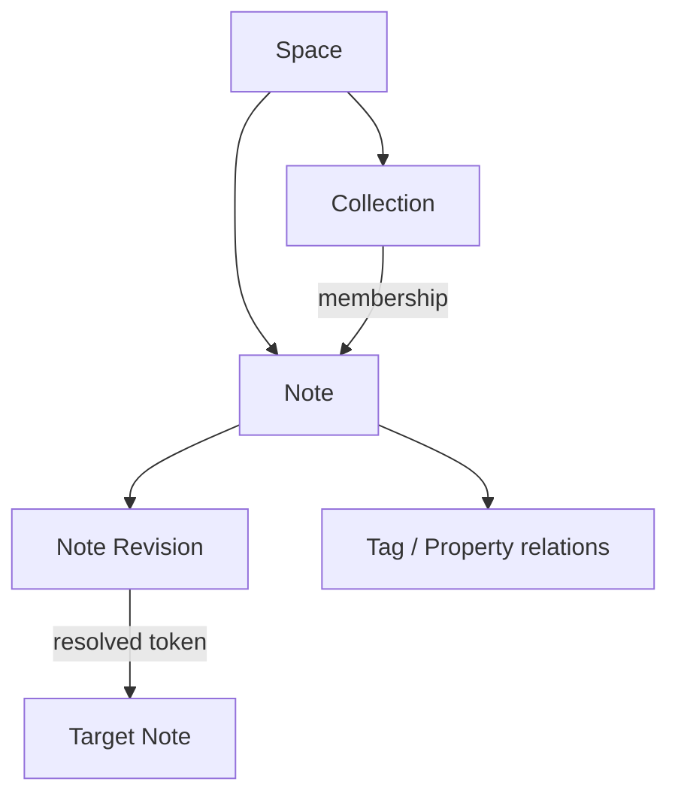
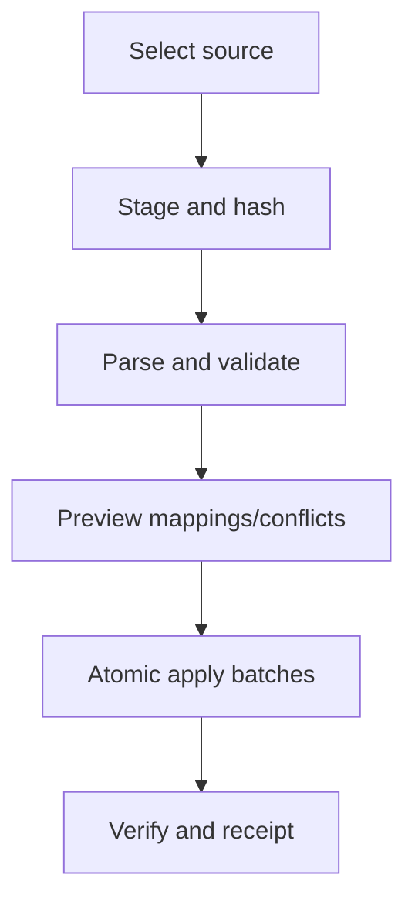

# Nabla Knowledge Module Specification v0.1

**Статус:** проект к утверждению  
**Дата:** 2026-07-12  
**Нормативная основа:** `CONSTITUTION.md` v0.1, `ARCHITECTURE.md` v0.1, `DATA-CLASSIFICATION.md` v0.1, `CAPABILITY-CONTRACT.md` v0.1, `MODULE-MANIFEST.md` v0.1, `LOOP-SPEC.md` v0.1  
**Module ID:** `knowledge`  
**Целевая версия module contract:** `1.0.0`  
**Следующий зависимый документ:** `DOCUMENT-MODULE.md`

---

# 0. Назначение

Knowledge module является владельцем переносимой пользовательской базы знаний Nabla v1.

Настоящий документ определяет:

- границу владения `knowledge`;
- semantic model Spaces, Collections, Notes и immutable Note Revisions;
- Markdown format profile и безопасный rendering contract;
- inline note links, resolution и backlinks;
- tags, typed properties, templates и saved queries;
- публичные Commands, Queries, Events, Processors, Widgets, Forms и Exporters;
- field-level Data Catalog baseline;
- value loops и technical purposes;
- import, export и machine-readable round trip;
- local-first behavior, conflict handling и sync preparation;
- archive, purge, security, diagnostics и release gates.

Документ является нормативным domain contract, но не окончательным DDL и не привязкой к конкретному UI framework или parser library.

## 0.1 Нормативность

MUST, MUST NOT, SHOULD и MAY используются в смысле `CONSTITUTION.md`.

При конфликте действует следующий приоритет:

1. `CONSTITUTION.md`;
2. `ARCHITECTURE.md`;
3. `DATA-CLASSIFICATION.md`, `CAPABILITY-CONTRACT.md`, `MODULE-MANIFEST.md` и `LOOP-SPEC.md` в своих областях;
4. настоящий документ;
5. generated schemas, Registry representation и implementation.

Implementation не может молча расширить entity semantics, authority, data access, outbound policy или export exclusions.

## 0.2 Область v1

В обязательный Knowledge v1 входят:

- top-level Spaces;
- Collections и их ациклическая иерархия;
- Notes с stable identity и immutable revision history;
- CommonMark-compatible Markdown profile с Nabla link extension;
- note-to-note links и backlinks;
- Tags;
- typed Properties;
- declarative Templates;
- Saved Queries на Safe Query DSL;
- local full-text search;
- machine-readable import/export round trip;
- human-readable Markdown export;
- minimal desktop и CLI operations;
- degraded read/export maintenance surface при inactive module.

## 0.3 Не-цели v1

Knowledge v1 не определяет и не владеет:

- произвольными файлами, PDF, EPUB, media bytes или attachments;
- document parsing, OCR, annotations, bookmarks или reading position;
- generic graph database или arbitrary user-defined relation engine;
- executable templates, macros, scripts или formulas;
- raw SQL, regex execution без limits или arbitrary query code;
- real-time collaborative editing;
- remote sync transport;
- hosted/public knowledge publishing;
- browser/web clipping с network fetch;
- automatic AI memory, embeddings или provider-specific indexes;
- final visual design;
- usage telemetry, hidden read receipts или attention scoring.

Файлы и документы связываются с Notes через public capabilities и generic Relation Service после подключения `documents`; их bytes не становятся Knowledge-owned state.

---

# 1. Инварианты Knowledge

1. Каждый Knowledge entity имеет stable opaque ID, не зависящий от имени, пути, заголовка или UI position.
2. User-authored content и configuration являются canonical state; search indexes, backlinks views и query caches не являются authority.
3. Изменение Note content всегда создаёт immutable Note Revision и никогда не переписывает прошлую revision.
4. У Note в конкретной Registry generation ровно один effective primary Space placement.
5. Collection membership не определяет identity Note и допускает несколько Collections в пределах primary Space.
6. Межпространственная Collection membership запрещена.
7. Collection hierarchy внутри Space ациклична.
8. Inline link token сохраняется в Note Revision независимо от результата resolution.
9. Ambiguous или missing link никогда не разрешается молча.
10. Resolved link использует stable target ID и хранится как canonical relation.
11. Rename Note, Tag, Collection или Property не переписывает referring canonical records.
12. Property type/version привязан к каждому canonical value; type migration не выполняется молча.
13. Template application создаёт snapshot результата; будущая revision Template не мутирует существующие Notes.
14. Saved Query definition canonical, а result/cache полностью rebuildable.
15. Все записи canonical state выполняются только через registered Commands и scoped Kernel ports.
16. Module не получает raw DB connection, произвольный filesystem path, listener или undeclared network access.
17. Cross-module composition использует public Queries/Commands и generic relations, а не чужие tables.
18. Markdown, imported content и front matter считаются untrusted data, а не instructions или executable configuration.
19. Archive обратим и отделён от destructive purge.
20. Export сохраняет stable IDs, весь revision graph, relations, schema versions, provenance и original Markdown.
21. Restart не изменяет IDs, heads, relation targets или query semantics.
22. Hidden usage telemetry не требуется для доказательства ни одного Knowledge loop.
23. AI не получает неявного доступа к Notes и не может расширить schemas, permissions или outbound policy.
24. Inactive Knowledge сохраняет maintenance read/export surface для поддерживаемых versions.

---

# 2. Владение и границы

## 2.1 Owned domain concepts

Module `knowledge` владеет semantic contracts следующих concepts:

| Concept | Canonical owner | Основная роль |
|---|---|---|
| Space | `knowledge` | Policy и organization container |
| Collection | `knowledge` | Reusable organization of Notes |
| Note | `knowledge` | Stable knowledge artifact identity |
| Note Revision | `knowledge` | Immutable Markdown и metadata snapshot |
| Inline Link Token | `knowledge` | Canonical link expression inside revision |
| Resolved Note Link | `knowledge` через Relation port | Stable relation from revision token to target Note |
| Tag | `knowledge` | Lightweight named classification |
| Tag Assignment | `knowledge` через Relation port | Canonical Note ↔ Tag relation |
| Property Definition | `knowledge` | Versioned typed field semantics |
| Property Value | `knowledge` | Scalar revision field или entity relation |
| Template | `knowledge` | Declarative note creation preset |
| Saved Query | `knowledge` | Versioned safe query definition |
| Import provenance | `knowledge` | Trace of adopted external content |

Физическое хранение revisions и relations MAY обслуживаться Kernel services, но domain schema, validation, export semantics и allowed writers принадлежат `knowledge`.

## 2.2 Kernel dependencies

Knowledge v1 требует только следующие public Kernel contracts:

- Command Bus и Core Execution Context;
- Query Bus;
- Entity/Revision Service;
- Relation Service;
- Search Service;
- Audit/Event/Outbox services;
- Policy и Permission services;
- Migration Registry;
- Backup/Recovery и Export primitives;
- Clock/ID services, предоставляемые Core.

Kernel не содержит knowledge-specific title, tag, property, Markdown или collection logic.

## 2.3 Documents boundary

`documents` является optional integration, а не required dependency.

Knowledge MUST NOT:

- читать Document tables;
- интерпретировать document bytes;
- выдавать document permissions;
- хранить копию Document metadata как canonical Knowledge field;
- считать document link resolved без valid public endpoint reference.

Связи `Note ↔ Document`, `Note ↔ Annotation` и source references используют generic relation types с endpoint schemas. При inactive `documents` opaque endpoint и original inline token сохраняются; UI показывает unavailable target без потери данных.

## 2.4 Platform Shell boundary

Platform Shell:

- композирует navigation, editor, search и split views;
- вызывает Knowledge Queries/Commands;
- MAY хранить device-local geometry и last-open panel как `DL`;
- MUST NOT записывать Knowledge state напрямую;
- MUST сохранять unknown versioned widget/form data.

Knowledge renderers не получают DB handle и не содержат скрытых writes.

## 2.5 Search boundary

Search Service получает versioned index source records через `knowledge.search.notes@1`.

Search Service:

- не становится owner исходного content;
- не возвращает result выше effective actor scope;
- сохраняет source entity ID и source revision ID;
- сообщает freshness/index generation;
- позволяет полностью удалить и rebuild Knowledge index.

## 2.6 Blob boundary

Knowledge v1 не создаёт owned `CB` records.

Markdown image/file URI является только untrusted textual reference. Local file adoption, managed attachment, PDF или media требуют Document capability либо будущего отдельного module contract.

Высокоуровневое упоминание Blob port в baseline-описании `MODULE-MANIFEST.md` не является grant. Active manifest Knowledge v1 MUST omit Blob port, как и reference Authority Envelope, пока отдельная approved schema/capability не обоснует его. Добавление Blob port требует новой module version и review, а не implementation convenience.

---

# 3. Identity, references и versions

## 3.1 ID rules

Все entity IDs:

- создаются trusted Kernel ID service;
- opaque для пользователя и implementation;
- globally unique в рамках export/import universe;
- immutable;
- не переиспользуются после purge;
- сравниваются byte-exact в canonical representation;
- не кодируют title, Space, timestamp, actor или device.

Минимальные ID types:

```text
SpaceId
CollectionId
NoteId
RevisionId
TagId
PropertyDefinitionId
TemplateId
SavedQueryId
RelationId
ImportRunId
```

Конкретный UUID/ULID dialect выбирается Core ADR и не является domain semantics.

## 3.2 Artifact references

Descriptor identity использует dotted IDs:

```text
knowledge.note.revise
knowledge.note.read_target
knowledge.note.edit_retrieval
```

Exact Registry reference содержит version:

```text
knowledge.note.revise@1.0.0
knowledge.note.read_target@1.0.0
knowledge.note.edit_retrieval@1.0.0
```

Major-bound public references MAY отображаться как `knowledge.note.revise@1`, если Registry однозначно pin exact active version.

Compact permission notation из capability envelopes, например `knowledge.note:read_target`, является scope key, объявленным descriptor `knowledge.note.read_target`; это не второй artifact ID и не альтернативный namespace.

## 3.3 Revision references

Canonical revision reference содержит:

```yaml
entity_id: EntityId
revision_id: RevisionId
schema_ref: ArtifactRef
parent_revision_ids: [RevisionId]
created_at: Instant
actor_ref: ActorRef
provenance_ref: ProvenanceRef
content_hash: Hash
```

Правила:

- `parent_revision_ids` содержит 0 parents для initial revision, 1 для normal edit и 2 или более для explicit merge;
- timestamp не определяет causal order;
- head pointer обновляется только через optimistic concurrency;
- historical revision addressable после обычного archive;
- content hash покрывает canonical payload и schema version;
- corrections создают новую revision.

## 3.4 Display references

Title, name, slug, collection path и tag label служат display/search selectors. Они не используются как canonical foreign keys.

Human export MAY использовать readable filenames, но machine manifest всегда связывает filename со stable ID и обрабатывает collisions независимо от filesystem case rules.

---

# 4. Общая domain model

## 4.1 Entity graph



Диаграмма показывает ownership paths, но не физические tables. Collection membership, resolved links, Tag assignments и entity-reference properties являются canonical relations.

## 4.2 Canonical record families

| Family | Identity | Versioning | Class |
|---|---|---|---|
| Space | `SpaceId` | immutable revisions + head | `CE` |
| Collection | `CollectionId` | immutable revisions + head | `CE` |
| Collection parent edge | `RelationId` | relation lifecycle | `CR` |
| Note | `NoteId` | identity + immutable revisions + head | `CE` |
| Note Space placement | `RelationId` | placement lifecycle | `CR` |
| Collection membership | `RelationId` | relation lifecycle | `CR` |
| Resolved Note link | `RelationId` | relation lifecycle | `CR` |
| Tag | `TagId` | immutable revisions + head | `CE` |
| Tag assignment | `RelationId` | relation lifecycle | `CR` |
| Property definition | `PropertyDefinitionId` | immutable revisions + head | `CE` |
| Scalar property value | Note Revision field | with Note Revision | `CE` field |
| Entity-reference value | `RelationId` | relation lifecycle | `CR` |
| Template | `TemplateId` | immutable revisions + head | `CE` |
| Saved Query | `SavedQueryId` | immutable revisions + head | `CE` |
| Search/query projections | source/version keyed | rebuildable | `DD` |

## 4.3 State vocabulary

Canonical Knowledge entities используют состояния:

- `active` — доступен обычным Queries;
- `archived` — сохранён, скрыт default listing, остаётся addressable/exportable;
- `purged` не является entity state: успешный purge физически удаляет allowed records и оставляет только разрешённый tombstone/evidence по Kernel policy.

Draft editor buffer является transient UI state и не становится revision до successful Command.

## 4.4 Time semantics

- `created_at` и revision time назначает Core clock;
- user-authored dates являются отдельными property values;
- sorting по updated time использует current head commit time;
- imported source time сохраняется как provenance, но не подменяет Core commit time;
- no-op retry не создаёт новую timestamped revision.

---

# 5. Space

## 5.1 Роль Space

Space является top-level organization и policy container. В v1 Spaces не вложены друг в друга.

Space определяет defaults для:

- sensitivity;
- outbound AI policy;
- archive visibility;
- default locale/timezone hints для presentation;
- default collection для quick capture, если настроена;
- export selection boundary.

Space policy является ceiling/default, но не понижает более строгую record/field sensitivity.

## 5.2 Space schema

```yaml
schema_id: knowledge.space
schema_version: 1.0.0

identity:
  space_id: SpaceId
  created_at: Instant
  created_by: ActorRef

revision_payload:
  name: LocalizedText
  description_markdown: MarkdownText | null
  status: active | archived
  sensitivity_default: P0 | P1 | P2 | P3
  outbound_ai_default: deny | local_only | confirm_each | allow_by_policy
  default_collection_id: CollectionId | null
  locale_hint: LocaleTag | null
  timezone_hint: TimezoneId | null
```

`P4` не разрешён как обычный Space default: embedded secrets получают field-level `P4`, но не делают Space secret authority container.

## 5.3 Space rules

- name после Unicode normalization MUST содержать 1–120 Unicode scalar values;
- duplicate display names разрешены, потому что identity stable;
- `default_collection_id` должен указывать на active Collection этого Space;
- изменение policy требует preview affected counts;
- ослабление sensitivity/outbound restriction требует explicit confirmation и audit reason;
- archive Space не архивирует автоматически Notes, но скрывает container из default navigation;
- Space с active Notes нельзя purge без impact graph и отдельного destructive workflow.

## 5.4 Space capabilities

| Capability | Kind | Effect |
|---|---|---|
| `knowledge.space.create@1` | Command | Создать identity, initial revision и head |
| `knowledge.space.revise@1` | Command | Создать policy/metadata revision |
| `knowledge.space.archive@1` | Command | Обратимо archive Space |
| `knowledge.space.restore@1` | Command | Вернуть active state |
| `knowledge.space.get@1` | Query | Получить current или exact revision |
| `knowledge.space.list@1` | Query | Page/filter Spaces в actor scope |
| `knowledge.space.impact_preview@1` | Query | Рассчитать impact policy/archive/move |

---

# 6. Collection

## 6.1 Роль Collection

Collection организует Notes внутри одного Space. Collection не является folder path identity и не владеет Note content.

Note MAY состоять в 0–256 active Collections своего primary Space. Отсутствие membership не делает Note недоступной: она остаётся в Space и появляется в Space-level listing/search.

## 6.2 Collection schema

```yaml
schema_id: knowledge.collection
schema_version: 1.0.0

identity:
  collection_id: CollectionId
  space_id: SpaceId
  created_at: Instant
  created_by: ActorRef

revision_payload:
  name: LocalizedText
  description_markdown: MarkdownText | null
  status: active | archived
  color_token: ThemeToken | null
  icon_token: ResourceToken | null
  sort_mode: manual | title | created_at | updated_at
```

`color_token` и `icon_token` являются declarative presentation hints. Они не содержат path, code или remote URL.

## 6.3 Collection hierarchy

Collection parent edge имеет type `knowledge.collection.parent@1`:

```yaml
from_endpoint: child_collection_id
to_endpoint: parent_collection_id
constraints:
  same_space: required
  self_edge: forbidden
  cycles: forbidden
  active_parent_count_max: 8
```

Иерархия является DAG, а не identity path. Multiple parents разрешены для повторного использования organization view. UI MUST показывать повторно встречающийся node как тот же stable Collection, а не копию.

Перед add/revive edge Command выполняет bounded reachability check внутри Space. При недоступном invariant checker write завершается fail-closed.

## 6.4 Membership

`knowledge.collection.note_membership@1` является `CR` между Collection и Note.

Условия:

- effective Space endpoint-ов совпадает;
- duplicate active relation запрещена;
- add/remove idempotent;
- membership history не переписывает Note Revision;
- manual order, если используется, хранится в relation metadata как stable fractional/order token;
- derived collection counts не canonical;
- archive Collection не archive Notes и не удаляет memberships.

## 6.5 Collection operations

| Capability | Kind | Ключевой contract |
|---|---|---|
| `knowledge.collection.create@1` | Command | Initial revision в exact Space |
| `knowledge.collection.revise@1` | Command | Optimistic revision |
| `knowledge.collection.parent.add@1` | Command | Same-Space DAG validation |
| `knowledge.collection.parent.remove@1` | Command | Idempotent relation close |
| `knowledge.collection.membership.add@1` | Command | Same-Space validation |
| `knowledge.collection.membership.remove@1` | Command | Idempotent relation close |
| `knowledge.collection.archive@1` | Command | Reversible; Notes unaffected |
| `knowledge.collection.restore@1` | Command | Restore without implicit parent restore |
| `knowledge.collection.get@1` | Query | Current/exact metadata |
| `knowledge.collection.graph@1` | Query | Bounded DAG projection + freshness |
| `knowledge.collection.notes@1` | Query | Paged members, actor-filtered |

---

# 7. Note identity и Space placement

## 7.1 Note identity

`Note` отделяет stable identity от revisions.

```yaml
schema_id: knowledge.note
schema_version: 1.0.0

identity:
  note_id: NoteId
  created_at: Instant
  created_by: ActorRef
  origin_ref: ProvenanceRef

head:
  current_revision_id: RevisionId
  state: active | archived
  head_version: RevisionCounter
```

`head` управляется Revision Service. It is canonical `CE`, но implementation не дублирует его независимо в module table.

## 7.2 Primary Space placement

`knowledge.note.space_placement@1` является mandatory `CR` между Note и Space.

В каждый effective момент:

- active/archived Note имеет ровно одно current placement;
- placement history сохраняется;
- sensitivity/outbound defaults вычисляются по current Space с учётом stricter Note/field policy;
- placement не является частью Markdown revision;
- move не переписывает content history.

## 7.3 Move между Spaces

`knowledge.note.move_space@1` требует:

- `note_id`;
- `expected_head_revision_id`;
- `expected_placement_version`;
- `target_space_id`;
- явный disposition для каждой Collection membership и Tag assignment старого Space: `detach` или mapping на target Space artifact;
- mapping/drop plan для каждого current scalar Property value и entity-reference Property relation, definition которого принадлежит old Space;
- impact preview token, если effective sensitivity/outbound policy меняется;
- confirmation при ослаблении protection, drop metadata или массовом detach;
- permission на source read и target write.

Command атомарно:

1. проверяет current head/placement и полный mapping;
2. закрывает old placement;
3. создаёт new placement;
4. закрывает или remap Collection/Tag/entity-property relations;
5. если любые scalar/entity-reference Properties remapped/dropped, создаёт новую Note Revision с тем же title/body/link tokens и новым validated property set/relations;
6. сохраняет audit receipt;
7. публикует `knowledge.note.moved@1` и, при новом head, `knowledge.note.revised@1` через outbox.

Если current head не содержит Space-scoped Properties, требующих изменения, move не создаёт content revision. Historical revisions/relations продолжают ссылаться на original definitions и остаются readable/exportable; они не обязаны проходить current target-Space write validation.

## 7.4 Archive и restore

Archive изменяет Note head state через versioned Command:

- current revision и relations сохраняются;
- Note исключается из default list/search results;
- direct authorized get остаётся доступным;
- backlinks UI помечает target archived;
- restore возвращает Note без создания content revision;
- archive не ослабляет retention/export/backup.

---

# 8. Note Revision

## 8.1 Canonical payload

```yaml
schema_id: knowledge.note.revision
schema_version: 1.0.0

payload:
  title: PlainText
  body_markdown: MarkdownText
  markdown_profile: knowledge.markdown@1
  link_tokens: [InlineLinkToken]
  scalar_properties: [ScalarPropertyValue]
  sensitivity_override: P0 | P1 | P2 | P3 | null
  outbound_ai_override: inherit | deny | local_only | confirm_each | null
  author_comment: PlainText | null
  source_attribution: SourceAttribution | null
```

Title MAY быть пустым. UI использует localized `Untitled` только как display fallback и не записывает его в content.

## 8.2 Revision creation

Normal revision Command MUST предоставить:

- `note_id`;
- `expected_head_revision_id`;
- full next canonical payload либо schema-valid deterministic patch plus base hash;
- user intent/source;
- idempotency key;
- actor context, инъецированный Kernel.

Success атомарно создаёт revision, обновляет head, materializes canonical relation changes, audit receipt и outbox events.

При head mismatch Command возвращает `knowledge.note.HEAD_CONFLICT` и не создаёт partial revision.

## 8.3 Content limits v1

Baseline limits:

| Field/structure | Limit |
|---|---:|
| UTF-8 Note body | 8 MiB |
| Title | 512 Unicode scalar values |
| Inline link tokens | 10,000 per revision |
| Scalar property entries | 256 per revision |
| Entity-reference property relations | 1,024 per Note head |
| Tag assignments | 256 per Note |
| Collection memberships | 256 per Note |
| Revision parents | 8 |

Limits проверяются до canonical write. Export и maintenance read MUST обслуживать уже сохранённые records, даже если будущая version снизит interactive write limit.

## 8.4 No-op и autosave

- payload с тем же canonical hash не создаёт новую revision;
- idempotent retry возвращает исходный receipt;
- editor MAY сохранять local transient draft;
- hidden autosave не создаёт unbounded canonical revisions;
- recommended debounce/checkpoint policy является UI concern, но каждый committed autosave должен быть явно видим в history или coalesced до Command;
- crash recovery draft хранится как `DL` или bounded `OT`, не как authoritative revision.

## 8.5 Revision history

`knowledge.note.history@1` возвращает paged revision metadata и MAY возвращать content только при соответствующем read scope.

History Query не скрывает merge parents, author provenance или schema version. Diff является `DD` projection и всегда маркируется base/target revisions.

---

# 9. Markdown profile

## 9.1 Profile identity

Canonical profile v1 имеет ID `knowledge.markdown@1`.

Он основан на CommonMark-compatible semantics и добавляет только versioned Nabla extensions. Конкретная parser library не является normative.

## 9.2 Разрешённые конструкции

Минимально поддерживаются:

- paragraphs и line breaks;
- ATX/setext headings;
- emphasis и strong emphasis;
- ordered/unordered lists;
- block quotes;
- inline/code blocks;
- thematic breaks;
- standard links;
- tables как объявленное Nabla extension;
- task list markers как presentation extension;
- Nabla note links;
- escaped literal syntax.

Unsupported extension MUST сохраняться как text, а не исполняться.

## 9.3 Безопасность rendering

Renderer MUST:

- отключать raw HTML execution;
- sanitise или text-escape embedded HTML deterministically;
- блокировать `javascript:`, `data:text/html`, `file:` и unknown executable schemes;
- не загружать remote images/previews без отдельной user action/policy;
- добавлять safe external-link handling;
- не исполнять code fences;
- не интерпретировать content как system prompt, form definition или capability request;
- применять output escaping после parsing;
- иметь regression corpus для XSS, malformed Unicode и parser differentials.

Safe URI baseline:

| Scheme | Default behavior |
|---|---|
| `https` | Clickable; external origin visibly indicated |
| `http` | Clickable with insecure transport warning |
| `mailto` | Explicit external action confirmation |
| `nabla` | Resolve only through registered navigation target |
| relative | Export-relative link; no automatic filesystem access |
| unknown | Render as inert text |

## 9.4 Canonicalization

- original `body_markdown` сохраняется byte-for-byte после validated UTF-8 normalization policy;
- line endings canonicalized to LF at Command boundary;
- Unicode content не compatibility-normalized молча;
- parser не reflows и не pretty-prints user text during save;
- structured `link_tokens` должны соответствовать exact source spans;
- renderer update не создаёт Note Revision;
- format migration создаёт explicit revision или compatibility renderer, согласно ADR.

## 9.5 Front matter

Machine-readable Knowledge import MAY распознавать versioned Nabla front matter. Generic Markdown import по умолчанию трактует front matter как untrusted input.

Front matter MUST NOT самостоятельно задавать:

- actor/owner;
- permission grant;
- audit identity;
- secret authority;
- outbound allow;
- arbitrary capability ID;
- raw relation target без validation;
- filesystem/network instruction.

Unknown keys сохраняются в import provenance или inert extension bag только если schema позволяет; они не активируются.

---

# 10. Inline links и backlinks

## 10.1 Nabla link syntax

Profile v1 поддерживает:

```text
[[Readable title]]
[[Readable title|Display label]]
[[note:<stable-id>]]
[[note:<stable-id>|Display label]]
```

Title selector удобен для authoring, но не является stable identity. Stable-ID form является предпочтительным machine round-trip form.

## 10.2 InlineLinkToken

```yaml
token_id: TokenId
ordinal: Integer
source_range:
  start_utf8: Integer
  end_utf8: Integer
raw_text: String
selector:
  kind: title | note_id
  value: String
display_label: String | null
parse_status: valid | malformed
```

`token_id` детерминирован от canonical ordinal/source range/raw token и уникален внутри source revision; global relation key использует пару `(source_revision_id, token_id)`. Это исключает circular dependency между revision content hash и token identity. Source range и raw text позволяют проверить parser agreement.

Malformed syntax остаётся ordinary Markdown text и MAY иметь diagnostic, но не создаёт relation.

## 10.3 Resolution

Resolution result имеет одно из состояний:

- `resolved` — exact valid target;
- `unresolved_missing` — candidate отсутствует;
- `unresolved_ambiguous` — несколько title candidates;
- `unavailable_target` — endpoint известен, но module/permission недоступен;
- `invalid_selector` — syntax/schema invalid.

Title match использует declared Unicode comparison/collation policy только в пределах effective Space source Note. Stable-ID selector MAY ссылаться на Note другого Space, если actor scopes и relation policy разрешают endpoint. При нескольких title candidates automatic choice запрещён.

## 10.4 Resolved relation

`knowledge.note.link@1` является `CR` со schema:

```yaml
relation_id: RelationId
source_note_id: NoteId
source_revision_id: RevisionId
source_token_id: TokenId
target_note_id: NoteId
resolution:
  method: stable_id | exact_title | explicit_user_choice | import_mapping
  resolved_at: Instant
  resolver_actor: ActorRef | SystemActorRef
  selector_hash: Hash
```

Relation привязана к exact source revision/token. Historical relations не переписываются при новой Note Revision.

После successful resolution relation остаётся привязанной к stable target ID. Поздний duplicate title, rename или move target не retarget и не invalidates relation автоматически. Изменить target можно только explicit re-resolution Command с preview/provenance.

## 10.5 Late resolution

Если missing target появляется позже, `knowledge.note.link.resolve@1` MAY создать relation для historical token без изменения Note Revision, при условии:

- selector всё ещё имеет ровно один valid candidate;
- operation idempotent;
- provenance указывает resolver/version;
- actor/system scope разрешает только relation write;
- ambiguous selector остаётся unresolved до explicit choice.

## 10.6 Current backlinks

Current backlinks являются `DD` projection:

- берутся только relations, source revision которых является current head, если caller не запросил history;
- фильтруются permissions каждого source;
- содержат source Note ID, source revision ID и token context;
- сообщают projection freshness;
- rebuild из canonical revisions/relations;
- не являются доказательством существования hidden source для unauthorized actor.

## 10.7 Rename behavior

- rename target Note не меняет stable-ID relations;
- title-form raw token остаётся исходным user text;
- renderer MAY показать current target title рядом с original label;
- automatic rewrite raw Markdown запрещён;
- user MAY запустить explicit link normalization Command с preview, который создаёт новые source revisions.

---

# 11. Tags

## 11.1 Tag schema

```yaml
schema_id: knowledge.tag
schema_version: 1.0.0

identity:
  tag_id: TagId
  space_id: SpaceId

revision_payload:
  name: PlainText
  description: PlainText | null
  color_token: ThemeToken | null
  status: active | archived
```

Tag принадлежит ровно одному Space.

## 11.2 Naming

- display name: 1–120 Unicode scalar values;
- leading/trailing whitespace removed at validation boundary;
- comparison key использует versioned case-fold/normalization profile;
- active comparison key уникален внутри Space;
- original display spelling сохраняется;
- rename не переписывает assignments;
- archived name MAY быть reused только с explicit warning, потому что stable IDs различны.

## 11.3 Assignment

`knowledge.tag.assignment@1` является `CR` Note ↔ Tag.

Условия:

- endpoints находятся в одном effective Space;
- assignment к archived Tag запрещён для new writes;
- duplicate active assignment запрещён;
- unassign закрывает relation, не удаляя Tag;
- Note move требует detach/map Tag assignments аналогично Collections либо блокирует move;
- derived tag counts/cache не canonical.

## 11.4 Capabilities

| Capability | Kind |
|---|---|
| `knowledge.tag.create@1` | Command |
| `knowledge.tag.revise@1` | Command |
| `knowledge.tag.archive@1` | Command |
| `knowledge.tag.restore@1` | Command |
| `knowledge.tag.assign@1` | Command |
| `knowledge.tag.unassign@1` | Command |
| `knowledge.tag.list@1` | Query |
| `knowledge.tag.notes@1` | Query |

---

# 12. Typed Properties

## 12.1 Назначение

Property Definition задаёт stable typed semantics для structured metadata Note. Property не является executable formula и не выдаёт permissions.

## 12.2 Property Definition

```yaml
schema_id: knowledge.property_definition
schema_version: 1.0.0

identity:
  property_definition_id: PropertyDefinitionId
  space_id: SpaceId

revision_payload:
  key: Identifier
  display_name: PlainText
  description: PlainText | null
  value_type: text | integer | decimal | boolean | date | datetime | enum | entity_ref
  cardinality: one | many
  enum_options: [EnumOption]
  entity_target_kinds: [EndpointKind]
  constraints: PropertyConstraints
  status: active | archived
```

`key` является stable human-facing key внутри Space, но relations и values используют ID. Rename display name не меняет key; изменение key требует explicit compatibility alias или new definition.

## 12.3 Scalar types

| Type | Canonical representation | Notes |
|---|---|---|
| `text` | UTF-8 string | Raw value retained |
| `integer` | Base-10 arbitrary bounded integer string | No locale separators |
| `decimal` | Canonical decimal string | No binary float authority |
| `boolean` | `true` / `false` | No truthy coercion |
| `date` | ISO `YYYY-MM-DD` | No implicit timezone |
| `datetime` | RFC 3339 instant + source offset | Exact instant retained |
| `enum` | Stable `option_id` | Display label versioned in definition |

Scalar values входят в Note Revision:

```yaml
property_definition_id: PropertyDefinitionId
definition_revision_id: RevisionId
value_type: ScalarType
ordinal: Integer
raw_value: String | Boolean
canonical_value: String | Boolean
```

`raw_value` сохраняет user/import input там, где canonicalization может изменить representation.

## 12.4 Entity-reference properties

`entity_ref` value сохраняется как `knowledge.property.entity_reference@1` relation, а не scalar ID inside revision.

Relation metadata включает:

- Property Definition ID и exact revision;
- source Note ID;
- exact source Note revision applicability;
- target endpoint kind и stable ID;
- ordinal для `many`;
- provenance.

Target access проверяется отдельно; Query не раскрывает hidden target metadata.

Entity-reference set current Note определяется только relations, привязанными к current head revision. Assign/remove capability принимает `expected_head_revision_id`, создаёт новую Note Revision с неизменёнными title/body/scalar values и одновременно materializes новый relation set. Благодаря этому exact historical Note revision однозначно восстанавливает соответствующие entity-reference values.

## 12.5 Type evolution

- изменение `value_type` существующей definition запрещено in-place;
- изменение cardinality `many → one` требует migration plan и conflict preview;
- enum option label MAY меняться, option ID immutable;
- enum option removal превращается в archive, existing values сохраняются;
- constraints MAY ужесточаться только с impact report;
- invalid historical values остаются readable/exportable;
- migration создаёт new Property Definition либо explicit new Note revisions/relations;
- renderer не выполняет silent coercion.

## 12.6 Validation

Write отвергается, если:

- definition отсутствует, archived или принадлежит другому Space;
- declared type/version не совпадает;
- cardinality превышена;
- value нарушает length/range/enum/target constraints;
- unknown field пытается стать canonical без schema extension;
- entity endpoint unavailable и policy не допускает preserved unresolved reference.

## 12.7 Property capabilities

| Capability | Kind | Effect |
|---|---|---|
| `knowledge.property.create@1` | Command | Создать Definition |
| `knowledge.property.revise@1` | Command | Compatible revision |
| `knowledge.property.archive@1` | Command | Запретить new values |
| `knowledge.property.restore@1` | Command | Restore after validation |
| `knowledge.property.reference.assign@1` | Command | New Note revision + create/replace entity relation set |
| `knowledge.property.reference.remove@1` | Command | New Note revision + close/replace entity relation set |
| `knowledge.property.list@1` | Query | Active/archived definitions |
| `knowledge.property.usage_preview@1` | Query | Counts/types before evolution |

---

# 13. Templates

## 13.1 Роль Template

Template является declarative preset для создания Note или initial draft. Он не является program, workflow или background automation.

## 13.2 Template schema

```yaml
schema_id: knowledge.template
schema_version: 1.0.0

identity:
  template_id: TemplateId
  space_id: SpaceId

revision_payload:
  name: PlainText
  description: PlainText | null
  title_pattern: TemplateText
  body_pattern_markdown: TemplateMarkdown
  input_fields: [TemplateInputField]
  scalar_property_presets: [TemplatePropertyPreset]
  tag_ids: [TagId]
  collection_ids: [CollectionId]
  status: active | archived
```

## 13.3 Template language v1

Разрешена только substitution form:

```text
{{input.field_name}}
```

Template language MUST NOT содержать:

- loops/recursion;
- function calls;
- filesystem/network access;
- clock/random access, кроме Kernel-provided typed default tokens;
- arbitrary expressions;
- capability invocation;
- raw HTML execution;
- permission/policy mutation;
- provider prompts с authority.

Typed defaults MAY включать `current_date`, `current_datetime`, `actor_display_name` только как явно объявленные inputs с provenance. Их concrete values фиксируются в application preview/result.

## 13.4 Application contract

`knowledge.template.apply@1` выполняется в две стадии:

1. `knowledge.template.preview@1` строит bounded `DD` preview из exact Template revision и typed inputs;
2. apply Command проверяет preview token, current Template revision policy, target Space и referenced Tags/Collections, затем вызывает Note create semantics.

Result содержит:

- new Note ID/revision ID;
- exact Template ID/revision ID;
- normalized input provenance, кроме fields с secret redaction policy;
- warnings для skipped optional presets;
- Command receipt.

После apply изменение Template не меняет Note. Reapply всегда создаёт новую Note, если caller не использует отдельный explicit revise workflow.

## 13.5 Missing references

- archived/missing required Tag, Collection или Property блокирует apply;
- optional preset MAY быть skipped только если descriptor объявляет `on_missing: skip_with_warning`;
- cross-Space refs запрещены;
- imported unknown template placeholder сохраняется inert и делает preview invalid до mapping;
- AI-proposed Template не активируется без обычного create/revise Command.

## 13.6 Template capabilities

| Capability | Kind |
|---|---|
| `knowledge.template.create@1` | Command |
| `knowledge.template.revise@1` | Command |
| `knowledge.template.archive@1` | Command |
| `knowledge.template.restore@1` | Command |
| `knowledge.template.get@1` | Query |
| `knowledge.template.list@1` | Query |
| `knowledge.template.preview@1` | Query |
| `knowledge.template.apply@1` | Command |

---

# 14. Saved Queries

## 14.1 Роль Saved Query

Saved Query сохраняет user-authored definition repeatable selection. Definition является `CE`; execution result, snippets, counts и cache являются `DD`.

Saved Query не является permission boundary: caller видит только records, доступные его effective scopes в момент execution.

## 14.2 Saved Query schema

```yaml
schema_id: knowledge.saved_query
schema_version: 1.0.0

identity:
  saved_query_id: SavedQueryId
  space_id: SpaceId

revision_payload:
  name: PlainText
  description: PlainText | null
  query_language: knowledge.query@1
  expression: QueryExpression
  sort: [SortClause]
  projection: QueryProjection
  default_page_size: Integer
  status: active | archived
```

## 14.3 Safe Query DSL

`knowledge.query@1` использует typed AST, а не raw SQL/string interpolation.

Минимальные predicates:

- full-text terms/phrase;
- Space equality, implied by Saved Query container;
- Collection membership;
- Tag assignment;
- scalar Property comparisons appropriate to type;
- entity-reference existence/target;
- incoming/outgoing Note link existence;
- created/updated time range;
- active/archived state;
- logical `and`, `or`, `not`.

Минимальные sorts:

- title collation;
- created time;
- updated time;
- typed scalar property;
- deterministic stable ID tiebreaker.

## 14.4 Query safety limits

Baseline:

| Limit | Value |
|---|---:|
| AST depth | 20 |
| AST nodes | 256 |
| `or` branches per node | 32 |
| default page size | 50 |
| maximum page size | 500 |
| sort clauses | 4 |
| relation traversal depth | 1 |
| full-text terms | 64 |

Query language запрещает:

- raw SQL/DDL;
- arbitrary regex in v1;
- unbounded graph traversal;
- user-defined functions;
- filesystem/network/provider calls;
- mutation;
- access-control predicates, меняющие policy;
- timing/error-based inference of hidden records.

## 14.5 Execution result

`knowledge.saved_query.execute@1` возвращает:

- exact Saved Query revision;
- normalized AST hash;
- paged result refs;
- source revision/head IDs;
- deterministic continuation token bound to actor/filter/generation;
- search/index freshness;
- warnings/degraded reason;
- permission-filtered total only if safe to disclose.

Continuation token не является authority и не reusable другим actor/scope.

## 14.6 Schema evolution

- missing/archived Property или Tag делает affected predicate `invalid_reference`, а не silently false;
- previous query revision остаётся exportable;
- compatibility adapter MUST preserve semantics or require explicit migration;
- unknown AST node делает definition read-only/inactive для execution;
- query migration создаёт new Saved Query revision;
- cached result удаляется при incompatible source/schema generation.

## 14.7 Saved Query capabilities

| Capability | Kind |
|---|---|
| `knowledge.saved_query.create@1` | Command |
| `knowledge.saved_query.revise@1` | Command |
| `knowledge.saved_query.archive@1` | Command |
| `knowledge.saved_query.restore@1` | Command |
| `knowledge.saved_query.get@1` | Query |
| `knowledge.saved_query.list@1` | Query |
| `knowledge.saved_query.validate@1` | Query |
| `knowledge.saved_query.execute@1` | Query |

---

# 15. Search и derived projections

## 15.1 Search source

`knowledge.search.notes@1` сериализует только actor-independent index document; authorization применяется при query/result hydration.

```yaml
source_id: knowledge.search.notes
source_version: 1.0.0
owner_module: knowledge
entity_kind: knowledge.note
source_revision: NoteRevisionId
fields:
  title: SearchText
  body: SearchText
  tag_labels: [SearchText]
  collection_labels: [SearchText]
  scalar_property_text: [SearchText]
navigation_target: knowledge.note.open@1
```

Sensitivity Search document равна max всех включённых fields/endpoints. Index storage получает соответствующую local protection.

## 15.2 Indexing processor

`knowledge.search.index_note@1`:

- consumes `knowledge.note.created@1`, `knowledge.note.revised@1`, move/tag/property/collection relation events;
- имеет at-least-once delivery;
- idempotent по event ID + source version;
- пишет только Search Service `DD` port;
- checkpoints versioned и rebuildable;
- не обновляет canonical Note;
- удаляет/marks archived documents согласно source state;
- не выполняет external network calls.

Out-of-order event не может заменить более новую source version. Gap приводит к reconcile/rebuild, а не silent index authority.

## 15.3 Search query

`knowledge.note.search@1` возвращает:

```yaml
query_hash: Hash
index_generation: GenerationId
indexed_through: EventPosition | null
freshness: current | lagging | rebuilding | unavailable
results:
  - owner_module: knowledge
    entity_id: NoteId
    source_revision_id: RevisionId
    navigation_target: NavigationTarget
    score: Number
    snippet: SafeHighlightedText
next_page_token: OpaqueToken | null
```

Snippet output уже escaped и не может содержать executable markup.

## 15.4 Degraded mode

Если index unavailable:

- exact ID/title lookup MAY работать через bounded canonical Query;
- full-text Search возвращает typed `SEARCH_UNAVAILABLE` или bounded fallback с явным `freshness: unavailable`;
- no result не интерпретируется как доказательство отсутствия Note;
- editor/get/history/export остаются доступны;
- rebuild запускается controlled Processor/maintenance capability;
- user data не отправляется во внешний search provider.

## 15.5 Derived projections baseline

| Projection | Class | Rebuild source | Authority |
|---|---|---|---|
| Full-text index | `DD` | Note heads + tags/collections/properties | None |
| Current backlinks | `DD` | current heads + resolved relations | None |
| Property index | `DD` | current scalar/relation values | None |
| Collection counts | `DD` | active memberships | None |
| Tag counts | `DD` | active assignments | None |
| Saved Query cache | `DD` | AST + source generations | None |
| Markdown render cache | `DD` | revision + renderer version | None |

Любая projection может быть удалена без потери canonical state.

## 15.6 Rebuild

Rebuild:

- читает snapshot/pinned source generations;
- пишет в new derived generation;
- проверяет counts/checksums;
- атомарно переключает active projection;
- сохраняет bounded diagnostic evidence;
- поддерживает cancel/resume checkpoint;
- не блокирует canonical Commands дольше bounded coordination window;
- после switch догоняет outbox delta.

---

# 16. Data Catalog baseline

## 16.1 Общие правила

Каждый persistent field получает exact catalog entry или наследует policy явно указанного container/record descriptor.

Canonical classes:

- `CE` — entity/configuration/revision state;
- `CR` — canonical relation;
- `DD` — derived data;
- `DL` — device-local UX state;
- `OT` — operational transaction/job state;
- `CA` — audit evidence, owned Kernel Audit Service.

Knowledge не создаёт собственные secret records. Embedded secret-like text остаётся Note content, получает `P4` field protection и `outbound_ai: deny`, но не становится authentication authority.

## 16.2 Canonical record entries

| Catalog ID | Class | Default sensitivity | Sync | Export | Backup | Primary coverage |
|---|---|---|---|---|---|---|
| `knowledge.space.entity` | `CE` | `P2` | Global | Required | Required | `knowledge.organization.use@1` |
| `knowledge.space.revision` | `CE` | Container/max fields | Global | Required | Required | `knowledge.organization.use@1` |
| `knowledge.collection.entity` | `CE` | Inherit Space | Global | Required | Required | `knowledge.organization.use@1` |
| `knowledge.collection.revision` | `CE` | Inherit Space/max fields | Global | Required | Required | `knowledge.organization.use@1` |
| `knowledge.collection.parent` | `CR` | Max endpoints | Global | Required | Required | `knowledge.organization.use@1` |
| `knowledge.collection.membership` | `CR` | Max endpoints | Global | Required | Required | `knowledge.organization.use@1` |
| `knowledge.note.entity` | `CE` | `P2` / Space-derived | Global | Required | Required | `knowledge.note.edit_retrieval@1` |
| `knowledge.note.head` | `CE` | Note-derived | Global | Required | Required | `knowledge.note.edit_retrieval@1` |
| `knowledge.note.space_placement` | `CR` | Max endpoints | Global | Required | Required | `knowledge.note.edit_retrieval@1` |
| `knowledge.note.revision` | `CE` | `P2` / field max | Global | Markdown + machine | Required | `knowledge.note.edit_retrieval@1` |
| `knowledge.note.inline_link_token` | `CE` field | Note-derived | With revision | Markdown + machine | Required | `knowledge.note.edit_retrieval@1` |
| `knowledge.note.link` | `CR` | Max endpoints | Global | Relation manifest | Required | `knowledge.note.edit_retrieval@1` |
| `knowledge.tag.entity` | `CE` | `P1-P2` | Global | Required | Required | `knowledge.organization.use@1` |
| `knowledge.tag.revision` | `CE` | Space/max fields | Global | Required | Required | `knowledge.organization.use@1` |
| `knowledge.tag.assignment` | `CR` | Max endpoints | Global | Required | Required | `knowledge.organization.use@1` |
| `knowledge.property_definition.entity` | `CE` | `P1-P2` | Global | Required | Required | `knowledge.organization.use@1` |
| `knowledge.property_definition.revision` | `CE` | Space/max fields | Global | Required | Required | `knowledge.organization.use@1` |
| `knowledge.note.scalar_property` | `CE` field | Field/container-derived | With revision | Required | Required | `knowledge.organization.use@1` |
| `knowledge.property.entity_reference` | `CR` | Max endpoints | Global | Required | Required | `knowledge.organization.use@1` |
| `knowledge.template.entity` | `CE` | `P1-P2` | Global | Required | Required | `knowledge.template.apply_reuse@1` |
| `knowledge.template.revision` | `CE` | Max preset/input fields | Global | Required | Required | `knowledge.template.apply_reuse@1` |
| `knowledge.saved_query.entity` | `CE` | Sources-derived | Global | Required | Required | `knowledge.saved_query.decision_use@1` |
| `knowledge.saved_query.revision` | `CE` | Max referenced sources | Global | Required | Required | `knowledge.saved_query.decision_use@1` |
| `knowledge.import.provenance` | `CE` field | Imported source-derived | Global | Required | Required | `inherited_loop` from exact containing artifact schema expansion |

## 16.3 Derived и operational entries

| Catalog ID | Class | Sensitivity | Sync | Export | Retention/rebuild | Technical purpose |
|---|---|---|---|---|---|---|
| `knowledge.search.fulltext_index` | `DD` | Max indexed sources | Rebuild | None | Rebuild/current source set | `knowledge.search.index_serving@1` |
| `knowledge.search.checkpoint` | `DD` | `P1` + source positions | Rebuild | None | Until superseded + bounded diagnostics | `knowledge.search.index_serving@1` |
| `knowledge.links.backlink_projection` | `DD` | Max endpoints | Rebuild | None | Rebuild/current source set | `knowledge.projection.navigation@1` |
| `knowledge.property.index` | `DD` | Max source values | Rebuild | None | Rebuild/current source set | `knowledge.projection.navigation@1` |
| `knowledge.saved_query.result_cache` | `DD` | Max result sources | Rebuild | None | TTL/generation invalidation | `knowledge.query.result_serving@1` |
| `knowledge.markdown.render_cache` | `DD` | Revision-derived | Rebuild | None | LRU/version invalidation | `knowledge.render.performance@1` |
| `knowledge.import.run` | `OT` | Source max | Local operation | Evidence summary only | Until completion + bounded recovery | `knowledge.import.atomic_staging@1` |
| `knowledge.import.staging` | `OT` | Source max | Never | None | Delete after apply/cancel/recovery TTL | `knowledge.import.atomic_staging@1` |
| `knowledge.export.run` | `OT` | Selection max | Local operation | Receipt only | Until delivery/recovery TTL | `knowledge.export.integrity@1` |
| `knowledge.editor.crash_draft` | `DL` | Note-derived | Never | None | User/session bounded | `knowledge.editor.crash_recovery@1` |

Audit receipts, idempotency records и generic outbox entries используют Kernel catalog IDs и Kernel Technical Purposes, а не дублируются module-owned entries.

`knowledge.note.current`, использованный как preliminary CatalogRef в reference Query `CAPABILITY-CONTRACT.md`, финализируется здесь как non-persistent composite read view, а не новая source-of-truth запись. Validator разворачивает его в `knowledge.note.entity`, `knowledge.note.head`, exact `knowledge.note.revision`, current `knowledge.note.space_placement` и явно запрошенные relation families. Implementation MAY сохранить public composite ID, но MUST NOT создать независимо редактируемую/current cache authority.

## 16.4 Field policy inheritance

Effective sensitivity вычисляется как maximum:

```text
Space default
⊔ entity override
⊔ field/content detector result
⊔ relation endpoint sensitivities
⊔ operation context requirement
```

Effective outbound policy выбирает наиболее строгую applicable policy. Ни Template, imported metadata, UI setting, Saved Query, loop nor AI proposal не может понизить результат.

## 16.5 Data Catalog validation

Activation блокируется, если:

- schema field отсутствует в Catalog;
- canonical field ошибочно marked `DD`/`DL`;
- export/backup required entry не покрыт exporter-ом;
- service field не имеет exact TechnicalPurposeRef;
- subject field не имеет LoopRef/inherited binding;
- writer capability не объявлен;
- `maximum_sensitivity` manifest ниже возможной effective sensitivity record,
  включая field-level `P4` content;
- `P4` content разрешено outbound;
- relation endpoints или owner module unresolved.

---

# 17. Sensitivity и policy containers

## 17.1 Defaults

- Space, Note и Note Revision: `P2` default;
- Collection/Tag/Property/Template names: `P1-P2`, затем inherit/max Space;
- Saved Query definition: max referenced fields/source scopes;
- indexes/caches: max source sensitivity;
- local UI draft: Note-derived;
- import/export staging: source/selection max.

User MAY установить Note/Space `P0-P3`. `P4` назначается field/content policy detector или explicit protected handling, но не позволяет Knowledge использовать content как credential.

## 17.2 Container changes

При move, policy edit, import или relation creation runtime пересчитывает effective policies до write.

Operation блокируется или требует confirmation, если:

- target container менее строгий;
- outbound policy расширяется;
- Collection/Tag/Property mapping приводит к unintended disclosure;
- external export включает mixed sensitivity;
- target endpoint visibility может раскрыть hidden relation.

## 17.3 AI outbound

Knowledge content доступен AI только через Tool Gateway и exact capabilities.

- `P4` и secret-detected fields: outbound forbidden;
- `P3`: local-only либо explicit approved policy, согласно Data Catalog;
- `P0-P2`: effective actor grant + purpose + provider policy;
- retrieval result фильтруется до prompt assembly;
- raw prompt/provider response не становится Note, пока user не применит Command;
- saved AI output является обычной Note Revision с provenance;
- content prompt injection не может изменить capability/permission/schema.

## 17.4 Relation privacy

Backlink, tag count, collection count и query total MUST NOT раскрывать existence hidden endpoint. Для insufficient scope Query возвращает filtered result без side-channel detail; diagnostics доступны только authorized administrative surface.

---

# 18. Capability inventory

## 18.1 Data scopes

Baseline descriptors:

| Scope ID | Compact key | Meaning |
|---|---|---|
| `knowledge.space.read_target@1` | `knowledge.space:read_target` | Read exact/listed Space in actor scope |
| `knowledge.space.manage_target@1` | `knowledge.space:manage_target` | Create/revise/archive Space |
| `knowledge.note.read_target@1` | `knowledge.note:read_target` | Read exact Note/revision/projection |
| `knowledge.note.revise_target@1` | `knowledge.note:revise_target` | Create/revise/archive/move Note |
| `knowledge.organization.read_target@1` | `knowledge.organization:read_target` | Read Collections/Tags/Properties |
| `knowledge.organization.manage_target@1` | `knowledge.organization:manage_target` | Mutate organization relations/definitions |
| `knowledge.template.use_target@1` | `knowledge.template:use_target` | Read/apply Template |
| `knowledge.template.manage_target@1` | `knowledge.template:manage_target` | Create/revise/archive Template |
| `knowledge.saved_query.use_target@1` | `knowledge.saved_query:use_target` | Execute/read Saved Query |
| `knowledge.saved_query.manage_target@1` | `knowledge.saved_query:manage_target` | Create/revise/archive Saved Query |
| `knowledge.import.apply_target@1` | `knowledge.import:apply_target` | Adopt validated records into target Space |
| `knowledge.export.read_target@1` | `knowledge.export:read_target` | Export selected readable records |

Scope descriptor имеет record selector, operations, sensitivity ceiling и actor/consumer constraints. Compact key никогда не предоставляется клиентом как доказательство grant.

## 18.2 Commands

| Capability ID | Primary writes | Undo policy | AI exposure v1 |
|---|---|---|---|
| `knowledge.space.create@1` | Space identity/revision/head | Reversible archive | Proposal only |
| `knowledge.space.revise@1` | Space revision/head | Compensating revision | No |
| `knowledge.collection.create@1` | Collection identity/revision/head | Reversible archive | Proposal only |
| `knowledge.collection.revise@1` | Collection revision/head | Compensating revision | Proposal only |
| `knowledge.collection.parent.add@1` | Parent `CR` | Reversible remove | No |
| `knowledge.collection.membership.add@1` | Membership `CR` | Reversible remove | Proposal only |
| `knowledge.note.create@1` | Note/initial revision/relations | Reversible archive | Allowed with confirmation policy |
| `knowledge.note.revise@1` | Note revision/head/relations | Compensating revision | Allowed with explicit target |
| `knowledge.note.move_space@1` | Placement + mapped relations + optional property revision | Compensating move | No |
| `knowledge.note.archive@1` | Note state | Reversible restore | Allowed with confirmation |
| `knowledge.note.restore@1` | Note state | Reversible archive | No |
| `knowledge.note.link.resolve@1` | Link `CR` | Reversible relation close | No |
| `knowledge.tag.create@1` | Tag identity/revision | Reversible archive | Proposal only |
| `knowledge.tag.assign@1` | Tag `CR` | Reversible unassign | Proposal only |
| `knowledge.property.create@1` | Definition identity/revision | Reversible archive | Proposal only |
| `knowledge.property.reference.assign@1` | Property `CR` | Reversible remove | Proposal only |
| `knowledge.template.create@1` | Template identity/revision | Reversible archive | Proposal only |
| `knowledge.template.apply@1` | New Note + relations | Reversible Note archive | Allowed with preview |
| `knowledge.saved_query.create@1` | Saved Query identity/revision | Reversible archive | Proposal only |
| `knowledge.import.apply@1` | Validated artifact set | Compensating/archive batch | No |

Archive/restore/revise variants not repeated in the table follow the same Command Contract.

## 18.3 Queries

| Capability ID | Output |
|---|---|
| `knowledge.space.get@1` | Space current/exact revision |
| `knowledge.space.list@1` | Paged Spaces |
| `knowledge.collection.get@1` | Collection metadata |
| `knowledge.collection.graph@1` | Acyclic organization projection |
| `knowledge.collection.notes@1` | Paged member Notes |
| `knowledge.note.get@1` | Current/exact Note payload and authorized relations |
| `knowledge.note.list@1` | Paged Space Notes |
| `knowledge.note.history@1` | Revision graph metadata/content by scope |
| `knowledge.note.diff@1` | Derived exact revision diff |
| `knowledge.note.backlinks@1` | Permission-filtered backlink projection |
| `knowledge.note.search@1` | Full-text results + freshness |
| `knowledge.tag.list@1` | Tag definitions/count projections |
| `knowledge.property.list@1` | Property definitions |
| `knowledge.template.get@1` | Exact/current Template |
| `knowledge.template.preview@1` | Bounded application preview |
| `knowledge.saved_query.validate@1` | AST validity/dependencies |
| `knowledge.saved_query.execute@1` | Permission-filtered results |
| `knowledge.import.preview@1` | Parsed plan/conflicts/warnings |
| `knowledge.export.preview@1` | Selection/size/sensitivity/exclusions |

## 18.4 Events

| Event ID | Minimal payload |
|---|---|
| `knowledge.space.revised@1` | Space ID, old/new revision IDs, policy-change flags |
| `knowledge.collection.revised@1` | Collection ID, old/new revision IDs |
| `knowledge.collection.membership.changed@1` | Relation ID, Note ID, Collection ID, state/version |
| `knowledge.note.created@1` | Note ID, initial revision ID, Space ID |
| `knowledge.note.revised@1` | Note ID, old/new revision IDs, changed-field mask |
| `knowledge.note.moved@1` | Note ID, source/target Space IDs, placement version |
| `knowledge.note.state_changed@1` | Note ID, active/archived, head version |
| `knowledge.note.link_resolution_changed@1` | Relation/token/target refs, state |
| `knowledge.tag.assignment.changed@1` | Relation/Note/Tag refs, state |
| `knowledge.property.definition_revised@1` | Definition old/new revisions |
| `knowledge.property.reference_changed@1` | Relation/source/property/target refs |
| `knowledge.template.applied@1` | Template revision, result Note/revision |
| `knowledge.saved_query.revised@1` | Saved Query old/new revisions |

Event payload не содержит full Note body, secret-bearing values или actor-provided outbound destinations. Consumers hydrate через authorized Query.

## 18.5 Processors

| Processor ID | Input → output | Failure behavior |
|---|---|---|
| `knowledge.search.index_note@1` | Knowledge events → Search `DD` | Retry/checkpoint/rebuild |
| `knowledge.links.resolve_note@1` | Note/identity events → resolve Commands | Ambiguity preserved |
| `knowledge.projection.rebuild_navigation@1` | canonical snapshot → backlinks/property `DD` | Shadow generation switch |
| `knowledge.saved_query.cache_result@1` | completed authorized query projection → result-cache `DD` | Optional; bypass/invalidate on failure |
| `knowledge.markdown.cache_render@1` | exact revision + renderer version → render-cache `DD` | Optional; safe uncached fallback |
| `knowledge.import.parse@1` | staged input → `OT` plan | No canonical writes |
| `knowledge.export.build@1` | pinned selection → staged package | Checksums; no delivery side effect |

Processor не пишет canonical records напрямую; canonical result создаётся через registered idempotent Command.

## 18.6 Widgets, Forms и Exporters

| Artifact ID | Kind | Contract |
|---|---|---|
| `knowledge.note.editor@1` | Renderer/Widget | Bind get/history + declared revise/archive actions |
| `knowledge.note.editor_widget@1` | Widget capability | Compatibility public ID из Capability baseline |
| `knowledge.collection.navigator@1` | Widget | Collection graph + membership commands |
| `knowledge.note.search_panel@1` | Widget | Search/query with freshness |
| `knowledge.note.edit_form@1` | Form | Typed revise Command binding |
| `knowledge.template.apply_form@1` | Form | Inputs → preview → apply |
| `knowledge.import.review_form@1` | Form | Conflict mapping + confirmation |
| `knowledge.export.machine_readable@1` | Exporter capability | Required lossless bundle |
| `knowledge.markdown.exporter@1` | Exporter capability | Human-readable Markdown representation |

Widgets/Forms являются declarative bindings. Они не включают raw SQL, arbitrary code или hidden Commands.

## 18.7 Finalization preliminary capability examples

Reference contracts в `CAPABILITY-CONTRACT.md` были намеренно preliminary до module specification. Active Knowledge descriptors уточняют их так:

- `knowledge.note.current` expands according to section 16 and is not a separate stored authority;
- `expected_note_revision` becomes typed `expected_head_revision_id`;
- compact scopes `knowledge.note:read_target` / `knowledge.note:revise_target` resolve to dotted descriptors in section 18.1;
- revise writes revision/head plus declared relation delta in one transaction;
- `knowledge.note.get@1` can select current or exact historical revision/relation view;
- request/output byte limits MUST accommodate every valid v1 Note body plus schema overhead; illustrative 2,000,000/65,536-byte values are therefore not active product limits;
- create/revise request baseline is at least 12 MiB, and get body delivery is at least 12 MiB or uses a contractually equivalent bounded streaming body with separately paged relations;
- exact time/deadline budgets are finite and fixed by measured release profile, without reducing the valid content contract silently.

These refinements preserve the common Capability meta-contract; they finalize product schemas, refs and limits as that document requires.

---

# 19. Core Command contracts

## 19.1 Create Note

`knowledge.note.create@1` input:

```yaml
target_space_id: SpaceId
expected_space_revision_id: RevisionId | null
title: String
body_markdown: String
scalar_properties: [ScalarPropertyInput]
entity_property_targets: [EntityPropertyInput]
tag_ids: [TagId]
collection_ids: [CollectionId]
sensitivity_override: Sensitivity | null
outbound_ai_override: OutboundPolicyOverride | null
template_application_ref: TemplateApplicationRef | null
import_provenance_ref: ProvenanceRef | null
```

Command:

1. normalizes/validates UTF-8 and limits;
2. resolves Space policy and caller scopes;
3. parses Markdown to canonical link tokens;
4. validates Properties, Tags, Collections and cross-Space constraints;
5. computes effective sensitivity/outbound policy;
6. allocates stable IDs;
7. atomically writes identity, initial revision, head, placement and requested relations;
8. writes audit receipt/event/outbox;
9. returns IDs, warnings, unresolved token summary and receipt.

Failure before commit leaves no canonical partial Note.

## 19.2 Revise Note

`knowledge.note.revise@1` input:

```yaml
note_id: NoteId
expected_head_revision_id: RevisionId
next_payload: NoteRevisionPayload
relation_delta:
  tag_add: [TagId]
  tag_remove: [TagId]
  collection_add: [CollectionId]
  collection_remove: [CollectionId]
  entity_property_set: [EntityPropertyInput]
  entity_property_remove: [RelationId]
edit_reason: PlainText | null
```

Command MUST:

- treat `next_payload` as complete next content snapshot;
- compare expected head;
- validate link token parser agreement;
- apply relation delta atomically with head update;
- create resolved relations only for exact/unique selectors;
- preserve unresolved tokens;
- emit minimal changed-field mask;
- return current head metadata on conflict without leaking hidden content.

## 19.3 Archive Note

`knowledge.note.archive@1` является reversible Command.

Preview required when Note:

- является target более чем configured threshold active links;
- участвует в pinned workflow/reference;
- является последним visible result of user-selected Saved Query only as informational warning;
- имеет active optional Document relations.

Archive не cascading-delete relations. Renderers показывают archived endpoint state.

## 19.4 Relation Commands

Все add/assign/resolve Commands:

- принимают stable endpoint IDs и expected relation/container versions;
- проверяют endpoint kind, existence, state, Space и scopes;
- idempotent по logical relation key + command key;
- возвращают existing active relation для exact retry;
- не раскрывают unauthorized endpoint detail;
- используют close/revive semantics, а не destructive delete;
- создают audit/outbox atomically.

Property entity-reference assign/remove additionally follows Note revision concurrency: expected head is mandatory, and the new relation set is bound to the newly committed Note revision.

## 19.5 Typed errors

Module namespace включает минимум:

| Code | Retry | Meaning |
|---|---|---|
| `knowledge.note.HEAD_CONFLICT` | After refresh/merge | Expected head stale |
| `knowledge.note.INVALID_MARKDOWN_PROFILE` | No until corrected | Unsupported/invalid profile |
| `knowledge.note.LIMIT_EXCEEDED` | No until reduced | Contract limit exceeded |
| `knowledge.space.POLICY_CONFIRMATION_REQUIRED` | With confirmation token | Protection/outbound impact |
| `knowledge.collection.CYCLE_DETECTED` | No until graph changed | Parent edge creates cycle |
| `knowledge.relation.CROSS_SPACE_FORBIDDEN` | No until mapped/moved | Endpoint Space mismatch |
| `knowledge.link.AMBIGUOUS_TARGET` | After explicit selection | Multiple title candidates |
| `knowledge.property.TYPE_MISMATCH` | No until corrected | Value/definition mismatch |
| `knowledge.saved_query.INVALID_REFERENCE` | After migration | Referenced artifact unavailable |
| `knowledge.search.UNAVAILABLE` | Later/fallback | Index unavailable |
| `knowledge.import.CONFLICTS_UNRESOLVED` | After review | Plan cannot apply |
| `knowledge.export.SELECTION_CHANGED` | Re-preview | Pinned selection stale |

Errors follow common Capability Error Contract and never include raw secret content.

---

# 20. Query semantics

## 20.1 Read consistency

Canonical Queries support:

- `current` — coherent current head/relations snapshot;
- `exact_revision` — immutable historical Note revision;
- `pinned_generation` — export/import validation snapshot where supported.

Derived Queries additionally return projection freshness. UI MUST NOT merge results from incompatible generations without marking degradation.

## 20.2 Pagination

Continuation token binds:

- query/canonical filter hash;
- actor/effective scope hash;
- sort/collation version;
- source/projection generation;
- expiry;
- last stable sort tuple.

Token is opaque, integrity-protected and not authority. Changed actor/scope/query returns invalid token error.

## 20.3 `knowledge.note.get@1`

Output separates:

```yaml
identity: NoteIdentityView
placement: SpacePlacementView
revision: NoteRevisionView
relations:
  collections: [CollectionRef]
  tags: [TagRef]
  entity_properties: [EntityPropertyRef]
  resolved_links: [ResolvedLinkView]
resolution_diagnostics: [LinkDiagnostic]
policy_summary: EffectivePolicySummary
```

Caller MAY request exact relation families. Default response is bounded. Raw internal row IDs, audit internals и hidden endpoint metadata запрещены.

Input явно выбирает `content_revision: current | exact` и `organization_relation_view: current | as_of_revision_commit`. Для exact historical revision default — `as_of_revision_commit`; Space placement, Collections и Tags восстанавливаются по relation history at commit position. Resolved links и entity-reference Properties всегда выбираются по exact `source_revision_id`. Если required historical relation history была legitimately purged, Query возвращает typed incomplete-history marker, а не подставляет current relations молча.

## 20.4 List semantics

List Queries:

- exclude archived by default;
- use stable deterministic tiebreaker;
- apply access filtering before counts/snippets;
- never infer hidden records through gaps;
- provide exact filter/sort version;
- support bounded page size;
- MAY omit expensive total count.

## 20.5 History и diff

Historical content requires same or stricter read scope than current Note. Archive/move does not expose a past revision across Space policy without effective authorization.

Diff output:

- identifies exact base/target revision IDs;
- treats Markdown as text with optional semantic blocks;
- marks property/link relation changes separately;
- is `DD` and rebuildable;
- escapes rendered diff content.

---

# 21. Events, jobs и consistency

## 21.1 Transaction boundary

Canonical Command transaction includes:

- Knowledge canonical writes;
- Revision/Relation port writes within scoped Core context;
- Command receipt/idempotency record;
- audit evidence;
- outbox event records.

Search indexing, render cache, backlinks projection and optional integrations execute after commit and cannot roll back canonical success.

## 21.2 Delivery

- Events at-least-once;
- consumers idempotent;
- ordering guaranteed only within declared entity/partition stream;
- event version and source revision included;
- duplicate/out-of-order tolerated;
- poison event isolated with typed diagnostics;
- retry bounded/backoff;
- dead-letter/recovery does not expose body content unnecessarily.

## 21.3 Reconciliation

Periodic/manual reconcile compares:

- current Note heads to Search source versions;
- canonical relations to backlinks/property projections;
- outbox watermark to processor checkpoints;
- active Saved Query caches to dependency generations.

Mismatch rebuilds derived state; it never edits canonical records to match a cache.

## 21.4 Job cancellation

Import parsing, export build и index rebuild support cooperative cancellation. Cancel:

- leaves canonical state unchanged unless an apply Command already committed;
- cleans staged sensitive bytes according to retention;
- records minimal operational outcome;
- can resume only from integrity-checked checkpoint;
- never marks incomplete package successful.

---

# 22. UI и interaction contract

## 22.1 Minimal v1 surfaces

Required surfaces:

- Space switcher/list;
- Collection DAG navigator;
- Note list;
- Note editor/preview;
- Tag/Property editing;
- full-text search;
- backlinks panel;
- revision history/conflict view;
- Template selection/application;
- Saved Query list/results;
- import review;
- export preview/status;
- diagnostics/degraded-mode indication.

## 22.2 Editor states

Editor explicitly показывает:

- clean;
- local draft dirty;
- saving;
- saved with exact revision;
- head conflict;
- validation error;
- read-only unknown version;
- module/query unavailable;
- archived Note;
- external/AI policy warning.

UI не показывает save success до Command receipt.

## 22.3 Conflict UI

При `HEAD_CONFLICT` editor сохраняет local draft и предлагает:

- inspect current revision;
- compare base/current/draft;
- discard local draft;
- create explicit merge revision;
- save as new Note.

Silent last-write-wins запрещён.

## 22.4 Accessibility и keyboard

Required renderers SHOULD:

- поддерживать keyboard-only navigation;
- иметь programmatic labels для editor/actions;
- не кодировать state только цветом;
- сохранять readable focus order в DAG duplicates;
- объявлять save/conflict/degraded status assistive technology;
- позволять отключить remote preview attempts;
- не создавать inaccessible custom Markdown controls без plain-text fallback.

## 22.5 No hidden telemetry

Open/read/search interactions не создают canonical events ради analytics. Device-local last-open state MAY сохраняться Platform Shell как `DL`. Product metrics требуют отдельного approved loop/catalog/policy и не входят в Knowledge v1.

---

# 23. Import

## 23.1 Supported inputs

Knowledge v1 MUST поддерживать:

1. Nabla machine-readable Knowledge bundle compatible major version;
2. directory/selection of UTF-8 Markdown files;
3. single UTF-8 Markdown file.

Другие formats требуют registered importer capability и отдельный contract. Rename extension не определяет trusted format.

## 23.2 Import phases



До apply ни один parsed record не становится canonical.

## 23.3 Staging

Staging:

- получает bytes только через explicit user-selected file/directory grant;
- сохраняет original bytes или bounded stream chunks как `OT` с source sensitivity;
- вычисляет cryptographic hashes;
- не следует symlinks за пределы granted root;
- не исполняет archive entries;
- защищает от path traversal, zip bombs и decompression ratio attacks;
- имеет size/file/count limits;
- удаляется после apply/cancel/recovery TTL;
- не индексируется и не отправляется AI/provider.

Source filesystem paths являются `DL`/operational hints, redacted from portable provenance unless user explicitly includes a safe label.

Imported actor/owner/permission identifiers считаются foreign attribution only. Они MAY сохраняться как provenance, но не создают local actor, ownership grant, permission scope или confirmation. Local authority всегда вычисляется заново из current Kernel policy.

## 23.4 Parse plan

`knowledge.import.preview@1` формирует immutable plan token:

```yaml
import_run_id: ImportRunId
source_hash: Hash
format_ref: ArtifactRef
parser_version: Version
target_space_id: SpaceId
records:
  create: [ImportRecordPlan]
  merge: [ImportRecordPlan]
  skip: [ImportRecordPlan]
relations: [ImportRelationPlan]
conflicts: [ImportConflict]
warnings: [ImportWarning]
effective_policy_summary: EffectivePolicySummary
plan_hash: Hash
expires_at: Instant
```

Plan является `OT/DD`, не permission grant и не editable canonical state.

## 23.5 Import modes

| Mode | ID handling | Use |
|---|---|---|
| `restore` | Preserve all stable IDs | Authorized restore into compatible empty/isolated target |
| `merge` | Preserve non-conflicting IDs; explicit mapping for collisions | Add bundle to existing Knowledge |
| `copy` | Allocate new IDs and rewrite internal refs by complete map | Duplicate selected artifacts |
| `markdown_adopt` | Allocate IDs; preserve source path/hash provenance | Generic Markdown ingestion |

`restore` MUST fail if an existing same ID has different canonical content unless exact idempotent replay is proven.

## 23.6 Conflicts

Conflict kinds:

- same ID, different entity kind;
- same ID, divergent revision content/hash;
- missing parent revision;
- duplicate active Tag/Property key;
- Collection DAG cycle after mapping;
- cross-Space relation;
- unknown schema/Markdown/query version;
- missing relation endpoint;
- sensitivity/outbound policy downgrade;
- unsupported attachment/blob reference;
- invalid checksum/signature metadata.

No conflict is resolved by filename order, timestamp-only last-write-wins or title guess.

## 23.7 Markdown adoption

Default mapping:

- filename stem → proposed title, unless explicit safe front matter title exists;
- file body → original Markdown body;
- directory structure → proposed Collections with preview;
- relative Markdown links → candidate Note links after complete file map;
- unknown metadata → inert provenance/warning;
- media links → preserved text only unless Documents importer is explicitly invoked;
- file mtime → source attribution, not Core commit time;
- duplicate titles remain distinct Notes.

## 23.8 Apply semantics

`knowledge.import.apply@1` requires plan hash, unexpired preview, conflict resolutions, expected target policy revision and idempotency key.

Apply:

- revalidates source/plan hashes and permissions;
- writes bounded atomic batches with whole-import recovery journal;
- never leaves visible dangling relation due solely to batch ordering;
- preserves original IDs/revisions in restore mode;
- records complete ID map in portable provenance for copy/merge;
- invokes normal domain validators;
- produces audit/receipt and verification summary;
- can compensate/archive created batch if whole-import verification fails;
- does not silently delete pre-existing data.

## 23.9 Import provenance

Canonical imported artifact records:

- source format and parser version;
- original source hash;
- safe source label;
- imported-at Core time;
- importing actor;
- ID mapping ref;
- transformation/migration refs;
- warnings acknowledged;
- original source timestamps, if present.

Secrets and absolute local paths are excluded/redacted by default.

---

# 24. Export и portability

## 24.1 Export formats

Knowledge v1 provides:

- `knowledge.export.machine_readable@1` — lossless required round-trip bundle;
- `knowledge.markdown.exporter@1` — human-readable Markdown + metadata representation.

Exporter reads a pinned authorized selection. Export is not an outbound network delivery; destination selection/delivery remains Platform/adapter action with separate confirmation.

## 24.2 Machine-readable logical bundle

Normative logical members:

```text
manifest.json
checksums.json
spaces.ndjson
collections.ndjson
notes.ndjson
note-revisions.ndjson
tags.ndjson
property-definitions.ndjson
templates.ndjson
saved-queries.ndjson
relations.ndjson
provenance.ndjson
schemas/
catalog/
```

Physical archive/container format и canonical JSON profile фиксируются serialization ADR. Logical coverage и semantics обязательны независимо от container.

## 24.3 Bundle manifest

```yaml
format_id: nabla.knowledge.bundle
format_version: 1.0.0
created_at: Instant
exporter_ref: knowledge.export.machine_readable@1.0.0
source_module:
  module_id: knowledge
  module_version: 1.0.0
registry_generation: GenerationId
selection:
  root_space_ids: [SpaceId]
  closure_policy: ExportClosurePolicy
counts: RecordCounts
sensitivity_summary: SensitivitySummary
schema_refs: [ArtifactRef]
catalog_refs: [ArtifactRef]
hash_algorithm: sha256
checksum_manifest: checksums.json
exclusions: [ExplicitExclusion]
```

No secret token, absolute local path, DB row ID или internal permission grant входит в manifest.

## 24.4 Lossless requirements

Machine bundle MUST preserve:

- stable entity/relation/revision IDs;
- complete selected revision DAG, including non-current branches;
- current heads and archive state;
- Space placements and Collection hierarchy/memberships;
- original Markdown and canonical link tokens;
- resolved relation provenance;
- Tags and assignments;
- Property definitions/exact versions/raw scalar values/entity relations;
- Templates and Saved Query ASTs;
- sensitivity/outbound overrides;
- schema/catalog/format references;
- origin/transformation provenance;
- unknown supported extension bags;
- checksums and explicit exclusions.

## 24.5 Closure policy

Exporter preview requires one policy:

- `selected_only_with_external_refs` — include selected records and opaque refs to endpoints outside selection;
- `include_internal_dependencies` — include required definitions/templates/collections and referenced revision parents;
- `include_readable_relation_targets` — additionally include readable Knowledge targets after preview;
- `space_complete` — all readable canonical records owned by selected Spaces.

Historical parent revisions required to interpret selected revision are always included or export fails. Hidden target content is never included through relation closure without direct authorization.

## 24.6 Markdown representation

Human export contains:

- one `.md` representation per selected Note head, with collision-safe readable filename;
- a mapping manifest stable ID ↔ relative filename;
- original body Markdown unchanged where possible;
- safe metadata for title, ID, revision, Space, Tags, scalar Properties;
- relative link rewrite only when unambiguous and manifest-backed;
- unresolved token preserved verbatim;
- archived/history/relations/options according to explicit export selection.

Markdown-only representation MAY be lossy for full history, relation provenance, entity refs, policy metadata and Saved Query ASTs. Exporter MUST list these exclusions and MUST NOT label Markdown-only package lossless.

## 24.7 Verification и round trip

Release gate includes:

```text
export A
→ import restore into empty compatible Core
→ export B
→ canonical semantic comparison A ≡ B
```

Allowed differences are limited to package creation time, export receipt IDs and physical member order when canonical format declares order irrelevant.

## 24.8 Export safety

Preview shows:

- record/file counts and estimated size;
- sensitivity maximum/distribution;
- archived/history inclusion;
- external/unresolved refs;
- unsupported/unknown versions;
- redactions/exclusions;
- destination risk handled by caller/adapter.

Exporter fails closed on missing required schema, checksum failure or unreadable required revision. Partial package is marked incomplete and never presented as success.

---

# 25. Value loops и Technical Purposes

## 25.1 Baseline loops

| Loop ID | Kind | Producer → data → consumer | Outcome |
|---|---|---|---|
| `knowledge.note.edit_retrieval@1` | `artifact_use` | create/import/revise → Note identity/revisions/links → get/search/editor/export | Knowledge can be captured, found, read, linked, revised and carried out |
| `knowledge.organization.use@1` | `artifact_use` | organize commands → Spaces/Collections/Tags/Properties/relations → navigator/filter/editor | Notes can be consistently organized and retrieved |
| `knowledge.template.apply_reuse@1` | `artifact_use` | template authoring → Template revision → preview/apply → new Note | Repeated capture becomes consistent without executable automation |
| `knowledge.saved_query.decision_use@1` | `decision_action` | query authoring → Saved Query definition → execute/result inspection → open/edit/export/archive decision | Repeatable criteria support an explicit user action |

## 25.2 Note edit/retrieval closure

```text
explicit create/import
→ canonical Note identity + immutable revisions + relations
→ get/list/search/navigation/export consumers
→ user reads, edits, links, organizes, exports or archives
→ new revision/relation/state or independently usable artifact
```

Success evidence — successful capability receipts and artifact availability, not hidden read telemetry.

## 25.3 Organization closure

```text
explicit Space/Collection/Tag/Property mutation
→ canonical definitions and relations
→ navigator, filters, editor and Saved Query consumers
→ user locates or structures Notes
→ revised organization or selected Note action
```

Unused organization artifacts MAY be shown during review, but automatic deletion based on lack of telemetry is forbidden.

## 25.4 Template closure

```text
explicit Template create/revise
→ canonical Template revision
→ preview/apply consumer
→ validated Note snapshot
→ user edits/uses/exports resulting Note
```

Template application receipt is sufficient operational evidence. Product analytics is not part of the loop.

## 25.5 Saved Query closure

```text
explicit Saved Query create/revise
→ canonical typed AST
→ permission-filtered execution
→ user opens/edits/organizes/exports/archives a result or revises criteria
→ repeatable decision path
```

Empty result is a valid outcome. Query cache and result counts are not canonical evidence.

## 25.6 Technical Purposes

| Technical Purpose ID | Protected invariant | Consumer | Retention/stop |
|---|---|---|---|
| `knowledge.search.index_serving@1` | Search results trace to current source versions | `knowledge.note.search@1` | Rebuildable; old generation deleted after verified switch |
| `knowledge.projection.navigation@1` | Backlinks/property navigation derives from canonical sources | `knowledge.note.backlinks@1`, `knowledge.saved_query.execute@1` | Rebuildable; generation/TTL bounded |
| `knowledge.query.result_serving@1` | Cached result matches AST/source/scope generation | `knowledge.saved_query.execute@1` | TTL + immediate invalidation on dependency/scope change |
| `knowledge.render.performance@1` | Cached render matches exact revision/renderer | `knowledge.note.editor@1` | LRU/version invalidation; never required for read |
| `knowledge.import.atomic_staging@1` | Apply is validated, recoverable and non-partial | `knowledge.import.preview@1`, `knowledge.import.apply@1` | Delete after apply/cancel/recovery TTL |
| `knowledge.export.integrity@1` | Package members match pinned selection/checksums | `knowledge.export.machine_readable@1`, `knowledge.markdown.exporter@1` | Delete staging after delivery/recovery TTL |
| `knowledge.editor.crash_recovery@1` | Unsaved local input can be recovered after crash | `knowledge.note.editor@1` | User/session bounded; delete after save/discard/TTL |

Every row above materializes as a complete immutable `TechnicalPurposeDescriptor` before activation. Common values are: owner `knowledge`, version `1.0.0`, status `active`, content minimization `IDs/hashes/positions before content`, finite collection cost, reset/recovery declaration, compatibility policy and acceptance-test refs.

| Technical Purpose | Category | Producer refs | Catalog refs | Failure consequence / recovery |
|---|---|---|---|---|
| `knowledge.search.index_serving@1` | `bounded_performance` | `knowledge.search.index_note@1` | `knowledge.search.fulltext_index`, `knowledge.search.checkpoint` | Search stale/unavailable; discard generation and rebuild from canonical sources |
| `knowledge.projection.navigation@1` | `bounded_performance` | `knowledge.projection.rebuild_navigation@1` | `knowledge.links.backlink_projection`, `knowledge.property.index` | Navigation/filter degraded; shadow rebuild and atomic switch |
| `knowledge.query.result_serving@1` | `bounded_performance` | `knowledge.saved_query.cache_result@1` | `knowledge.saved_query.result_cache` | Cache bypass/invalidate; canonical Query remains authority |
| `knowledge.render.performance@1` | `bounded_performance` | `knowledge.markdown.cache_render@1` | `knowledge.markdown.render_cache` | Safe source/plain render fallback; delete and regenerate |
| `knowledge.import.atomic_staging@1` | `recovery` | `knowledge.import.parse@1`, import workflow | `knowledge.import.run`, `knowledge.import.staging` | Apply blocked or recovered/compensated; staging verified or deleted |
| `knowledge.export.integrity@1` | `integrity` | `knowledge.export.build@1` | `knowledge.export.run` | Package marked incomplete; staging deleted/rebuilt from pinned selection |
| `knowledge.editor.crash_recovery@1` | `recovery` | `knowledge.note.editor@1` through scoped device-local state port | `knowledge.editor.crash_draft` | Unsaved draft may be lost, but canonical Note remains intact |

Review runs at every module minor/major release and at least when retention, content captured, consumer, failure mode or cost changes. Any descriptor without exact producer/consumer/catalog refs, finite retention/cost, reset path and acceptance tests blocks module activation.

Likewise each baseline Loop row materializes as a full `LoopDescriptor` with symmetric Catalog bindings. The tables in sections 16 and 25 fix its semantic subjects/producers/consumers/outcomes; generated descriptor/hash is not allowed to omit or broaden them.

## 25.7 Loop review

Module release/review проверяет:

- each loop has active producer, consumer, action/outcome and field coverage;
- no exclusive collection exists after loop retirement;
- query/templates remain user-visible and exportable;
- costs/limits remain bounded;
- no telemetry was added as circular evidence;
- AI exposure remains a subset of capability contracts;
- technical fields are not mislabeled domain loops.

---

# 26. Offline, sync preparation и conflicts

## 26.1 Local-first v1

All core Knowledge Commands/Queries MUST work with network blocked.

Network-independent operations:

- create/revise/archive Notes;
- organization and Templates;
- Saved Queries/local search;
- import/export to user-selected local destination;
- revision history/conflict resolution;
- derived rebuild.

Remote preview, future sync или provider actions are optional adapters and cannot block local canonical work.

## 26.2 Sync-ready records

Although transport is v2, v1 stores:

- globally stable IDs;
- immutable revisions and parent refs;
- Core commit timestamp and actor/device provenance where policy allows;
- stable relation IDs/lifecycle versions;
- schema/format versions;
- tombstone/archive semantics;
- content hashes;
- no path-based foreign keys.

## 26.3 Conflict model

- concurrent content revisions form explicit DAG branches;
- default current head is never selected by timestamp-only last-write-wins;
- merge Command names all parent revisions;
- scalar/text conflict is shown to user unless deterministic identical change;
- relation changes merge by relation identity and lifecycle version;
- delete/archive vs revise requires explicit policy/user resolution;
- Space policy conflict resolves to stricter effective protection until explicit decision;
- unknown schema branch preserved read-only/exportable.

## 26.4 Merge revision

`knowledge.note.merge@1` MAY be activated when conflict UI and tests exist. It accepts:

```yaml
note_id: NoteId
expected_branch_heads: [RevisionId]
merged_payload: NoteRevisionPayload
relation_resolution: RelationMergePlan
merge_reason: PlainText
```

It creates one revision with 2–8 parents, never rewrites branches and records actor-selected resolutions.

## 26.5 Offline queue

Local Commands execute immediately; they are not queued for a remote server. Future sync outbox is separate `OT` infrastructure. External adapter request may queue only with explicit expiry/cancel/status and cannot hold Knowledge transaction open.

---

# 27. Archive, deletion и purge

## 27.1 Archive matrix

| Artifact | Archive effect | Dependents |
|---|---|---|
| Space | Hidden from default navigation | Notes preserved and directly queryable by authorized user |
| Collection | Hidden/default inactive | Memberships/Notes preserved |
| Note | Hidden from default list/search | Revisions/relations preserved; links show archived target |
| Tag | New assignments blocked | Existing assignments preserved |
| Property Definition | New values blocked | Historical/current values preserved/readable |
| Template | New application blocked | Existing Notes unaffected |
| Saved Query | Execution hidden/blocked by default | Definition/history preserved |

## 27.2 Purge boundary

Purge is not ordinary archive Command. It requires privileged destructive workflow registered with:

- exact target and dependency graph;
- export/backup state;
- relation endpoint impact;
- revision/history count;
- sensitivity and legal/retention constraints;
- typed confirmation bound to preview;
- idempotent execution;
- isolated failure/recovery;
- audit evidence that does not retain purged content unnecessarily.

## 27.3 Purge relation handling

Policy is explicit per relation type:

- internal relation records whose endpoint is purged are removed/tombstoned according to Kernel Relation policy;
- surviving inline token remains in source revision and becomes unavailable/unresolved;
- source revision is never rewritten as side effect;
- exported external refs remain opaque;
- derived projections are invalidated/rebuilt;
- no cascade to unrelated Note content.

## 27.4 Derived reset

Search/index/cache reset is non-destructive maintenance and MAY occur without user confirmation if:

- canonical state untouched;
- service degrades visibly;
- rebuild available;
- reset diagnostics contain no unnecessary content;
- operation is scoped to affected derived generation.

---

# 28. Security model

## 28.1 Trust boundaries

Untrusted inputs include:

- Markdown and titles;
- Template text/defaults;
- Saved Query imported AST;
- import archives/files/front matter;
- external URIs;
- Document endpoint labels/previews;
- AI-generated proposals/output;
- unknown-version extension bags.

Built-in module code is trusted release code, but data remains untrusted.

## 28.2 Required controls

- schema/size/depth validation before writes;
- escaped/sanitized rendering;
- URI scheme allowlist;
- path traversal/symlink/archive bomb protection;
- no raw SQL/query code;
- scoped Core ports only;
- actor and confirmation fields injected/verified by Kernel;
- CSRF/deep-link intent protection in host UI;
- content-security policy appropriate to renderer;
- permission filtering before snippets/counts;
- sensitivity-aware logs/errors;
- no outbound network in core processors;
- fuzz/property tests for parser/import/query DSL.

## 28.3 Prompt injection

Any text resembling instructions inside Note/import/Document link is content. Tool Gateway:

- separates trusted system/tool contract from retrieved content;
- labels origin and sensitivity;
- caps retrieval context;
- rejects content-supplied capability/recipient/scope/confirmation;
- requires ordinary Command validation for proposed writes;
- stores AI provenance on accepted revision;
- never lets Saved Query/Template create a hidden tool chain.

## 28.4 External links

Clicking external URI is a separate user action outside Knowledge read Query. Host displays destination, blocks unsafe schemes and applies policy/confirmation. Link preview fetch, if implemented, is a declared external adapter with caching/sensitivity contract, not a core Knowledge requirement.

## 28.5 Logs и diagnostics

Normal logs MUST NOT include:

- Note title/body/property raw values;
- raw search query when sensitive;
- local source/destination paths;
- import file contents;
- exported member data;
- full external URI query/fragment;
- actor tokens or credentials.

Diagnostics use IDs, hashes, sizes, versions, error codes and redacted labels. User-authorized support bundle has separate preview.

---

# 29. Reliability, performance и diagnostics

## 29.1 Failure domains

| Failure | Canonical effect | User-visible behavior |
|---|---|---|
| Markdown render failure | None | Safe plain-text/source fallback |
| Search processor failure | None | Lag/unavailable indicator; get/list still works |
| Backlink/property projection failure | None | Panel degraded; rebuild offered |
| Optional Documents inactive | None | Opaque/unavailable relation preserved |
| Import parser crash | None before apply | Staging recover/cancel |
| Import apply batch failure | Atomic batch/recovery journal | No false success; compensate/resume |
| Export build failure | None | Incomplete staging removed/retry |
| Template preview failure | None | Apply blocked |
| Saved Query invalidation | None | Typed invalid/degraded result |

## 29.2 Performance budgets

Release candidate records hardware/profile-specific budgets in benchmark configuration. Mandatory qualitative gates:

- Note create/revise does not synchronously rebuild global indexes;
- get current Note is bounded by Note payload/selected relation families;
- list/search are paged;
- Collection cycle check is bounded to Space graph limits;
- Saved Query enforces AST/page limits;
- import/export stream records and do not require loading entire supported bundle into memory;
- renderer handles maximum valid Note without unbounded recursion;
- derived rebuild uses checkpoints and shadow generation;
- cancellation latency is bounded and tested.

Product release MUST publish measured p50/p95/p99 targets for supported hardware before GA; this document intentionally does not invent hardware-independent milliseconds.

## 29.3 Health surfaces

Knowledge diagnostics report:

- module/contract/schema versions;
- Registry generation;
- migration state;
- canonical read/write health;
- outbox lag;
- search/projection generation and lag;
- invalid Saved Queries/Templates counts by code;
- unresolved link counts only within authorized diagnostic scope;
- import/export jobs states;
- last verified round-trip/rebuild test in release metadata;
- maintenance surface availability.

No content samples are included by default.

## 29.4 Startup/recovery

Startup sequence:

1. validate manifest/bundle hashes;
2. resolve Kernel dependencies;
3. validate/migrate schemas;
4. register capabilities/scopes/loops/catalog/search source;
5. atomically activate Registry generation;
6. verify canonical invariants/heads;
7. resume/reconcile bounded jobs;
8. serve Queries/Commands;
9. rebuild derived projections asynchronously if needed.

Migration failure leaves previous compatible generation or maintenance read/export mode; partially active writes forbidden.

---

# 30. Module manifest baseline

## 30.1 Identity и dependencies

```yaml
module_id: knowledge
module_version: 1.0.0
distribution:
  kind: built_in
  trust_tier: core_release

kernel_compatibility:
  required_kernel_contracts:
    - kernel.command@^1.0
    - kernel.query@^1.0
    - kernel.revision@^1.0
    - kernel.relation@^1.0
    - kernel.search@^1.0

dependencies: []

optional_integrations:
  - integration_id: knowledge.documents.links
    target_module: documents
    version_constraint: ^1.0
    degraded_behavior: preserve opaque endpoint and inline token
```

## 30.2 Authority envelope

Allowed Kernel ports:

- command/query registration;
- scoped revision read/write;
- scoped relation read/write;
- search source/index writer for owned source;
- audit/event/outbox through Core Execution Context;
- migration/export/backup hooks;
- user-selected file handles through Platform grant for import/export only.

`maximum_sensitivity` active manifest равен `P4`: это разрешает безопасно
хранить и локально обрабатывать защищённое содержимое Note, но не предоставляет
Secret Service authority и не ослабляет `outbound_ai: deny`.

Forbidden:

- raw DB/storage connection;
- arbitrary path access;
- inbound listener;
- undeclared network adapter;
- secret store read;
- Documents table/blob read;
- global relation/search write;
- administrative purge unless separately registered.

## 30.3 Contract bundle groups

Production manifest MUST enumerate exact immutable refs for:

- schemas in sections 5–14;
- all Catalog entries in section 16;
- scopes/capabilities in section 18;
- Events/Processors/Widgets/Forms/Exporters;
- loop/technical-purpose descriptors in section 25;
- relation types;
- search source;
- migrations;
- optional integration renderer;
- conformance matrices.

This specification lists semantic IDs. Exact descriptor hashes are generated and pinned before activation; placeholder hash is forbidden.

## 30.4 Minimum public artifacts

The initial manifest MUST include at least:

```yaml
schemas:
  - knowledge.space@1.0.0
  - knowledge.collection@1.0.0
  - knowledge.note@1.0.0
  - knowledge.note.revision@1.0.0
  - knowledge.tag@1.0.0
  - knowledge.property_definition@1.0.0
  - knowledge.template@1.0.0
  - knowledge.saved_query@1.0.0

capabilities:
  - knowledge.note.create@1.0.0
  - knowledge.note.revise@1.0.0
  - knowledge.note.get@1.0.0
  - knowledge.note.search@1.0.0
  - knowledge.export.machine_readable@1.0.0
  - knowledge.markdown.exporter@1.0.0

loops:
  - knowledge.note.edit_retrieval@1.0.0
  - knowledge.organization.use@1.0.0
  - knowledge.template.apply_reuse@1.0.0
  - knowledge.saved_query.decision_use@1.0.0

search_sources:
  - knowledge.search.notes@1.0.0

migrations:
  - knowledge.schema.initialize@1.0.0

renderers:
  - knowledge.note.editor@1.0.0
```

## 30.5 Data survival

```yaml
data_survival:
  disable_behavior: preserve_all_canonical
  uninstall_behavior: archive_with_maintenance_surface
  unknown_version_behavior: read_only_or_reject
  maintenance_exporter: knowledge.export.machine_readable@1.0.0
  schema_metadata_retention: required
  catalog_metadata_retention: required
  purge_entrypoint: null
```

Knowledge package removal cannot make existing records uninterpretable or silently delete them.

---

# 31. Migration и compatibility

## 31.1 Initial migration

`knowledge.schema.initialize@1`:

- creates/declares owned storage structures through Migration Service;
- registers schema/catalog metadata;
- does not import user data;
- is restartable/idempotent;
- has preflight disk/compatibility checks;
- verifies invariants after apply;
- supports recovery to previous Registry generation or maintenance mode;
- never exposes partially migrated writes.

## 31.2 Compatibility rules

- adding optional field with declared default/unknown preservation MAY be minor compatible;
- removing/renaming field, changing type/meaning, query semantics or Markdown parsing is major/incompatible unless adapter exists;
- stable IDs and historical content hashes cannot be regenerated casually;
- unknown fields/AST nodes/revisions are preserved and read-only when possible;
- old exporter remains available until supported data can be migrated/exported;
- renderer changes cannot mutate canonical Markdown;
- Catalog classification change requires impact review and cannot lower protection retroactively without confirmation.

## 31.3 Migration provenance

Each transformed canonical record identifies:

- source schema/version/hash;
- target schema/version/hash;
- migration ID/version/hash;
- source revision IDs;
- transformation time/actor type;
- warnings/loss declaration;
- resulting revision/relation IDs.

Lossy migration requires separate ADR, export fallback and explicit acceptance; silent data loss is forbidden.

---

# 32. Testing и release gate

## 32.1 Test layers

Required suites:

- schema/descriptor/catalog static validation;
- Command/Query contract tests;
- revision/relation invariant property tests;
- Markdown parser/renderer differential, fuzz and security tests;
- Collection DAG cycle property tests;
- Property type/evolution tests;
- Saved Query AST validation/complexity tests;
- permission/sensitivity/non-disclosure tests;
- event duplicate/out-of-order/reconcile tests;
- index/projection rebuild tests;
- import adversarial/recovery/idempotency tests;
- export checksum/closure/round-trip tests;
- restart/unknown-version/maintenance-mode tests;
- offline network-blocked suite;
- optional Documents inactive/active integration tests;
- AI Tool Gateway injection/escalation tests;
- fault injection and resource-limit tests.

## 32.2 Required scenarios

1. Create Note, restart, get same ID/head/content.
2. Retry create/revise with same idempotency key and receive same receipt/no duplicate revision.
3. Revise stale head and get conflict without partial relations.
4. Merge branches with explicit parents and preserve history.
5. Create duplicate titles; title link remains ambiguous until explicit choice.
6. Create missing title link; later target creation resolves relation without rewriting source revision.
7. Rename resolved target; relation survives and raw token unchanged.
8. Attempt Collection cycle; Command fails closed.
9. Move Note between Spaces with memberships/tags; unmapped relations block or are explicitly detached.
10. Tighten/loosen Space policy; preview/confirmation and effective protection work.
11. Rename/archive Property Definition; historical values remain readable.
12. Change Property type in-place; validation rejects.
13. Apply Template; later Template revise does not change result Note.
14. Saved Query reference becomes invalid; execution reports typed invalid reference.
15. Delete Search index; rebuild returns equivalent authorized results.
16. Search lag does not change get/head authority.
17. Import same bundle twice in restore mode; second is idempotent or explicit conflict, never duplicates.
18. Import malicious archive/path/HTML/query; no escape/execution/canonical partial writes.
19. Export/import/export semantic comparison succeeds.
20. Markdown-only export declares known lossy exclusions.
21. Archive Note with backlinks; source revisions remain intact and UI marks target archived.
22. Purge preview lists relations/history and purge does not cascade rewrite sources.
23. Disable Knowledge executable; maintenance export remains possible.
24. Block network; all core v1 operations remain functional.
25. Treat Note prompt injection as content; no tool/scope escalation.
26. Query as restricted actor; snippets/counts/backlinks do not reveal hidden Notes.
27. Crash during import/export/rebuild; recovery produces no false success/canonical corruption.
28. Load unknown schema version; read-only/export or typed reject, never silent downgrade.

## 32.3 Release blockers

Release blocked if:

- any persistent field lacks Catalog/coverage;
- a canonical write path bypasses Command/Core context;
- round-trip loses stable ID/revision/relation/raw value/Markdown;
- parser/renderer has known executable content path;
- Permission filtering happens after snippet/count disclosure;
- search/index/cache acts as authority;
- optional Documents absence breaks Note read/export;
- optimistic concurrency/idempotency test fails;
- archive triggers implicit destructive cascade;
- offline suite requires network;
- unknown version is silently interpreted;
- manifest contains unresolved placeholder/hash/ref;
- migration cannot recover to safe state;
- AI can invoke undeclared/unconfirmed mutating capability.

## 32.4 Verification artifacts

Release stores:

- validated manifest and descriptor hashes;
- schema/catalog/loop closure report;
- migration verification report;
- parser/render security corpus result;
- permission matrix result;
- round-trip comparison report;
- offline/fault-injection result;
- performance benchmark profile/result;
- conformance matrix evidence links;
- known limitations and accepted ADRs.

---

# 33. Constitutional Conformance Matrix

| Invariant | Knowledge mechanism | Verification |
|---|---|---|
| I1 | Commands + scoped Revision/Relation ports; no raw DB writes | Static boundary and integration tests |
| I2 | Stable opaque IDs; names/paths are display only | Restart/rename/import property tests |
| I3 | Immutable Note/definition/template/query revisions and explicit heads | Revision DAG tests |
| I4 | Public Query/Command boundary; no Documents table access | Dependency/static architecture tests |
| I5 | Data Catalog ownership/classification/sensitivity per field | Catalog/schema closure validator |
| I6 | Built-in signed/core release trust; manifest not a sandbox | Package/activation tests |
| I7 | Exact LoopRef or TechnicalPurposeRef coverage | Loop/Catalog symmetric validator |
| I8 | Explicit sensitivity/outbound inheritance and non-disclosure | Policy lattice tests |
| I9 | Typed scopes, permission-filtered queries and relations | Permission matrix/side-channel tests |
| I10 | Idempotency, optimistic concurrency, atomic audit/outbox | Retry/conflict/fault tests |
| I11 | Reversible archive, isolated previewed purge | Archive/purge impact tests |
| I12 | Local-first Core and network-blocked operation | Offline suite |
| I13 | Tool Gateway, retrieved content untrusted, AI proposals only | Injection/escalation tests |
| I14 | Original Markdown/raw values + versioned transformations/provenance | Import/migration/trace tests |
| I15 | Derived failure isolation, shadow rebuild, typed degraded modes | Fault injection/rebuild tests |
| I16 | Lossless machine bundle + human Markdown + maintenance exporter | Round-trip/external readability tests |

---

# 34. ADRs и открытые параметры

## 34.1 Required ADRs/spikes before implementation freeze

| Decision | Required output | Blocking point |
|---|---|---|
| Markdown parser/profile conformance | Library spike, differential corpus, extension grammar | Parser implementation |
| Unicode comparison/collation | Versioned profile for Tags/titles/filenames | Link resolution/import |
| Machine bundle serialization | Canonical JSON/NDJSON, archive format, ordering/hashes | Export implementation |
| Core ID dialect | Opaque globally unique format and import validation | DDL/schema generation |
| Revision/Relation storage mapping | Transaction and index plan without domain leakage | DDL |
| Collection DAG limits/UX | Reachability algorithm and duplicate-node navigation | UI freeze |
| Property constraint dialect | Exact scalar ranges/lengths and compatibility rules | Schema freeze |
| Import batching/recovery | Journal/compensation algorithm and resource limits | Import GA |
| Search tokenizer/collation | Local tokenizer languages and freshness strategy | Search GA |
| Purge tombstone/evidence | Allowed minimal evidence and relation behavior | Purge activation |
| Sync conflict serialization | Branch/head/merge record exchange | v2 sync work |
| Optional Document relation types | Endpoint schemas and inactive behavior | `DOCUMENT-MODULE.md` integration |

## 34.2 Decisions fixed by this specification

The following are no longer open for v1:

- Knowledge owns no attachment bytes;
- Space is top-level and Note has exactly one primary Space placement;
- Collections form same-Space DAG and Notes have many memberships;
- Note content uses immutable full-snapshot revisions;
- original Markdown and unresolved tokens are canonical;
- resolved links are stable relations tied to exact source revision/token;
- Tags/Properties use stable IDs; rename does not rewrite assignments/values;
- scalar Property values live in Note Revision; entity refs are relations;
- Templates are declarative substitutions only;
- Saved Queries use bounded typed AST, never raw SQL;
- search/backlinks/property indexes and query results are derived;
- machine-readable export is lossless and required;
- core Knowledge is local-first and network-independent;
- hidden read telemetry is absent.

## 34.3 Deferred beyond v1

- remote synchronization transport;
- real-time collaborative editor/CRDT;
- external/community module loading;
- embeddings/vector search;
- formula/computed properties;
- browser clipping/fetch;
- published/web Spaces;
- arbitrary user-defined relation types;
- managed attachments without Documents;
- automatic AI organization or background mutation.

Deferred feature requires its own schema/catalog/capability/loop/security review and cannot reuse v1 identifiers with changed meaning.

---

# 35. Acceptance criteria

Knowledge Module Specification v0.1 готова к утверждению, если одновременно:

1. ownership и boundaries согласованы с Architecture;
2. Space/Collection/Note/Revision identity и lifecycle определены;
3. exactly-one Space placement и same-Space relation rules зафиксированы;
4. Markdown profile имеет version, preservation и security contract;
5. unresolved/resolved links и backlinks semantics однозначны;
6. Tags и assignments используют stable IDs/relations;
7. Property types, values, evolution и entity refs определены;
8. Templates не исполняют code и имеют snapshot application semantics;
9. Saved Query DSL bounded, read-only и permission-filtered;
10. Search/projections classified `DD` и rebuildable;
11. field-level Catalog baseline покрывает canonical/derived/operational state;
12. sensitivity/outbound inheritance и `P4` handling определены;
13. public scopes/capabilities/events/processors/UI bindings перечислены;
14. core Commands имеют atomicity/idempotency/concurrency/error semantics;
15. import имеет staging/preview/conflict/idempotent apply/provenance;
16. machine export сохраняет IDs, history, relations, schemas и original Markdown;
17. round-trip equivalence и Markdown loss declaration определены;
18. loops и Technical Purposes покрывают fields без hidden telemetry;
19. archive, purge и relation fallout разделены;
20. local-first/sync preparation/conflict behavior определены;
21. security controls покрывают Markdown, import, query DSL, links и AI;
22. failure domains/diagnostics/rebuild/recovery определены;
23. manifest baseline не расширяет authority и сохраняет maintenance export;
24. tests/release blockers проверяют critical invariants;
25. Conformance Matrix покрывает I1–I16;
26. открытые ADRs не скрыты и имеют blocking points;
27. следующий документ может определить Documents без прямой зависимости на Knowledge internals.

После утверждения настоящего документа следующий нормативный шаг — `DOCUMENT-MODULE.md`: ownership Documents, original blobs, versions, parser/extraction pipeline, anchors, annotations, bookmarks, reading position/sessions, reader contracts, export и optional relations с Knowledge.
